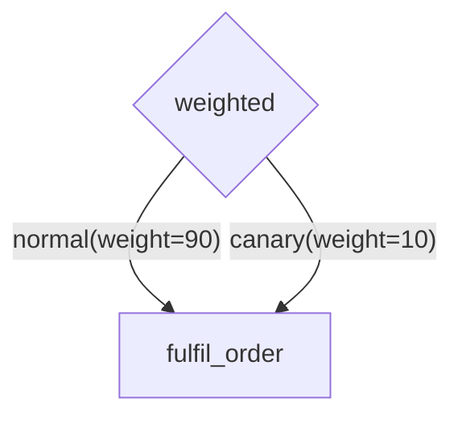

# Lane as the Flow-Control Primitive

Status: **partially implemented**. The pivot itself has landed — see "What landed"
below. Supersedes [lane-routing-flat-lanes.md](lane-routing-flat-lanes.md), which is
now abandoned rather than pending, and revises
[router-nodes.md](router-nodes.md)'s Part 1, whose lane/queue split has been undone.

## What landed

The indirection is gone. `RoutingConfig`/`RoutingRule`/`RoutingStrategy`,
`StateManager.resolve_queue` and its nine call sites, `TaskRoutingConfigProtocol`
and its four adapter implementations, the `/task-routing` CRUD routes, the
`task_routing_rules` table, the `tasks.lane` column, `Task.lane`, the
`lane_resolutions` metric and `docs/lanes-and-queues.md` were all removed. `Task`
carries a single `queue`, named directly by the `:queue` node-label segment,
`submit(queue=...)` or a router's choice, and `validate_task` requires it to exist
with no fallback. Net −1224 lines. Queue names are constrained to
`^[a-zA-Z_][a-zA-Z0-9_]*$` (W7).

**What deliberately did not change:** the label stayed on the node (`task_name:queue`)
rather than moving onto the edge. The pivot's claim is that a lane *is* a queue, which
is independent of where the label sits, so edge labels remain a later step — along with
everything in §4.1 (root routers), §4.2 (edge weights) and §6.

## What remains

§6.1 (DAG label validation via `collect_lanes` + `submit_dag`), §6.2 (no-role
warning), §6.3 (delete guards), §6.4 (`paused`), §6.5 (the pop-ordering bug, still
live), §5.1 (`priority`), §4.1 and §4.2. §3's default destination is half-done:
there is no identity default any more, but nothing seeds a `default` queue, there is
no `DEFAULT_LANE` startup check, and `TaskGenerator.DEFAULT_QUEUES = {"default"}`
still short-circuits the backend.

**The pivot, in one line: a lane does not map to a queue — a lane *is* a queue.**
Drop the indirection and the great majority of the open problem register goes with
it. §2–§4 are the analysis that led here; §5 is the resulting model; §6 and §7 are
the answer to "what is left to solve" and "what can no longer be done".

---

## 1. What the indirection was buying

One capability, and it is worth naming precisely, because everything else survives
without it: **repointing a logical destination onto a different physical queue at
runtime, without a diagram edit.**

That is the whole of it. The lane/queue split also appeared to buy per-destination
policy (rate limits, capacity) and router-selected destinations, but neither needs
an indirection — both work on a destination named directly.

Against that one capability, the indirection costs:

- `RoutingConfig` / `RoutingRule` / `RoutingStrategy` / `from_lane` /
  `WILDCARD_LANE` — **169 references across 13 modules**, three adapter
  implementations, a SQL table, and a CRUD API surface.
- `resolve_queue` and its nine call sites
  ([state_manager.py:497](../../jobbers/state_manager.py#L497),
  [:666](../../jobbers/state_manager.py#L666),
  [:1284](../../jobbers/state_manager.py#L1284),
  [task_processor.py:419](../../jobbers/task_processor.py#L419),
  [:427](../../jobbers/task_processor.py#L427),
  [:534](../../jobbers/task_processor.py#L534),
  [:707](../../jobbers/task_processor.py#L707)).
- Two fields on `Task` (`lane`, `queue`) and the requested-vs-resolved concept.
- The `lane_resolutions` metric and its `strategy` tag.
- Flat-lanes §15 (**S1–S5**), §16 (**R1–R7**) and §17's **L1/L3** — a problem class
  that exists *only* because two names can point at one thing, or one name at
  several.
- The fork this document could not settle a day ago: lane-scoped vs. pool-scoped
  rate limits (P-3), and `limit_group` as its escape hatch.

The trade is one runtime operation against roughly a third of the routing
subsystem. §7 argues the operation has adequate substitutes.

---

## 2. Two facts about the current code

These survive the pivot and still drive the design.

### 2.1 `max_concurrent` is per-worker and in-memory

`SubmissionRateLimiter.concurrency_limits`
([state_manager.py:1562](../../jobbers/state_manager.py#L1562)) compares the cap
against `self.current_tasks_by_queue`
([state_manager.py:179](../../jobbers/state_manager.py#L179)), a `defaultdict` on
the `StateManager` instance populated by `task_in_registry`. It is a
**per-process** count: `max_concurrent: 3` across ten workers admits thirty.

Worth stating plainly in the docs, which currently imply otherwise. Under the
pivot a *global* cap also becomes cheap to reach later — see §6.9.

### 2.2 The pop is multi-key, and its documented priority is fiction

`get_next_task` issues one `bzpopmin` over a set of keys
([_shared.py:792-795](../../jobbers/adapters/_shared.py#L792-L795)). redis-py does
`keys = list_or_args(keys, None)` and Redis pops from "the first non-empty sorted
set named in the `keys` list" — so order matters.

But `queues` is a `set` the whole way down: `concurrency_limits` returns a set,
`filter_by_worker_queue_capacity`
([task_generator.py:85](../../jobbers/task_generator.py#L85)) returns a set
comprehension, and [_shared.py:794](../../jobbers/adapters/_shared.py#L794) builds
another. Set iteration order is arbitrary. **The docstring's "in order of priority
(first in the list is highest priority)"
([state_manager.py:420](../../jobbers/state_manager.py#L420)) is not honoured
anywhere.**

A live bug on `main`, independent of everything else here, and a prerequisite for
§5's `priority` field.

---

## 3. The default destination

The flat-lanes plan's decision 7 — an undefined lane resolves to the queue of the
same name — was the *identity default*. Under the pivot it is not a default, it is
an identity: there is nothing to resolve. What remains worth deciding is whether a
destination must be **declared**.

**It must.** A queue is already an explicitly created resource (`POST /queues`
409s on duplicate), and requiring declaration is what closes the black hole that
flat-lanes §8.2 traces: a typo'd label enqueues into `task-queues:{typo}`, which no
role polls, and the task sits `SUBMITTED` forever — not failed, not stalled, absent
from the DLQ. With no fallback, an unknown name is a 400 at submit.

So:

- Unlabelled edges submit to the destination named by `DEFAULT_LANE` (env var,
  default `"default"`), which is **seeded** like the existing `default` queue and
  `default` role, and whose capacity and rate limits are editable at runtime like
  any other.
- Startup check: the destination named by `DEFAULT_LANE` must exist. A deployment
  that renamed it and did not create it should fail to boot, not fail on its first
  unlabelled edge.
- One site to fix with it: `TaskGenerator.DEFAULT_QUEUES = {"default"}`
  ([task_generator.py:63](../../jobbers/task_generator.py#L63)) short-circuits the
  backend entirely for role `default`, so a worker in that role polls `default`
  whether or not it is configured. This is the one place where "seeded" and
  "hardcoded" currently blur.

Validation collapses to one sentence: **the destination must exist.** No rule
lookup, no target-queue check, no `strategy=identity` metric tag to explain.

---

## 4. What the router has to carry, and what it cannot

The pivot hands weighted distribution to the router node. That substitution holds
for DAG children and fails in two specific places; both are load-bearing for §7.

A router is a `RouterCallback` ([dag.py:259](../../jobbers/models/dag.py#L259)) —
it fires when a parent task completes, runs inline on the worker's event loop, and
submits the branch it picks. So:

- **A router cannot be a DAG root** *today*. The parser rejects it explicitly:
  "Router '{rid}' has no incoming edge. A router cannot be a DAG root"
  ([mermaid_dag.py:522](../../jobbers/utils/mermaid_dag.py#L522)). §4.1 lifts this,
  which is what recovers root distribution (§7.2).
- **A router cannot read config.** Routers are enforced plain `def`, documented
  pure, and do no I/O. A router cannot consult the database for current weights.
  Its `parameters` come from the DAG spec, so weights are editable for *stored*
  specs (`PUT /cron-dags/{id}`) and supplied per call for ad-hoc submissions — but
  never read from a central config.

A weighted router is also non-deterministic, which is new: `router_decisions` and
the child's persisted destination record what was chosen, so the decision is
auditable after the fact, but a re-run of the same parent may route differently.
Worth checking against [dag-resume-design.md](dag-resume-design.md) before relying
on it. A *root* router (§4.1) does not have this problem — its decision is made
once at submit and frozen as the root task's destination.

### 4.1 Routers at the DAG root

Allowing a router with no incoming edges, **resolved in the submit path before
`submit_dag` is called**, recovers entry-point distribution at very low cost. The
key property is that the router collapses at the API boundary:
`submit_dag(*roots: DAGNode, ...)`
([state_manager.py:1331](../../jobbers/state_manager.py#L1331)) keeps receiving
plain `DAGNode` roots, so fan-in initialisation, `TaskProcessor`, the Lua scripts
and task storage are all untouched.

The Manager already has what it needs: it imports the task module
([manager_proc.py:55](../../jobbers/runners/manager_proc.py#L55)) for
`validate_task`'s registry lookup, and routers are registered by that same import.
No new deployment requirement.

Shape:

1. Parser: a router with zero incoming edges is a root router. `parse_mermaid_dag`
   returns it alongside the `DAGNode` roots.
2. Submit path: run each root router, substitute the selected branch's `DAGNode` as
   a real root.
3. Everything downstream: unchanged.

**Open items:**

| ID | Item | Recommendation |
| --- | --- | --- |
| **RR1** | What is a root router's input? There is no parent and no `results`. | Pass the submission's root parameters in the `results` position — "the data available at this point", which at root is the payload. |
| **RR2** | Failure handling diverges. Mid-DAG a raising router reaches `_handle_post_process_failure` and its error callback; at root there is no task yet to attach a failure to. | 400, naming the router. The submission simply did not happen, which is more honest — and more immediate — than the mid-DAG case. |
| **RR3** | What does `None` (the `else` branch) mean at root? Mid-DAG it ends a path silently. | Also a 400. A 200 that silently created no task is the worst available outcome. |
| **RR4** | **Cron DAGs: the Scheduler has no registry.** `scheduler_proc` takes no `task_module` argument — only the Manager and Worker import task modules — so a root router on a cron entry would fire at dispatch in a process where it is not registered. | **Forbid root routers on cron entries**, validated at `POST /cron-dags` (in the Manager, which has the registry). Giving the Scheduler a `task_module` is the alternative, but it makes the Scheduler redeploy with task code for a weak need: spreading a once-per-schedule root. If it is wanted, make the cron root a cheap dispatcher that fans out. |
| **RR5** | `fresh_copy()` / `_remap` are methods on `DAGTaskSpec` ([dag.py:104](../../jobbers/models/dag.py#L104)), so a `RouterSpec` root has no entry point for cron per-run ID remapping. | Falls out of RR4 — never arises. Noted so it is not rediscovered. |
| **RR6** | Does `POST /submit-task` get this too? It has no diagram, so no declared branches. | No. A bare single-task submit names its destination. If you want spread on one task, submit a one-node DAG with a root router — which keeps the "selector over declared candidates" constraint instead of reintroducing free-form destinations. |
| **RR7** | Parser rules for a root router. | Needs ≥1 outgoing edge, distinct labels, no chaining (unchanged); mixed roots (a task root and a router root in one diagram) should be allowed. |

### 4.2 Weights on the edge label

Declaring the weight beside the destination moves weights out of the router
function and into the diagram:



One task node, two queues, weights visible — a shape node-lanes forced you to
express as two duplicated nodes. This is **more** aligned with the project's stated
principle than central config was: flat-lanes §13 rejected per-task overrides
precisely because they meant
"a diagram would stop telling the whole story about where work runs". A weight is
part of that story, and a label is where it is readable.

It also moves weight validation earlier. `RoutingRule` validates
`len(weights) == len(queues)` at model-construction time; on edges the same check —
plus "all of a router's outgoing edges carry a weight or none do" and "weights are
positive" — is a property of the diagram.

**Open items:**

| ID | Item | Recommendation |
| --- | --- | --- |
| **W1** | Are weighted labels legal on a task's outgoing edges? A task's edges all fire, so two edges to one child would mean fan-out, not a choice. | **Settled: router edges only.** The motivating example is a *router* `A` with two branches to one task `B` — one task node on two queues, which node-lanes forced you to duplicate. A parse error on a weighted task edge, since the diagram reads plausibly either way. |
| **W2** | With weights in the diagram, the common case needs no function: a 90/10 split is fully declarative. Does that make a second kind of rhombus node? | No — ship a **built-in `weighted` router** registered by jobbers itself. One mechanism (routers), one node kind, no parser special case beyond edge parameters. A custom router stays available for decisions that read `results`. |
| **W3** | Where are edge parameters validated? The parser is deliberately registry-free — `mermaid_dag.py` imports only `models.dag`, `models.task_status`, `re`, `json`, `base64` and `ulid`, so it cannot see a router's declared edge-parameter schema. | **Settled: at submit**, alongside task and router names and params, which is the site §6.1 already establishes. Keeps the parser usable for rendering a stored diagram in the admin UI with no task code loaded. |
| **W4** | Edge-label syntax. | **Settled: reuse the node grammar** — `\|queue(weight=90)\|`. The kwargs are data associated with that queue, for the router function's use, which is exactly what the reading "the weight belongs to the queue" means here. See W6 for what "reuse" has to mean mechanically. |
| **W5** | How do edge parameters reach a custom router? Routers currently receive `results` plus their own node parameters. | `RouterBranch` gains `parameters: dict`, and the router receives its branch list. The built-in `weighted` router consumes exactly that. |
| **W6** | **Reuse the param sub-grammar, not `_LABEL_RE`.** `@version` is meaningless on an edge (the branch's version comes from the task node). | **Settled.** Edge label is `name[(params)]`; params go through the existing `_parse_params` ([mermaid_dag.py:281](../../jobbers/utils/mermaid_dag.py#L281)), which is already standalone and already coerces ints and floats — so `weight=90` arrives as `int` with no new work. The name takes the node identifier rule, which W7 now enforces on queues. |
| **W7** | Nothing constrained a queue name: `QueueConfig.name` was a bare `str`, so a queue could be created that no diagram could address. Hyphens were the live case — lane labels allowed `[a-zA-Z0-9_-]+` while task/router names do not. | **Settled and landed.** `QUEUE_NAME_PATTERN = ^[a-zA-Z_][a-zA-Z0-9_]*$` in [queue_config.py](../../jobbers/models/queue_config.py), enforced by a `field_validator` (covering create, static config and programmatic construction) and by a `Path(pattern=...)` on `PUT /queues/{queue_name}`, which assigns to `.name` directly and so bypasses the validator. Hyphenated queue names in docs, examples and tests replaced with underscores. **Release note:** an existing deployment with a hyphenated queue name now fails validation on read as well as write, since `from_row` constructs through the model. |
| **W8** | Does Mermaid.js render parentheses inside `\|...\|`? | **Settled: yes, with quotes** — `\|"queue(weight=90)"\|` is valid, the quotes making it a quoted edge label. Note this is a different construct from the `--"key">>` items-key form being removed (§6.1), which quotes a segment of the *arrow*, not the label. The generator must emit the quotes. |

### 4.3 What remains unrecovered

With §4.1 and §4.2, weights are declarative, visible, and validated — but they
travel with the submission. **Cron entries are the only stored DAG spec**
(`POST /cron-dags`, `PUT /cron-dags/{cron_id}`); `GET /dags` lists *runs*, not
templates, and `POST /submit-dag` takes mermaid text from the caller on every call.

So:

- **Cron DAGs**: weights are centrally editable via `PUT /cron-dags/{cron_id}`. Fully
  recovered.
- **API-submitted DAGs**: the weight lives in whatever the caller sends. Changing a
  canary split for every submitter means changing every caller, or introducing a
  stored DAG template.

That residual — a central weight that applies to all submissions of a shape
regardless of who submits it — is the last thing `WEIGHTED` routing config could do
that this cannot. It argues for a stored/named DAG template if it ever bites, which
is a larger and separately useful feature, not a reason to keep the routing layer.

---

## 5. The model

One noun. A destination has a name, capacity, admission, and ordering; a role is a
set of destinations; an edge label names one.

```python
class QueueConfig(BaseModel):
    name: str
    max_concurrent: int | None = 10      # per worker (§2.1); 0/None = unlimited
    priority: int = 0                    # pop order; see §5.1
    paused: bool = False                 # see §6.4
    rate_numerator: int | None = None    # admission, submit-side
    rate_denominator: int | None = None
    rate_period: RatePeriod | None = None
```

Deleted outright: `RoutingConfig`, `RoutingRule`, `RoutingStrategy`,
`WILDCARD_LANE`, `from_lane`, `resolve_queue`, the `task_routing_rules` table, the
`/task-routing` routes, three adapter implementations of
`TaskRoutingConfigProtocol`, `lane_resolutions`, and one of `Task`'s two
destination fields.

Unchanged: every Redis key (`task-queues:{queue}`, `task-heartbeats:{queue}`,
`rate-limiter:{queue}`, `schedule-queue:{queue}`, `dlq-queue:{queue}`), every
metric tag, the role system, the `config:version` invalidation machinery (still
needed — capacity and rate limits remain runtime-editable), and the whole fan-in /
Lua / DAG runtime.

That last paragraph is the strongest argument for the pivot: **it is almost
entirely a deletion.** No rekeying, no dashboard break, no migration beyond
dropping a table.

### 5.1 Priority becomes unambiguous

Once §2.2 is fixed, `priority` orders the worker's bzpopmin key list, descending,
ties round-robin. With one bucket per destination there is no
fairness-within-a-shared-bucket question at all — the problem flat-lanes **D-S2**
declined to solve stops existing rather than being solved.

Starvation remains: a saturated high-priority destination with a fast producer
never lets a lower one run on that worker. Recommend strict priority, documented,
revisited with data — a strict reading is what people expect from the word.

### 5.2 What must not move onto the destination

The test: **would the author writing the edge label know the answer?** If it
belongs to the work rather than the path, it is a task-type property.

`max_retries`, `retry_delay`, `backoff_strategy`, `max_retry_delay`,
`dead_letter_policy`, `timeout`, `max_heartbeat_interval`, `on_shutdown` and
`TaskConfig.max_concurrent` all stay on `TaskConfig`. A destination-level override
of any of them reintroduces exactly the precedence chain this pivot deletes.

Role membership stays on the role: it is deployment topology, and a destination
naming its own roles couples what the diagram says to how the fleet is deployed.

---

## 6. What still needs resolving

Ordered by how much it matters.

### 6.1 DAG label validation — now the top item

Flat-lanes §8.2's `collect_lanes(spec) -> set[str]` walk plus a check inside
`StateManager.submit_dag` (not the route handler, so programmatic callers and
`POST /cron-dags` are covered). **The pivot makes this more necessary, not less**:
every edge label is now a physical resource, so there are more names that must
exist, and the consequence of a missing one is unchanged — a task enqueued where
nothing polls.

### 6.2 Exists, but no role polls it (**R4**)

The only remaining structural black hole. Queue existence is not role membership,
and the Scheduler promotes due tasks only for its own role's queues
([scheduler_proc.py:50-54](../../jobbers/runners/scheduler_proc.py#L50-L54)) — so
retry-delayed and scheduled tasks for an unpolled destination are never dispatched
at all. Needs a warning at save time (`get_roles_for_queue` already exists) and a
mention in the §6.1 error.

### 6.3 Deleting a destination strands queued **and scheduled** work (**R5**)

Now the top operational risk, and worse than under the old plan: there is no
repoint-then-drain sequence, so deleting is the only way to retire a destination.
`delete_queue` checks neither pending entries nor the schedule set. Scheduled tasks
live in per-queue sorted sets enumerated via `get_all_queues()`
([redis/task_scheduler.py:140](../../jobbers/adapters/redis/task_scheduler.py#L140)),
so once the queue leaves the registry those entries are invisible to the Scheduler,
to `/scheduled-tasks`, and to `recover_orphans` — which covers only the
acquired-but-undispatched saga case.

Fix: `DELETE /queues/{name}` 409s when the active set **or the schedule set** is
non-empty, `?force=true` to override; plus a Cleaner check reporting schedule-set
keys for queues absent from `get_all_queues()`.

### 6.4 There is no way to pause a destination — new gap

Repointing was the "stop sending work here" lever, and removing it exposes that
nothing else expresses pause:

- `max_concurrent: 0` means **unlimited**, by deliberate design
  ([queue_config.py:21-27](../../jobbers/models/queue_config.py#L21-L27)) — it
  cannot mean "stop".
- The rate-limit fields are guarded by truthy checks at every call site, so
  `rate_numerator: 0` reads as "not rate limited".
- Removing the destination from every role works but is a blunt, cross-cutting
  edit that also stops anything else sharing the role.

Fix: an explicit `paused: bool`, checked pop-side so in-flight work drains and
queued work waits rather than being rejected. Cheap, and it is the honest
replacement for most of what repointing was used for. **Needs a call** on whether
pause is also submit-side (reject new submissions) or pop-side only.

### 6.5 The pop ordering bug (§2.2)

Independent, small, live on `main`, and a prerequisite for `priority`. Fix first.

### 6.6 Vocabulary — one noun, so pick the word

With lane ≡ queue, `Task.lane` and `Task.queue` collapse into one field and
[docs/lanes-and-queues.md](../../docs/lanes-and-queues.md) collapses into a section
of [resource-management.md](../../docs/resource-management.md).

Recommend **keeping `queue`** as the resource name across API, storage, metrics and
models — that is what the entire existing surface already says, so it is the
minimum diff — and treating "lane" as the name of the edge-label *position* in the
mermaid grammar, or retiring the word. Deciding now is cheap; deciding after the
frontend and docs are rewritten is not.

### 6.7 Create-before-use friction

The indirection used to absorb many labels onto one queue. Now every distinct label
is a resource that must be created and placed in a role. Mitigated by the default
destination (so you only pay for labels you deliberately write) and by §6.1 (the
failure is a 400 at submit, not silence) — but it is real, and it belongs in the
docs rather than hidden. The upside is that every destination is independently
measurable, which recovers flat-lanes **S1**/**S2** for free.

### 6.8 Carried over unchanged

- **L5** — a rate limit gates *first submits*, not throughput: retries, requeues,
  DLQ resubmits and fan-out arm batches all bypass it. Docs-only, and the name
  misleads harder now that there is one noun.
- **D-L3** — refuse a rate-limited *collector* destination at DAG submission (a
  rejection strands a fan-in), warn for *arm* destinations. Still needs a call.
- **D-L4** — all-three-or-none validation on the rate fields, replacing the
  four-way truthy checks with `is_rate_limited()`.
- A cron spec referencing a since-deleted destination is not re-validated at
  dispatch.

### 6.9 Explicitly deferred

A **global (cross-worker) concurrency cap** — the most-wanted missing feature here,
and the pivot brings it within reach: `task-heartbeats:{queue}` is already keyed on
the destination, so a `ZCARD` before the pop gives a cross-worker count. Racy but
bounded, and it doubles nothing. Its own design; note that today's cap is *also*
not global (§2.1), so this is a gap, not a regression.

---

## 7. What can no longer be supported

Honest accounting. The first three are real losses; the last three are mostly
recoverable.

### 7.1 Runtime-editable weighted distribution — **mostly recovered by §4.2**

`PUT /task-routing` with a `WEIGHTED` rule let an operator change how work spreads
across shards, live. Declaring weights on the edge label (§4.2) replaces this for
cron DAGs, whose specs are stored and editable via `PUT /cron-dags/{cron_id}`, and
puts the weight somewhere a reader can see it.

What is left unrecovered is narrower than it first looked: a **central weight for
API-submitted DAGs**, which take mermaid text from the caller on every call. See
§4.3.

### 7.2 Distributing root submissions — **RESOLVED by §4.1**

Entry-point sharding is recovered by allowing a router at the DAG root, resolved in
the submit path. The Manager already loads the registry, and because the router
collapses before `submit_dag`, nothing downstream changes.

Two residual restrictions, both deliberate: **cron entries may not have root
routers** (the Scheduler has no registry — RR4), and **`POST /submit-task` still
names its destination directly** (no diagram means no declared branches — RR6). A
one-node DAG with a root router covers the latter.

### 7.3 Emergency redirection without a deploy

Flat-lanes §13 already removed per-task overrides and kept lane-repointing as the
remaining runtime lever; removing that too leaves no way to redirect work. What is
left covers *stop* and *starve*, not *redirect*:

| Intent | Lever | Runtime-editable? |
| --- | --- | --- |
| Stop sending work here | `paused` (§6.4) | Yes |
| Stop consuming from here | remove from the role | Yes |
| Slow it down | rate limit / `max_concurrent` | Yes |
| Move capacity to the work | role membership | Yes |
| Move the work elsewhere | — | **No** |

Worth noting that [resource-management.md §4](../../docs/resource-management.md)
already documents draining and capacity-shifting via role membership, not
repointing. The pre-existing operational story survives intact; what the pivot
removes is a lever that arrived with lanes and was never the documented one.

### 7.4 Several destinations sharing one execution pool

Flat-lanes §15 called `reporting` and `default` both resolving to `default` the
normal starting state. Now they are separate buckets with separate per-worker
budgets, and "these two share three slots" is inexpressible —
`WORKER_CONCURRENT_TASKS` is the blunt version. Minor: the thing it cost (L1,
nothing caps total admission into a shared queue) also disappears, since there is
no sharing to account for.

### 7.5 Per-version routing

Routing config is keyed `(task_name, task_version)`, so v1 and v2 of a task can be
routed to different queues today without touching a diagram — there is a test for
it (`testresolve_queue_routing_is_version_specific`,
[test_state_manager.py:2212](../../tests/test_state_manager.py#L2212)). Gone:
different destinations now need different labels. Usually handled by deploying the
new diagram, but it is a real capability in the code today and should be removed
knowingly.

### 7.6 Two names for one destination

Two labels deliberately sharing a queue — flat-lanes §15.1 called this "a
legitimate configuration" once the collapse bug was fixed. Now two labels are two
destinations. The intent ("these differ in meaning but share capacity") is no
longer expressible; the compensation is that it is no longer *needed*, because
nothing collapses silently.

---

## 8. Recommendation

Take the pivot. It is a net deletion of roughly a third of the routing subsystem,
it dissolves flat-lanes §15 and §16 entirely along with §17's L1/L3 and this
document's own unsettled P-3 fork, and it requires no rekeying, no dashboard break
and no migration beyond dropping one table.

§7.2 (root distribution) is settled by §4.1's root router — a parser rule and a
substitution step in the submit path, with no change below `submit_dag`. §7.1 is
mostly settled by §4.2's edge weights, which are also more visible than the config
they replace. The remaining accepted losses are §4.3 (a central weight for
API-submitted DAGs, pending a stored DAG template), §7.3 (redirect, as distinct from
stop and starve), §7.5 (per-version routing) and §7.6 (two names for one
destination).

### Order

1. §2.2 pop-ordering fix. Independent, small, a live bug.
2. §6.1 `collect_lanes` + `submit_dag` validation, against the *current* node-lane
   code. Independently valuable and the main safety net for everything after.
3. §6.3 delete guards, §6.2 no-role warning, §6.4 `paused`.
4. Delete the routing layer: `RoutingConfig` and kin, `resolve_queue`, the
   `/task-routing` routes, the three adapters, the table, one `Task` field,
   `lane_resolutions`. See §8.1 for what goes with it.
5. `priority` on the destination (§5.1), now that §2.2 is fixed.
6. The flat-lanes parser work — edge labels, agreement validation, `RouterBranch`,
   `RouteTo` deletion — unchanged by the pivot except that an edge label now names
   a queue.
7. §4.1 root routers: lift the parser check, add the submit-path substitution, and
   the RR2/RR3/RR4 guards. Lands after step 6 because it needs `RouterBranch`.
8. §4.2 edge weights: `RouterBranch.parameters`, the colon lexing, the built-in
   `weighted` router, and submit-time schema validation (W3). Also after step 6.
9. §6.6 vocabulary decision, then docs, `openapi.json`, frontend.

### 8.1 What the config-propagation work keeps, and what step 4 takes with it

The R1/R2 propagation work (landed, uncommitted at the time of writing) was built
for repointing, which the pivot removes — so it is worth being explicit that almost
all of it is still load-bearing. Queue config stays runtime-editable and
per-process cached, so a second Manager replica still has to notice an edit.

**Keeps, unchanged:** `CONFIG_POLL_INTERVAL`, the `config_refreshes` counter,
`_config_version` / `_config_checked_at`, `refresh_config_if_stale()`,
`invalidate_all_queue_config()`, the `get_routing_version` → `get_config_version`
rename through `RoutingNotificationProtocol` and its adapter, the version bumps on
`save_queue_config` / `create_queue_config` / `delete_queue`, and
`TaskGenerator`'s unthrottled per-iteration poll. The negative-lookup test
(`test_creating_a_queue_expires_a_cached_negative_lookup`) becomes *more*
important, not less: with the identity default gone (§3), validation is purely
"does this queue exist", so a stale cached `None` is the whole failure mode.

**Relocates:** `resolve_queue`'s throttled poll moves to `submit_task`, which still
reads queue config for the admission check. The call site changes; the call does
not disappear.

**Rewrites:** `test_validate_task_polls_for_config_changes` (still true, but its
body is routing-config-driven) and `validation.py`'s comment, which describes lanes
and routing rules. `docs/lanes-and-queues.md`'s "Propagating a config change"
section should **move** into `resource-management.md` per §6.6 rather than be
rewritten.

**Deleted with step 4:**

| Item | Why |
| --- | --- |
| `_routing_config_cache`, `invalidate_all_routing_config()` | One cache, so `refresh_config_if_stale`'s "both caches are dropped together" collapses to one call |
| `save_routing_config` / `delete_routing_config` version bumps | The methods go |
| `test_repoint_reaches_a_second_process_without_restart` | Tests a repoint. `test_queue_config_change_reaches_a_second_process` already covers the same propagation through the surviving config object |
| `test_resolve_queue_polls_for_config_changes` | `resolve_queue` goes |
| `test_update_task_routing_bumps_config_version`, `test_delete_task_routing_bumps_config_version` | The `/task-routing` routes go |

None of these should be removed ahead of step 4: repointing works today, and they
are the only coverage of it.
