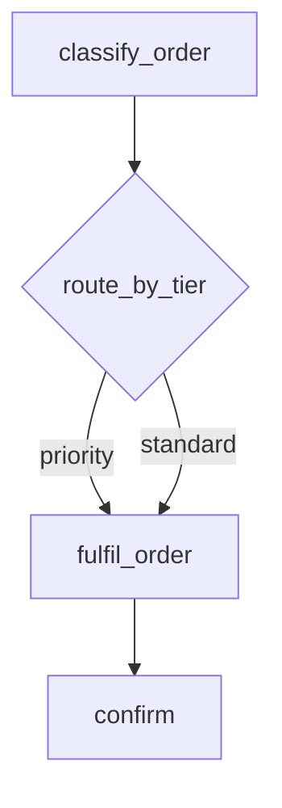
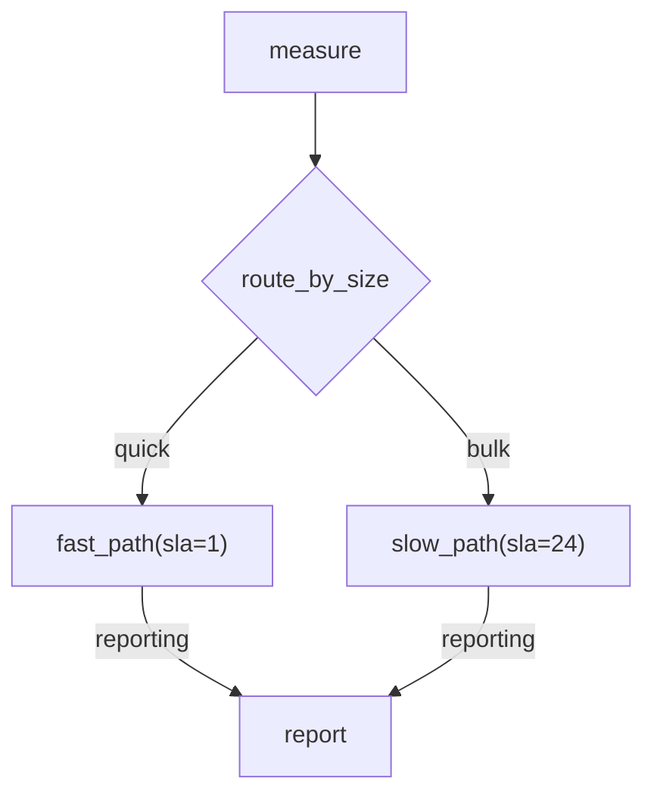

# Lane-on-Edge Routing — Option 1: Flat Lanes

Status: **design, pending approval** — supersedes the router/lane work in
[router-nodes.md](router-nodes.md), which this reworks rather than extends.

A variant in which a `Lane` also carried per-task overrides was written and
**dropped** in favour of this one. §13 records what that would have bought and why
it was not worth the precedence rules it reintroduced.

---

## 1. Context

Three strings currently mean the same thing at three different layers:

- A **router's return value** — `RouteTo(task, lane=..., version=...)`, a selector
  over candidates declared in the diagram.
- A **node's lane** — the `:lane` segment baked into a task-node label.
- A **routing config key** — `RoutingRule.from_lane`, scoped to
  `(task_name, task_version)` and stored in the routing backend.

They already compose (router picks a candidate → candidate's lane →
`resolve_queue` → queue), but each layer carries its own vocabulary, precedence
rules, and failure modes. The result is a `RouteTo` selector with name/lane/version
matching and ambiguity errors, a wildcard-vs-scoped precedence chain in
`RoutingConfig`, and a `:lane` grammar segment — all expressing one idea.

**Moving the lane from the node onto the edge collapses all three into one
string.** An edge names the lane for the submission it triggers; a router returns
a lane name, which selects an edge; a lane resolves to a queue through stored
config. One vocabulary end to end.

### 1.1 Why this is a net deletion

| Deleted | Replaced by |
| --- | --- |
| `RouteTo` and its name/lane/version matching | The router returns a `str` |
| `_select_candidate`'s "exactly one survivor" logic and ambiguity error | Edge-label lookup |
| Candidate `(name, version, lane)` uniqueness check | "A router's outgoing labels must be distinct" |
| `RoutingRule.from_lane`, `WILDCARD_LANE`, wildcard-vs-scoped precedence | The lane *is* the key |
| `RoutingConfig` (list-of-rules wrapper) | `Lane` |
| `:lane` in the node-label grammar | Edge labels |

No runtime state changes: fan-in tracking, the Lua scripts, and
`DAG_RUN_FANIN_MEMBERS` ([_shared.py:76](../../jobbers/adapters/_shared.py#L76))
are untouched. Lane resolution stays parse-time plus one config lookup at submit.

---

## 2. Settled decisions

1. **The lane lives on the edge**, not the node, for every edge type.
2. **A node's lane is the lane of its incoming edges, which must all agree.** A
   mismatch is a parse error.
3. **Zero incoming edges (roots) take the lane from the submit API** — a sibling
   parameter, not a field on the submitted `Task`. Omitted ⇒ `DEFAULT_LANE`.
4. **`:lane` leaves the node-label grammar entirely.** Roots get it from the API;
   every other node from its edges.
5. **An unlabeled edge out of a router is the `else` branch**, taken when the
   router returns `None`. No unlabeled edge ⇒ `None` ends the path.
6. **Lane → queue mapping is stored config**, editable at runtime.
7. **An undefined lane resolves to the queue of the same name** (the identity
   default), so a deployment that never defines a lane never meets the concept.

### 2.1 Why agreement is required rather than reconciled

For a static fan-in every declared predecessor always fires, so the set of
contributing lanes is constant across runs. Any policy over them — priority-max,
first-wins — evaluates to a compile-time constant, which is exactly what writing
one agreed label already expresses. Supporting disagreement would add ambiguity
for no expressive power.

The same holds for `--o` collectors: the `--o` edges are declared in the diagram,
so even when per-item routing spawns a variable number of arms, the set of
*possible* contributing lanes is static.

---

## 3. The `Lane` model

`jobbers/models/task_routing.py` loses `RoutingConfig`, `RoutingRule`, and
`WILDCARD_LANE`; `RoutingStrategy` survives unchanged.

```python
class Lane(BaseModel):
    """A named logical destination, resolved to one or more physical queues."""

    name: str
    strategy: RoutingStrategy = RoutingStrategy.SINGLE
    queues: list[str]
    weights: list[float] | None = None
```

The existing `SINGLE`/`WEIGHTED` validators move onto `Lane` verbatim.

Lanes are global: `Lane("priority")` means the same thing for every task that
uses it. Giving one task its own routing means giving it its own lane in the
diagram, which makes the intent visible where the work is described rather than
hidden in config.

---

## 4. Diagram grammar

### 4.1 Node labels

```text
node_id["task_name[@version][(param=val, ...)]"]
router_id{"router_name[@version][(param=val, ...)]"}
```

The `:lane` segment is removed from `_LABEL_RE`
([mermaid_dag.py:186](../../jobbers/utils/mermaid_dag.py#L186)). A label that
still carries one is a parse error naming the edge-label replacement, so old
diagrams fail loudly rather than silently routing to `default`.

### 4.2 Edge labels

Every edge type accepts an optional mermaid `|lane|` label:

| Edge | Meaning |
| --- | --- |
| `A -->\|fast\| B` | Submit `B` on lane `fast` when `A` completes. |
| `A --> B` | Submit `B` on `DEFAULT_LANE`. |
| `A -.->\|alerts\| err` | Error callback on lane `alerts`. |
| `A -->>\|heavy\| B` | Every fan-out arm runs on lane `heavy`. |
| `T --o\|merge\| C` | The collector runs on lane `merge`. |
| `R -->\|priority\| F` | Router branch `priority`; selects both the lane and the node. |
| `R --> F` | The router's `else` branch. |

The custom-items-key form composes with a lane label as
`A --"records">>|heavy| B`. It is rare and admittedly ugly — flagged as a wart
rather than designed around, since splitting the two into one label would
overload it worse.

Mermaid.js accepts `|text|` on all four arrow forms, so generated diagrams keep
rendering in the admin UI with no fallback needed. (Recorded here because it is
the obvious thing to re-question when reading this plan.)

### 4.3 Examples

Router picking a lane for one shared node:



One `fulfil_order` node on two lanes — today this forces two nodes with
duplicated parameters and duplicated downstream chains.

Branches that genuinely differ still get their own nodes:



`D`'s two incoming edges agree on `reporting`, so it runs there.

---

## 5. Router contract

`jobbers/models/router.py` keeps only `RouterConfig`; `RouteTo` is deleted.

```python
@register_router(name="route_by_tier", version=1)
def route_by_tier(results: dict, *, threshold: int = 100) -> str | None:
    return "priority" if results["tier"] == "gold" else "standard"
```

The return value is a lane name matching one of the router's outgoing edge
labels, or `None` for the `else` branch. Everything else about routers is
unchanged: plain `def` enforced at registration, pure and synchronous, loaded by
the same `task_module` import, driven from `TaskProcessor.post_process`.

### 5.1 Spec changes

```python
class RouterBranch(BaseModel):
    lane: str | None = None   # None = the else branch (unlabeled edge)
    task: DAGTaskSpec


class RouterSpec(BaseModel):
    id: ULID = Field(default_factory=ULID)
    router: str
    version: int = 0
    parameters: dict[str, Any] = {}
    branches: list[RouterBranch] = []
```

`_select_candidate` collapses to a dict lookup on `branch.lane`. Its failure
modes shrink to two — unregistered router, and a returned label matching no
branch — both still surfacing as `RouterError` through
`_handle_post_process_failure`.

### 5.2 Parse-time router rules

- Outgoing edge labels must be distinct.
- At most one outgoing edge may be unlabeled (the `else` branch).
- A router still needs ≥1 outgoing edge, ≥1 incoming edge, no chaining, and may
  not be a dispatcher, arm terminal, collector, or error target.

---

## 6. Lane resolution

`StateManager.resolve_queue`
([state_manager.py:1180](../../jobbers/state_manager.py#L1180)) becomes a single
lookup:

```python
async def resolve_queue(self, task: Task) -> str:
    lane = await self.get_lane(task.lane)
    if lane is None:
        return task.lane                      # identity default
    match lane.strategy:
        case SINGLE:   return lane.queues[0]
        case WEIGHTED: return random.choices(lane.queues, lane.weights, k=1)[0]
```

No `from_lane` matching, no wildcard fallback, no precedence chain. The existing
routing-config cache and `routing:version` bump carry over to lane CRUD
unchanged.

**Resolution stays one-shot**: at first submit or schedule. Retries and scheduler
dispatch reuse the already-resolved `task.queue`, exactly as today.

`SimpleCallback.lane is None` resolves to `DEFAULT_LANE` **when the task is
built**, not at parse time, so changing the setting affects stored cron DAG specs
without rewriting them.

---

## 7. Storage

`jobbers/migrations/runner.py` is `create_all`-only, and backwards compatibility
with running systems is out of scope, so tables are replaced rather than migrated.

- **SQL** — `task_routing_rules` is replaced by `lanes(name PK, strategy, queues,
  weights)` in `TABLE_GROUPS["routing"]`
  ([schema.py](../../jobbers/migrations/schema.py)). `tasks.lane` stays as-is.
- **Redis / Redis JSON** — `config:routing:{task_name}:{task_version}`
  ([redis/routing_backend.py:175](../../jobbers/adapters/redis/routing_backend.py#L175))
  becomes `config:lane:{name}`, holding a serialised `Lane`. A `lanes` index key
  backs `get_all_lanes()`.
- **Static** — the config file's `routing` list becomes a `lanes` list:
  `{"lanes": [{"name": "priority", "strategy": "single", "queues": ["shard-a"]}]}`.
  `StaticRoutingBackend.from_file` validates each lane's target queues exist.

**Existing deployments must drop `task_routing_rules` before upgrading.** Note it
in the release notes; do not add a shim.

### 7.1 Protocol

`TaskRoutingConfigProtocol` becomes `LaneConfigProtocol`:

```python
async def get_lane(self, name: str) -> Lane | None: ...
async def save_lane(self, lane: Lane) -> None: ...
async def delete_lane(self, name: str) -> bool: ...
async def get_all_lanes(self) -> list[Lane]: ...
```

`get_all_lanes` is new — it backs `GET /lanes` and the admin UI, which the
per-task-keyed config could not offer.

---

## 8. API

| Before | After |
| --- | --- |
| `GET/PUT/DELETE /task-routing/{task_name}/{task_version}` | `GET/PUT/DELETE /lanes/{name}` |
| — | `GET /lanes` |

Submission routes gain a `lane` parameter, sibling to the payload rather than a
field on it:

- `POST /submit-task` posts a bare `Task` today
  ([task_routes.py:76](../../jobbers/task_routes.py#L76)); it gains the wrapper
  shape `/schedule-task` already uses: `{"task": {...}, "lane": "priority"}`.
- `POST /schedule-task`, `POST /submit-dag`, `POST /cron-dags`, `PUT /cron-dags/{id}`
  gain an optional `lane` field. Cron entries persist it so every dispatch reuses it.
- Omitted ⇒ `DEFAULT_LANE`.

`DEFAULT_LANE` is a new environment variable (default `"default"`) alongside the
other settings in `CLAUDE.md`'s env table.

### 8.1 Validation

`validate_task` ([validation.py](../../jobbers/validation.py)) checks the lane,
not a rule: valid if a `Lane` record exists **or** a queue of that name exists.
When a `Lane` exists, its target queues must exist.

```text
Unknown lane 'gold': no lane is defined with that name and no queue named 'gold' exists
```

### 8.2 Closing the DAG lane-validation gap

`validate_task` is reached from `/submit-task`
([task_routes.py:81](../../jobbers/task_routes.py#L81)) and `/schedule-task`
([:109](../../jobbers/task_routes.py#L109)) only. `/submit-dag` and `/cron-dags`
never call it, and `StateManager.submit_dag` goes straight to `submit_task`, so
**today a lane name in a DAG is validated nowhere.** A typo'd label fails silently
rather than loudly:

1. It parses — a lane label is a valid identifier.
2. `resolve_queue` finds no matching `Lane` and applies the identity default,
   returning the lane name as a queue name.
3. `submit_task` fetches that queue's config, gets `None`, and concludes only that
   the task is not rate-limited. No error is raised.
4. The task is enqueued into `tasks:{typo}`, which belongs to no role, so no
   worker ever polls it.

The task then sits `SUBMITTED` indefinitely — not failed, not stalled (no
heartbeat was ever expected), absent from the DLQ, and reaped only if the
Cleaner's queue-age pruning happens to be configured.

This hole predates this plan; `:lane` node labels have it today. But the plan
widens it: lanes move onto edges, so there are more places to typo one, and the
whole point is that lanes routinely resolve to queues with *different* names —
exactly when the identity default stops being a helpful fallback and becomes a
trap.

**Fix — validate the lane set inside `StateManager.submit_dag`,** not in the route
handler. Add a `collect_lanes(spec) -> set[str]` walk to
[models/dag.py](../../jobbers/models/dag.py) alongside `collect_fan_in_keys`,
covering every callback kind: `SimpleCallback`/`FanInCallback` lanes, router
branch lanes, and `DynamicFanOutCallback.arm_lane`/`collector_lane`. Then
`submit_dag` resolves that set in one batch lookup against lanes and queues
before initialising any fan-in set, raising on unknowns:

```text
Unknown lanes in DAG: prioirty, repoting
```

Validating in `StateManager` rather than the route is deliberate: it covers
`POST /submit-dag`, `POST /cron-dags`, **and** programmatic callers
(`submit_dag(*roots, ...)` from Python), which a route-level check would miss.
`/cron-dags` gets the same check at creation time through the same helper.

---

## 9. Frontend

- `Lanes.jsx` — new CRUD page, sibling to `Queues.jsx`, backed by `GET /lanes`.
- `SubmitTask.jsx` — the Lane field becomes the submission parameter.
- `SubmitDAG.jsx` / `CronDags.jsx` — add a Lane field.
- `TaskDetail.jsx` / `ActiveTasks.jsx` — the existing lane → queue display is
  unchanged.

---

## 10. Files touched

| File | Change |
| --- | --- |
| `jobbers/models/task_routing.py` | `Lane` replaces `RoutingConfig`/`RoutingRule`/`WILDCARD_LANE` |
| `jobbers/models/router.py` | `RouteTo` deleted; `RouterConfig` kept |
| `jobbers/models/dag.py` | `DAGTaskSpec.lane` removed; `lane` onto `SimpleCallback`/`FanInCallback`; `RouterBranch`; `DynamicFanOutCallback.arm_lane`/`collector_lane` |
| `jobbers/models/task.py` | `_build_callback_task` takes the lane from the callback |
| `jobbers/utils/mermaid_dag.py` | Drop `:lane` from `_LABEL_RE`; pipe-label lexing on all edge types; agreement validation; generator emits `\|lane\|` |
| `jobbers/task_processor.py` | `_select_candidate` → branch lookup; arm/collector lanes |
| `jobbers/state_manager.py` | `resolve_queue` single lookup; lane cache/version bump |
| `jobbers/protocols.py` | `LaneConfigProtocol` |
| `jobbers/adapters/{sql,redis,redis_json,static}/routing_backend.py` | Lane storage |
| `jobbers/migrations/schema.py` | `lanes` table replaces `task_routing_rules` |
| `jobbers/validation.py`, `jobbers/task_routes.py` | Lane validation; `/lanes` CRUD; `lane` submit parameter |
| `frontend/src/pages/` | `Lanes.jsx`; lane fields on submit forms |
| `docs/lanes-and-queues.md`, `docs/mermaid-dag-spec.md`, `docs/dag-composition.md`, `docs/task-definition-reference.md`, `CLAUDE.md`, `openapi.json` | Rewrite for edge-lanes |

---

## 11. Implementation order

1. `Lane` model + `LaneConfigProtocol` + the four adapters + `lanes` table.
2. `resolve_queue` single lookup; lane cache and version bump; validation.
3. `/lanes` CRUD, `DEFAULT_LANE` setting, `lane` submit parameters.
4. Move `lane` off `DAGTaskSpec` onto the callbacks; `_build_callback_task`.
5. Parser: drop `:lane`, add pipe-label lexing, agreement validation.
6. Generator: emit `|lane|`, stop emitting `:lane`; round-trip tests.
7. `RouterBranch` + delete `RouteTo`; `_handle_router` branch lookup; `else` branch.
8. Arm and collector lanes in `_handle_declarative_fanout`.
9. `collect_lanes` + the `submit_dag` / cron-creation lane check (§8.2).
10. Frontend, docs, `openapi.json`.

Steps 1–3 land independently and leave the system working on node-lanes. Step 4
is the breaking cut; 4–9 should land together. Step 9 comes last of the structural
work because `collect_lanes` has to walk router branches and fan-out arm lanes,
which steps 7–8 introduce.

---

## 12. Known limitations

| Limitation | Rationale |
| --- | --- |
| Incoming edge labels into one node must agree | Any policy over them is a compile-time constant (§2.1); disagreement is ambiguity for nothing |
| A router's outgoing labels must be distinct | The return value is a lane name |
| `--"key">>\|lane\|` is ugly | Items-key and lane are orthogonal; merging them into one label would overload it |
| Lane names are not validated at *parse* time | `parse_mermaid_dag` is synchronous with no `StateManager`; §8.2 validates at submit instead, so a bad lane is a 400 rather than a parse error |
| A cron entry is not re-validated at dispatch | Its lanes are checked when the entry is created; deleting a lane afterwards strands future runs, with only `lane_resolutions{strategy=identity}` on an unexpected lane to hint at it |
| Deleting a queue still strands work already enqueued to it | Pre-existing queue-lifecycle behaviour, unchanged by lanes and identical for plain queues today |
| **No per-task routing override** | Re-pointing one task type requires giving it its own lane in the diagram — see §13 |

---

## 13. The per-task override alternative, and why it was dropped

A `Lane` here is flat: one name, one strategy, one queue set, for every task that
uses it. An operator can re-point a lane, but cannot re-point a single task type
that shares a lane with others — that needs a diagram edit giving it a lane of
its own.

The rejected alternative added `Lane.overrides: list[LaneOverride]`, keyed
`(task_name, task_version)` and winning over the lane's own setting. That
preserves a capability today's routing config has: diverting one task type onto a
drain queue mid-incident without touching a diagram.

It was dropped because the cost lands in the place this plan is trying to
simplify. `resolve_queue` would keep a precedence chain — override, then lane,
then identity default — which is the single largest deletion available here (§1.1).
It also reintroduces routing that nothing in the repository references, so a
diagram would stop telling the whole story about where work runs, with only
`lane_resolutions` as a signal that a task type had been diverted. Override CRUD
would have been read-modify-write over the whole lane document, carrying a
lost-update race between concurrent operators.

**Revisit this if** diverting one task type without a deploy turns out to be a
recurring operational need. The migration is additive — `overrides` is a new
optional field and the precedence chain slots into `resolve_queue` — so choosing
flat now does not foreclose it.

---

## 14. Verification

**Adapter contract tests** — the parametrized `task_routing_config_adapter`
fixture becomes `lane_config_adapter`, still covering `sql`/`redis`/`redis_json`:
save/get/delete round-trip, `SINGLE` and `WEIGHTED`, `get_all_lanes`, and
overwrite-replaces semantics.

**`resolve_queue`** — defined lane, weighted lane, undefined lane falling to the
identity default, and one-shot resolution across a retry.

**Parser** (`tests/utils/test_mermaid_router.py`, `test_mermaid_dag.py`) —
labeled edges of every type; unlabeled ⇒ `DEFAULT_LANE`; agreeing fan-in labels
accepted and mismatched ones rejected; `:lane` in a node label rejected with the
migration message; distinct router labels; one unlabeled router edge accepted and
two rejected; generator round-trip preserving labels.

**Runtime** (`tests/test_router_processing.py`) — router return selects the
matching branch; `None` takes the `else` branch; `None` with no `else` submits
nothing; unknown label raises `RouterError`.

**Lane validation** (§8.2) — `collect_lanes` reaches lanes on
`SimpleCallback`/`FanInCallback`, router branches, and fan-out arm/collector
edges; `submit_dag` rejects an unknown lane and names it; a lane backed only by a
same-named queue is accepted (identity default); `POST /cron-dags` rejects at
creation; and a **programmatic** `submit_dag(*roots, ...)` call is rejected too,
which is the case a route-level check would have missed.

**Real-backend tests are mandatory** per `CLAUDE.md`, since this touches submit
and fan-in paths. Using `state_manager_real_ta`: converging router branches
submit the collector exactly once with no pending fan-in set; per-item routing
spawns arms across two lanes whose shared fan-in closes exactly once; an arm's
`Task.lane` matches its branch label and its `queue` the resolved lane.

**Quality gates** — `pytest --cov=jobbers`, `ruff check .`,
`ruff format --check .`, `mypy jobbers`, `npm run build` in `frontend/`.

**End-to-end** — `docker compose up`; define lane `priority` → queue
`priority-shard-a`; submit the §4.3 router diagram; confirm the selected branch
shows `lane=priority, queue=priority-shard-a` while an unlabeled edge shows
`lane=default, queue=default`; then `PUT /lanes/priority` pointing at a different
queue and confirm a re-submission follows it with no diagram change.
