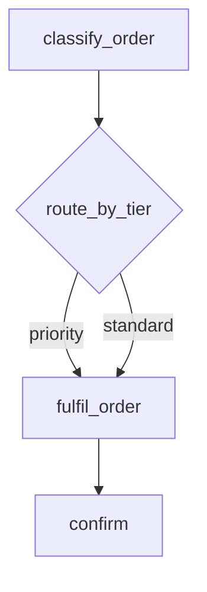
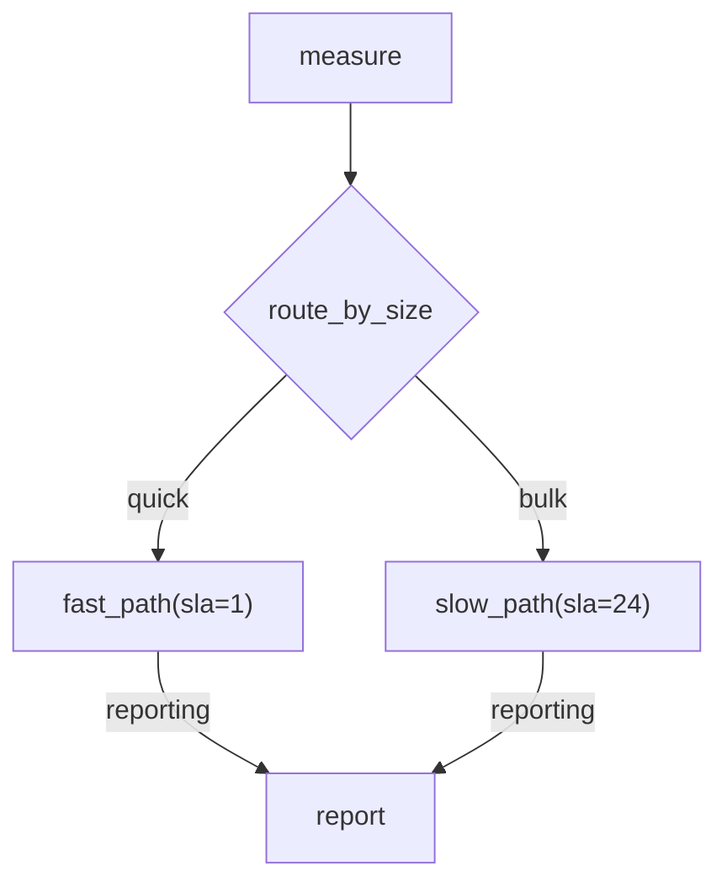

# Lane-on-Edge Routing — Option 1: Flat Lanes

Status: **ABANDONED** — superseded by
[lane-as-primitive.md](lane-as-primitive.md), which removed the lane/queue
indirection entirely rather than relocating where a lane is declared. Do not
implement this plan.

Kept for the reasoning, which is still the best record of *why* the indirection was
not worth its cost: §15 (many lanes, one queue), §16 (repointing) and §17 (rate
limiting on the lane) are the problem register that the pivot dissolved, and §13
records the per-task-override variant and why it was dropped. The `Lane` model,
edge-declared lanes, `LaneConfigProtocol`, the `lanes` table and the `/lanes` API
described here were never built.

Still-live items extracted from this plan, now tracked in
[lane-as-primitive.md](lane-as-primitive.md): **R3**/**R4** (target validation and
the no-role warning), **R5** (delete guards), **D-L3** and **D-L4**, and §8.2's
`collect_lanes` DAG validation — which survives as queue-name validation and is the
highest-value remaining item.

It originally superseded the router/lane work in
[router-nodes.md](router-nodes.md).

A variant in which a `Lane` also carried per-task overrides was written and
**dropped** in favour of this one. §13 records what that would have bought and why
it was not worth the precedence rules it reintroduced.

§15–§18 were added after the first review pass: they work the two configurations
this design makes routine (several lanes sharing a queue; repointing a lane),
move rate limiting onto the lane as a consequence, and collect every open item in
one register. **R1 and R2 are already fixed on `main`** — the fix was independent of
where a lane is declared, so it did not wait for the cut-over.

---

## 1. Context

Three strings currently mean the same thing at three different layers:

- A **router's return value** — `RouteTo(task, lane=..., version=...)`, a selector
  over candidates declared in the diagram.
- A **node's lane** — the `:lane` segment baked into a task-node label.
- A **routing config key** — `RoutingRule.from_lane`, scoped to
  `(task_name, task_version)` and stored in the routing backend.

They already compose (router picks a candidate → candidate's lane →
`resolve_queue` → queue), but each layer carries its own vocabulary, precedence
rules, and failure modes. The result is a `RouteTo` selector with name/lane/version
matching and ambiguity errors, a wildcard-vs-scoped precedence chain in
`RoutingConfig`, and a `:lane` grammar segment — all expressing one idea.

**Moving the lane from the node onto the edge collapses all three into one
string.** An edge names the lane for the submission it triggers; a router returns
a lane name, which selects an edge; a lane resolves to a queue through stored
config. One vocabulary end to end.

### 1.1 Why this is a net deletion

| Deleted | Replaced by |
| --- | --- |
| `RouteTo` and its name/lane/version matching | The router returns a `str` |
| `_select_candidate`'s "exactly one survivor" logic and ambiguity error | Edge-label lookup |
| Candidate `(name, version, lane)` uniqueness check | "A router's outgoing labels must be distinct" |
| `RoutingRule.from_lane`, `WILDCARD_LANE`, wildcard-vs-scoped precedence | The lane *is* the key |
| `RoutingConfig` (list-of-rules wrapper) | `Lane` |
| `:lane` in the node-label grammar | Edge labels |
| `QueueConfig`'s three rate-limit fields and `period_in_seconds()` | The same fields on `Lane` (§17) |

No runtime state changes: fan-in tracking, the Lua scripts, and
`DAG_RUN_FANIN_MEMBERS` ([_shared.py:76](../../jobbers/adapters/_shared.py#L76))
are untouched. Lane resolution stays parse-time plus one config lookup at submit.

---

## 2. Settled decisions

1. **The lane lives on the edge**, not the node, for every edge type.
2. **A node's lane is the lane of its incoming edges, which must all agree.** A
   mismatch is a parse error.
3. **Zero incoming edges (roots) take the lane from the submit API** — a sibling
   parameter, not a field on the submitted `Task`. Omitted ⇒ `DEFAULT_LANE`.
4. **`:lane` leaves the node-label grammar entirely.** Roots get it from the API;
   every other node from its edges.
5. **An unlabeled edge out of a router is the `else` branch**, taken when the
   router returns `None`. No unlabeled edge ⇒ `None` ends the path.
6. **Lane → queue mapping is stored config**, editable at runtime.
7. **An undefined lane resolves to the queue of the same name** (the identity
   default), so a deployment that never defines a lane never meets the concept.

### 2.1 Why agreement is required rather than reconciled

For a static fan-in every declared predecessor always fires, so the set of
contributing lanes is constant across runs. Any policy over them — priority-max,
first-wins — evaluates to a compile-time constant, which is exactly what writing
one agreed label already expresses. Supporting disagreement would add ambiguity
for no expressive power.

The same holds for `--o` collectors: the `--o` edges are declared in the diagram,
so even when per-item routing spawns a variable number of arms, the set of
*possible* contributing lanes is static.

---

## 3. The `Lane` model

`jobbers/models/task_routing.py` loses `RoutingConfig`, `RoutingRule`, and
`WILDCARD_LANE`; `RoutingStrategy` survives unchanged.

```python
class Lane(BaseModel):
    """A named logical destination, resolved to one or more physical queues."""

    name: str
    strategy: RoutingStrategy = RoutingStrategy.SINGLE
    queues: list[str]
    weights: list[float] | None = None
    # Admission control: {rate_numerator} tasks every {rate_denominator} {rate_period}.
    # Moved here from QueueConfig -- see §17.
    rate_numerator: int | None = None
    rate_denominator: int | None = None
    rate_period: RatePeriod | None = None

    def period_in_seconds(self) -> int | None: ...
```

The existing `SINGLE`/`WEIGHTED` validators move onto `Lane` verbatim, and so do
`QueueConfig`'s rate fields and `period_in_seconds()` — **the lane owns admission,
the queue owns execution** (§17). `RatePeriod` moves to `task_routing.py` with them;
`QueueConfig` is left holding `name` and `max_concurrent`.

Lanes are global: `Lane("priority")` means the same thing for every task that
uses it. Giving one task its own routing means giving it its own lane in the
diagram, which makes the intent visible where the work is described rather than
hidden in config.

---

## 4. Diagram grammar

### 4.1 Node labels

```text
node_id["task_name[@version][(param=val, ...)]"]
router_id{"router_name[@version][(param=val, ...)]"}
```

The `:lane` segment is removed from `_LABEL_RE`
([mermaid_dag.py:186](../../jobbers/utils/mermaid_dag.py#L186)). A label that
still carries one is a parse error naming the edge-label replacement, so old
diagrams fail loudly rather than silently routing to `default`.

### 4.2 Edge labels

Every edge type accepts an optional mermaid `|lane|` label:

| Edge | Meaning |
| --- | --- |
| `A -->\|fast\| B` | Submit `B` on lane `fast` when `A` completes. |
| `A --> B` | Submit `B` on `DEFAULT_LANE`. |
| `A -.->\|alerts\| err` | Error callback on lane `alerts`. |
| `A -->>\|heavy\| B` | Every fan-out arm runs on lane `heavy`. |
| `T --o\|merge\| C` | The collector runs on lane `merge`. |
| `R -->\|priority\| F` | Router branch `priority`; selects both the lane and the node. |
| `R --> F` | The router's `else` branch. |

The custom-items-key form composes with a lane label as
`A --"records">>|heavy| B`. It is rare and admittedly ugly — flagged as a wart
rather than designed around, since splitting the two into one label would
overload it worse.

Mermaid.js accepts `|text|` on all four arrow forms, so generated diagrams keep
rendering in the admin UI with no fallback needed. (Recorded here because it is
the obvious thing to re-question when reading this plan.)

### 4.3 Examples

Router picking a lane for one shared node:



One `fulfil_order` node on two lanes — today this forces two nodes with
duplicated parameters and duplicated downstream chains.

Branches that genuinely differ still get their own nodes:



`D`'s two incoming edges agree on `reporting`, so it runs there.

---

## 5. Router contract

`jobbers/models/router.py` keeps only `RouterConfig`; `RouteTo` is deleted.

```python
@register_router(name="route_by_tier", version=1)
def route_by_tier(results: dict, *, threshold: int = 100) -> str | None:
    return "priority" if results["tier"] == "gold" else "standard"
```

The return value is a lane name matching one of the router's outgoing edge
labels, or `None` for the `else` branch. Everything else about routers is
unchanged: plain `def` enforced at registration, pure and synchronous, loaded by
the same `task_module` import, driven from `TaskProcessor.post_process`.

### 5.1 Spec changes

```python
class RouterBranch(BaseModel):
    lane: str | None = None   # None = the else branch (unlabeled edge)
    task: DAGTaskSpec


class RouterSpec(BaseModel):
    id: ULID = Field(default_factory=ULID)
    router: str
    version: int = 0
    parameters: dict[str, Any] = {}
    branches: list[RouterBranch] = []
```

`_select_candidate` collapses to a dict lookup on `branch.lane`. Its failure
modes shrink to two — unregistered router, and a returned label matching no
branch — both still surfacing as `RouterError` through
`_handle_post_process_failure`.

### 5.2 Parse-time router rules

- Outgoing edge labels must be distinct.
- At most one outgoing edge may be unlabeled (the `else` branch).
- A router still needs ≥1 outgoing edge, ≥1 incoming edge, no chaining, and may
  not be a dispatcher, arm terminal, collector, or error target.

---

## 6. Lane resolution

`StateManager.resolve_queue`
([state_manager.py:1180](../../jobbers/state_manager.py#L1180)) becomes a single
lookup:

```python
async def resolve_queue(self, task: Task) -> str:
    lane = await self.get_lane(task.lane)
    if lane is None:
        return task.lane                      # identity default
    match lane.strategy:
        case SINGLE:   return lane.queues[0]
        case WEIGHTED: return random.choices(lane.queues, lane.weights, k=1)[0]
```

No `from_lane` matching, no wildcard fallback, no precedence chain. The existing
routing-config cache, the `config:version` bump and the throttled
`refresh_config_if_stale()` poll that `resolve_queue` now performs (§16.2, landed)
carry over to lane CRUD unchanged.

**Resolution stays one-shot**: at first submit or schedule. Retries and scheduler
dispatch reuse the already-resolved `task.queue`, exactly as today.

Because the rate limit now lives on the `Lane` (§17), `resolve_queue` returns the
one config document the submit path needs: `submit_task` no longer reads the target
queue's config at all.

`SimpleCallback.lane is None` resolves to `DEFAULT_LANE` **when the task is
built**, not at parse time, so changing the setting affects stored cron DAG specs
without rewriting them.

---

## 7. Storage

`jobbers/migrations/runner.py` is `create_all`-only, and backwards compatibility
with running systems is out of scope, so tables are replaced rather than migrated.

- **SQL** — `task_routing_rules` is replaced by `lanes(name PK, strategy, queues,
  weights, rate_numerator, rate_denominator, rate_period)` in
  `TABLE_GROUPS["routing"]` ([schema.py](../../jobbers/migrations/schema.py)).
  `tasks.lane` stays as-is. `queues` loses its three rate columns. The sliding-window
  tables move with the limit: `rate_limit_anchors(queue PK)` becomes
  `rate_limit_anchors(lane PK)` and `rate_limit_entries.queue` becomes
  `.lane` (with its FK and the `(lane, submitted_at)` index) — see §17.3.
- **Redis / Redis JSON** — `config:routing:{task_name}:{task_version}`
  ([redis/routing_backend.py:175](../../jobbers/adapters/redis/routing_backend.py#L175))
  becomes `config:lane:{name}`, holding a serialised `Lane`. A `lanes` index key
  backs `get_all_lanes()`.
- **Static** — the config file's `routing` list becomes a `lanes` list:
  `{"lanes": [{"name": "priority", "strategy": "single", "queues": ["shard_a"],
  "rate_numerator": 5, "rate_denominator": 1, "rate_period": "minute"}]}`.
  `StaticRoutingBackend.from_file` validates each lane's target queues exist.

**Existing deployments must drop `task_routing_rules` before upgrading.** Note it
in the release notes; do not add a shim.

### 7.1 Protocol

`TaskRoutingConfigProtocol` becomes `LaneConfigProtocol`:

```python
async def get_lane(self, name: str) -> Lane | None: ...
async def save_lane(self, lane: Lane) -> None: ...
async def delete_lane(self, name: str) -> bool: ...
async def get_all_lanes(self) -> list[Lane]: ...
```

`get_all_lanes` is new — it backs `GET /lanes` and the admin UI, which the
per-task-keyed config could not offer.

---

## 8. API

| Before | After |
| --- | --- |
| `GET/PUT/DELETE /task-routing/{task_name}/{task_version}` | `GET/PUT/DELETE /lanes/{name}` |
| — | `GET /lanes` |
| `rate_numerator` / `rate_denominator` / `rate_period` in the `/queues` payloads | The same three fields in the `/lanes` payloads (§17) |

The `/queues` change is a breaking API change, not an addition: a `POST /queues` or
`PUT /queues/{name}` body carrying rate fields is rejected rather than silently
ignored, so a deployment that rate-limited a queue finds out at the call rather than
by watching the limit stop applying.

Submission routes gain a `lane` parameter, sibling to the payload rather than a
field on it:

- `POST /submit-task` posts a bare `Task` today
  ([task_routes.py:76](../../jobbers/task_routes.py#L76)); it gains the wrapper
  shape `/schedule-task` already uses: `{"task": {...}, "lane": "priority"}`.
- `POST /schedule-task`, `POST /submit-dag`, `POST /cron-dags`, `PUT /cron-dags/{id}`
  gain an optional `lane` field. Cron entries persist it so every dispatch reuses it.
- Omitted ⇒ `DEFAULT_LANE`.

`DEFAULT_LANE` is a new environment variable (default `"default"`) alongside the
other settings in `CLAUDE.md`'s env table.

### 8.1 Validation

`validate_task` ([validation.py](../../jobbers/validation.py)) checks the lane,
not a rule: valid if a `Lane` record exists **or** a queue of that name exists.
When a `Lane` exists, its target queues must exist.

```text
Unknown lane 'gold': no lane is defined with that name and no queue named 'gold' exists
```

### 8.2 Closing the DAG lane-validation gap

`validate_task` is reached from `/submit-task`
([task_routes.py:81](../../jobbers/task_routes.py#L81)) and `/schedule-task`
([:109](../../jobbers/task_routes.py#L109)) only. `/submit-dag` and `/cron-dags`
never call it, and `StateManager.submit_dag` goes straight to `submit_task`, so
**today a lane name in a DAG is validated nowhere.** A typo'd label fails silently
rather than loudly:

1. It parses — a lane label is a valid identifier.
2. `resolve_queue` finds no matching `Lane` and applies the identity default,
   returning the lane name as a queue name.
3. `submit_task` fetches that queue's config, gets `None`, and concludes only that
   the task is not rate-limited. No error is raised.
4. The task is enqueued into `tasks:{typo}`, which belongs to no role, so no
   worker ever polls it.

The task then sits `SUBMITTED` indefinitely — not failed, not stalled (no
heartbeat was ever expected), absent from the DLQ, and reaped only if the
Cleaner's queue-age pruning happens to be configured.

This hole predates this plan; `:lane` node labels have it today. But the plan
widens it: lanes move onto edges, so there are more places to typo one, and the
whole point is that lanes routinely resolve to queues with *different* names —
exactly when the identity default stops being a helpful fallback and becomes a
trap.

**Fix — validate the lane set inside `StateManager.submit_dag`,** not in the route
handler. Add a `collect_lanes(spec) -> set[str]` walk to
[models/dag.py](../../jobbers/models/dag.py) alongside `collect_fan_in_keys`,
covering every callback kind: `SimpleCallback`/`FanInCallback` lanes, router
branch lanes, and `DynamicFanOutCallback.arm_lane`/`collector_lane`. Then
`submit_dag` resolves that set in one batch lookup against lanes and queues
before initialising any fan-in set, raising on unknowns:

```text
Unknown lanes in DAG: prioirty, repoting
```

Validating in `StateManager` rather than the route is deliberate: it covers
`POST /submit-dag`, `POST /cron-dags`, **and** programmatic callers
(`submit_dag(*roots, ...)` from Python), which a route-level check would miss.
`/cron-dags` gets the same check at creation time through the same helper.

---

## 9. Frontend

- `Lanes.jsx` — new CRUD page, sibling to `Queues.jsx`, backed by `GET /lanes`.
  Carries the rate-limit fields moved off the queue form (§17).
- `Queues.jsx` — loses its rate-limit fields, keeping `max_concurrent`.
- `SubmitTask.jsx` — the Lane field becomes the submission parameter.
- `SubmitDAG.jsx` / `CronDags.jsx` — add a Lane field.
- `TaskDetail.jsx` / `ActiveTasks.jsx` — the existing lane → queue display is
  unchanged.

---

## 10. Files touched

| File | Change |
| --- | --- |
| `jobbers/models/task_routing.py` | `Lane` replaces `RoutingConfig`/`RoutingRule`/`WILDCARD_LANE`; gains the rate fields and `RatePeriod` |
| `jobbers/models/queue_config.py` | `QueueConfig` shrinks to `name` + `max_concurrent`; `RatePeriod` and `period_in_seconds()` leave |
| `jobbers/adapters/_shared.py` | `QUEUE_RATE_LIMITER` → `LANE_RATE_LIMITER`; `submit_rate_limited_task(task, lane)`; `clean_rate_limiter(lanes, ...)` |
| `jobbers/adapters/{redis,redis_json,sql}/task_submit.py` | Rate-limiter key/column keyed by lane (Lua bodies unchanged) |
| `jobbers/models/router.py` | `RouteTo` deleted; `RouterConfig` kept |
| `jobbers/models/dag.py` | `DAGTaskSpec.lane` removed; `lane` onto `SimpleCallback`/`FanInCallback`; `RouterBranch`; `DynamicFanOutCallback.arm_lane`/`collector_lane` |
| `jobbers/models/task.py` | `_build_callback_task` takes the lane from the callback |
| `jobbers/utils/mermaid_dag.py` | Drop `:lane` from `_LABEL_RE`; pipe-label lexing on all edge types; agreement validation; generator emits `\|lane\|` |
| `jobbers/task_processor.py` | `_select_candidate` → branch lookup; arm/collector lanes |
| `jobbers/state_manager.py` | `resolve_queue` single lookup; lane cache/version bump |
| `jobbers/protocols.py` | `LaneConfigProtocol`; `submit_rate_limited_task`/`clean_rate_limiter` signatures |
| `jobbers/task_processor.py` (fan-out) | The rate-limited-arm warning checks lanes, and moves to DAG validation (§17.5) |
| `jobbers/adapters/{sql,redis,redis_json,static}/routing_backend.py` | Lane storage |
| `jobbers/migrations/schema.py` | `lanes` table replaces `task_routing_rules` |
| `jobbers/validation.py`, `jobbers/task_routes.py` | Lane validation; `/lanes` CRUD; `lane` submit parameter |
| `frontend/src/pages/` | `Lanes.jsx`; lane fields on submit forms |
| `docs/lanes-and-queues.md`, `docs/mermaid-dag-spec.md`, `docs/dag-composition.md`, `docs/task-definition-reference.md`, `CLAUDE.md`, `openapi.json` | Rewrite for edge-lanes |

---

## 11. Implementation order

1. `Lane` model (including the rate fields) + `LaneConfigProtocol` + the four
   adapters + `lanes` table.
2. `resolve_queue` single lookup; lane cache and version bump; validation.
3. `/lanes` CRUD, `DEFAULT_LANE` setting, `lane` submit parameters.
3a. Move rate limiting off the queue (§17): limiter key/columns, the two protocol
   signatures, `submit_task`/`stage_submit_task` taking a `Lane`, the Cleaner's
   lane-keyed sweep, and the `/queues` payload shrink. Lands after step 3 because it
   needs `Lane` CRUD to configure a limit at all, and before step 4 so the breaking
   API changes land together.
4. Move `lane` off `DAGTaskSpec` onto the callbacks; `_build_callback_task`.
5. Parser: drop `:lane`, add pipe-label lexing, agreement validation.
6. Generator: emit `|lane|`, stop emitting `:lane`; round-trip tests.
7. `RouterBranch` + delete `RouteTo`; `_handle_router` branch lookup; `else` branch.
8. Arm and collector lanes in `_handle_declarative_fanout`.
9. `collect_lanes` + the `submit_dag` / cron-creation lane check (§8.2).
10. Frontend, docs, `openapi.json`.

Steps 1–3 land independently and leave the system working on node-lanes. Step 4
is the breaking cut; 4–9 should land together. Step 9 comes last of the structural
work because `collect_lanes` has to walk router branches and fan-out arm lanes,
which steps 7–8 introduce.

---

## 12. Known limitations

| Limitation | Rationale |
| --- | --- |
| Incoming edge labels into one node must agree | Any policy over them is a compile-time constant (§2.1); disagreement is ambiguity for nothing |
| A router's outgoing labels must be distinct | The return value is a lane name |
| `--"key">>\|lane\|` is ugly | Items-key and lane are orthogonal; merging them into one label would overload it |
| Lane names are not validated at *parse* time | `parse_mermaid_dag` is synchronous with no `StateManager`; §8.2 validates at submit instead, so a bad lane is a 400 rather than a parse error |
| A cron entry is not re-validated at dispatch | Its lanes are checked when the entry is created; deleting a lane afterwards strands future runs, with only `lane_resolutions{strategy=identity}` on an unexpected lane to hint at it |
| Deleting a queue still strands work already enqueued to it | Pre-existing queue-lifecycle behaviour, unchanged by lanes and identical for plain queues today |
| **No per-task routing override** | Re-pointing one task type requires giving it its own lane in the diagram — see §13 |
| No per-lane fairness inside a shared queue | Execution is queue-scoped: `max_concurrent`, pop order and the worker pool are shared. Admission is lane-scoped (§17), so a rate limit is not — see §15 and D-S2 |
| Nothing caps total admission into one queue | Rate limits are per lane, so N lanes feeding one queue admit the sum of their budgets — see §17.6 (**L1**) and D-L1 |
| A lane with no `Lane` record cannot be rate limited | The identity default has nothing to carry a limit; defining the lane is the action that enables one — see §17.6 (**L2**) and D-L2 |
| A repoint is forward-only | Anything already resolved keeps its stored `task.queue`; the old queue must be drained, not deleted — see §16.1 and D-R5 |

§15 and §16 work the two runtime configurations this plan makes routine — several
lanes sharing a queue, and moving a lane from one queue to another — and §17 moves
rate limiting onto the lane as a consequence. Their open items (**S1–S5**,
**R1–R7**, **L1–L6**) and decisions are collected in §18. The "deleting a queue
strands work" row above is understated once repointing is the standard operation;
§16.6 and D-R4 propose replacing it with a guard.

---

## 13. The per-task override alternative, and why it was dropped

A `Lane` here is flat: one name, one strategy, one queue set, for every task that
uses it. An operator can re-point a lane, but cannot re-point a single task type
that shares a lane with others — that needs a diagram edit giving it a lane of
its own.

The rejected alternative added `Lane.overrides: list[LaneOverride]`, keyed
`(task_name, task_version)` and winning over the lane's own setting. That
preserves a capability today's routing config has: diverting one task type onto a
drain queue mid-incident without touching a diagram.

It was dropped because the cost lands in the place this plan is trying to
simplify. `resolve_queue` would keep a precedence chain — override, then lane,
then identity default — which is the single largest deletion available here (§1.1).
It also reintroduces routing that nothing in the repository references, so a
diagram would stop telling the whole story about where work runs, with only
`lane_resolutions` as a signal that a task type had been diverted. Override CRUD
would have been read-modify-write over the whole lane document, carrying a
lost-update race between concurrent operators.

**Revisit this if** diverting one task type without a deploy turns out to be a
recurring operational need. The migration is additive — `overrides` is a new
optional field and the precedence chain slots into `resolve_queue` — so choosing
flat now does not foreclose it.

---

## 14. Verification

**Adapter contract tests** — the parametrized `task_routing_config_adapter`
fixture becomes `lane_config_adapter`, still covering `sql`/`redis`/`redis_json`:
save/get/delete round-trip, `SINGLE` and `WEIGHTED`, `get_all_lanes`, and
overwrite-replaces semantics.

**`resolve_queue`** — defined lane, weighted lane, undefined lane falling to the
identity default, and one-shot resolution across a retry.

**Parser** (`tests/utils/test_mermaid_router.py`, `test_mermaid_dag.py`) —
labeled edges of every type; unlabeled ⇒ `DEFAULT_LANE`; agreeing fan-in labels
accepted and mismatched ones rejected; `:lane` in a node label rejected with the
migration message; distinct router labels; one unlabeled router edge accepted and
two rejected; generator round-trip preserving labels.

**Runtime** (`tests/test_router_processing.py`) — router return selects the
matching branch; `None` takes the `else` branch; `None` with no `else` submits
nothing; unknown label raises `RouterError`.

**Lane validation** (§8.2) — `collect_lanes` reaches lanes on
`SimpleCallback`/`FanInCallback`, router branches, and fan-out arm/collector
edges; `submit_dag` rejects an unknown lane and names it; a lane backed only by a
same-named queue is accepted (identity default); `POST /cron-dags` rejects at
creation; and a **programmatic** `submit_dag(*roots, ...)` call is rejected too,
which is the case a route-level check would have missed.

**Real-backend tests are mandatory** per `CLAUDE.md`, since this touches submit
and fan-in paths. Using `state_manager_real_ta`: converging router branches
submit the collector exactly once with no pending fan-in set; per-item routing
spawns arms across two lanes whose shared fan-in closes exactly once; an arm's
`Task.lane` matches its branch label and its `queue` the resolved lane.

**Quality gates** — `pytest --cov=jobbers`, `ruff check .`,
`ruff format --check .`, `mypy jobbers`, `npm run build` in `frontend/`.

**End-to-end** — `docker compose up`; define lane `priority` → queue
`priority_shard_a`; submit the §4.3 router diagram; confirm the selected branch
shows `lane=priority, queue=priority_shard_a` while an unlabeled edge shows
`lane=default, queue=default`; then `PUT /lanes/priority` pointing at a different
queue and confirm a re-submission follows it with no diagram change.

---

## 15. Many lanes, one queue

Two or more lanes resolving to the same physical queue is a supported and
expected configuration under this plan — more so than today, because lanes are
global (§3). With a handful of lanes shared across every diagram, `reporting` and
`default` both pointing at queue `default` is the normal starting state, not an
edge case. This section records what that does and does not guarantee.

Issues are tagged **S1–S5** so they can be worked through individually.

### 15.1 What survives the collapse

- **Lane identity is preserved on the task.** `Task.lane` (requested) and
  `Task.queue` (resolved) stay separate persisted fields, both returned by
  `summarized()` and `GET /task-status/{id}`. Two lanes landing on one queue does
  not erase that they asked for different destinations — the property the
  lane/queue split exists to provide.
- **Diagram semantics are untouched.** Router branches are selected by edge label
  (§5.1), never by resolved queue, so `R -->|priority| F` and `R -->|standard| F`
  remain distinct branches even when both lanes resolve to `default`. Edge-label
  agreement (§2) is likewise a parse-time check on lane names only.
- **It is observable.** `lane_resolutions{lane,queue,strategy}` records every
  resolution, so a many-to-one fan-in is visible without reading config — and the
  `strategy` tag distinguishes a lane that reached the queue through a `Lane`
  record from one that got there by the identity default (§2, decision 7).

### 15.2 What is shared — the actual cost

Execution is keyed on the physical queue, so merged lanes share one execution pool.
Admission is the exception, as of §17:

| Property | Where | Consequence of sharing |
| --- | --- | --- |
| `max_concurrent` | [state_manager.py:1495-1515](../../jobbers/state_manager.py#L1495-L1515) | One slot budget, FIFO in queue order. No per-lane fairness or priority; a burst on one lane delays the other. |
| ~~Rate limit~~ | §17 | **No longer shared.** The limit moves onto the `Lane`, so lanes sharing a queue each keep their own window and the rejection names the lane. What nothing caps is the *total* admitted into the queue — the sum of its lanes (**L1**). |
| Role membership / worker pool | `get_queues(role)` | Cannot scale, drain, or pause one lane. Splitting the queue is the only lever. |
| Heartbeat / stall detection / DLQ keying | per-queue sets | All per-queue; nothing is lane-scoped. |

**This is the intended trade-off, not a defect.** The rule worth writing into
`docs/lanes-and-queues.md`: share a queue when lanes differ only in intent and
should share *execution* capacity; give a lane its own queue the moment you want a
separate concurrency cap, a separate worker pool, or the ability to measure it
apart. Admission is the exception — after §17 a rate limit follows the lane, so
sharing a queue never means sharing a rate budget.

### 15.3 Issues to fix

**S1 — Lane is stored but not queryable.** `tasks.lane` exists as a SQL column
and as a blob field, but no filter or index anywhere accepts a lane:
`GET /tasks?queue=`, `/active-tasks?queue=`
([task_routes.py:372-381](../../jobbers/task_routes.py#L372-L381)), the DLQ
filter, and `/scheduled-tasks` are all queue-only. Once two lanes share a queue,
there is no way to answer "how is `priority` doing?" other than fetching tasks
and grouping client-side.

*Fix:* add an optional `lane` filter alongside `queue` on the task, active-task,
scheduled-task, and DLQ filters. SQL needs an index on `tasks.lane`; RediSearch
needs `lane` added to the index schema; plain Redis can filter post-fetch as it
already does for other non-indexed fields.

**S2 — Worker-side metrics carry no lane tag.** `time_in_queue` and
`tasks_selected` are tagged `{queue, role, task}`
([task_generator.py:156-163](../../jobbers/task_generator.py#L156-L163)). The
task blob already carries `lane` at that point, so the tag is free.

*Fix:* add `lane` to both. Watch cardinality: lanes are global and few under this
plan, so `lane x queue x role x task` is bounded, but it is a real multiplier on
`tasks_selected`.

**S3 — A rate-limit rejection names the queue, not the lane — DISSOLVED by §17.**
The error was actionable only if the operator already knew the lane-to-queue map
([state_manager.py:1238-1243](../../jobbers/state_manager.py#L1238-L1243)). Once the
limit belongs to the lane there is no mapping step to undo: the message names the
lane whose budget was consumed, because that is the budget that rejected it.
`Lane 'reporting' rate limit exceeded; task {id} was not submitted.`

**S4 — Nothing surfaces the reverse map.** With lanes global and CRUD-able
(§7.1, `get_all_lanes()`), "which lanes target queue X" is computable in one call
but exposed nowhere, so an operator sizing a queue cannot see what shares it.

*Fix:* include a `lanes` field on the queue detail response, derived from
`get_all_lanes()`. Cheap, and it is the thing an operator wants before changing
`max_concurrent`. `Queues.jsx` should show it too.

**S5 — `DELETE /lanes/{name}` says nothing about shared targets.** Deleting a
lane whose queue other lanes still use is harmless; deleting one whose queue
*nothing* else targets leaves an orphaned queue and silently re-points that lane
onto the identity default (the queue named after the lane), which may not exist.
The two cases deserve different responses.

*Fix:* on delete, if no same-named queue exists, refuse with 409 unless
`?force=true` — the lane would otherwise start resolving to a non-existent queue
and every submission on it would fail validation (§8.1). See also **R4**.

### 15.4 Decisions to make

**D-S1. Do we add lane-scoped resource limits at all?** — **SETTLED: admission yes,
concurrency no.** The dividing line turned out to be where the gate runs, not what
it caps (§17.1): the rate limit is a submit-side check that already has the lane in
hand, so it moves onto the `Lane` and takes the precedence question with it — the
limit lives in exactly one place. `max_concurrent` is a pop-side check the worker
makes against per-queue heartbeat sets before polling a queue; a lane-scoped version
would need the pop to know the lane of a queue-keyed sorted set's head element,
which is the per-lane-subqueue machinery D-S2 rejects. A `Lane.max_concurrent` is
therefore still out of scope, and "one lane per queue if you need execution
isolation" remains the documented answer.

**D-S2. Is per-lane fairness within a shared queue ever in scope?** Today the pop
is a single ZSET range per queue; per-lane fairness needs either per-lane
subqueues or a weighted pop. *Recommendation: no — state it as a known limitation
in §12.*

**D-S3. Do we validate many-to-one at all?** Two lanes with the same target could
warn. *Recommendation: no warning, no rejection* — it is a legitimate
configuration and warning on it would train operators to ignore warnings. The S4
reverse map is the honest version of the same information.

**D-S4. Does S1 (lane filters) block the cut-over or follow it?**
*Recommendation: follow it,* as a step 11, since it is additive and touches index
schemas in three adapters. S2 and S3 are one-liners and should land with step 2.

---

## 16. Repointing a lane to a different queue

`PUT /lanes/{name}` with a different `queues` list is the plan headline
operational move (the §14 end-to-end test ends on exactly it), and under flat
lanes it is *the only* way to re-point work without a diagram edit (§13). It
deserves the same scrutiny as the parse path.

Issues are tagged **R1–R7**. **R1 and R2 are resolved** (landed against current
`main`, ahead of the cut-over); R3–R7 and all of §15 are open.

### 16.1 What a repoint moves, and what it does not

A repoint is **forward-only**. `resolve_queue` runs once, at first submit or
schedule (§6); retries, scheduler dispatch, and DLQ resubmit all reuse the stored
`task.queue` ([state_manager.py:415-438](../../jobbers/state_manager.py#L415-L438)).
So after a repoint:

| State | Where it goes |
| --- | --- |
| New submissions | New queue (once the config reaches the resolving process — **R1**) |
| Tasks already queued | Old queue |
| Tasks in flight | Old queue |
| Retry-delayed / scheduled tasks | Old queue — resolved when scheduled, possibly hours earlier under `EXPONENTIAL` backoff |
| DLQ entries, and anything resubmitted from the DLQ | Old queue |
| Mid-flight DAG runs | Split across both; fan-in is keyed on `dag_run_id` so correctness holds, but the run concurrency and rate budgets are split across two queues in a way no config records |

There is no bulk re-resolve anywhere: nothing rewrites a stored `task.queue`.
That is deliberate (re-rolling a `WEIGHTED` lane per attempt would scatter one
task retries across shards), but it means **"the old queue is empty" has to
include the scheduler per-queue sorted set, not just the active queue.**

### 16.2 R1 — Only workers pick up a repoint (correctness bug) — **RESOLVED**

> **Landed ahead of the cut-over** (against the current node-lane code, since the
> fix is independent of where a lane is declared): `StateManager.refresh_config_if_stale()`
> compares a shared `config:version` key and drops the routing **and** queue config
> caches when it moved. It is throttled to `CONFIG_POLL_INTERVAL` (default 5s) and
> called from `resolve_queue`, `validate_task`, the two config GET routes, and
> `TaskGenerator.queues()` (unthrottled, once per iteration). Because the Scheduler
> resolves cron-DAG roots through `resolve_queue`, and DAG children are submitted
> through it on workers, no runner needed its own polling loop. `D-R1` settled as
> option (a). Tests: `test_repoint_reaches_a_second_process_without_restart`,
> `test_resolve_queue_polls_for_config_changes`,
> `test_refresh_config_if_stale_is_throttled`,
> `test_refresh_config_if_stale_noop_without_a_version`,
> `test_queue_config_change_reaches_a_second_process`,
> `test_validate_task_polls_for_config_changes`. Documented in
> `docs/lanes-and-queues.md` ("Propagating a config change") and `CLAUDE.md`.

The original finding, kept for the reasoning:

`save_routing_config` — which §6 says carries over to lane CRUD unchanged —
invalidates the **local** cache and bumps a global `routing:version`
([state_manager.py:1136-1145](../../jobbers/state_manager.py#L1136-L1145)). The
only consumer of that version is `TaskGenerator.queues()`
([task_generator.py:106-110](../../jobbers/task_generator.py#L106-L110)), i.e.
workers.

- The **Scheduler** resolves lanes itself for cron DAG roots
  ([state_manager.py:649-652](../../jobbers/state_manager.py#L649-L652)) and never
  polls `routing:version`. A long-lived scheduler keeps routing cron roots to the
  old queue **indefinitely**, until restart.
- A **second Manager replica** never sees the repoint either: the caches are plain
  dicts with no TTL
  ([state_manager.py:162-163](../../jobbers/state_manager.py#L162-L163)), so
  replica B resolves via the old lane for the life of the process.

Today a repoint is only fully effective after a rolling restart of the manager and
scheduler, and nothing says so.

*Fix:* move the version poll out of `TaskGenerator` into something every process
runs. Concretely: a `StateManager.refresh_config_if_stale()` that compares
`get_routing_version()` and calls `invalidate_all_routing_config()`, called from
(a) `TaskGenerator.queues()` as today, (b) the scheduler loop next to its existing
`config_interval` fetch
([scheduler_proc.py:45-54](../../jobbers/runners/scheduler_proc.py#L45-L54)), and
(c) a manager background task started in the FastAPI lifespan. This is a small,
self-contained change and should land in **step 2** of §11, since every later step
assumes a repoint actually propagates.

### 16.3 R2 — Negative queue-config caching can make a repoint permanently fail — **RESOLVED**

> **Landed with R1.** `D-R2` settled as the single-version option: `routing:version`
> became `config:version` and is now bumped by `save_queue_config`,
> `create_queue_config` and `delete_queue` as well as by routing-config writes, and
> the poll clears both caches together — which is what expires a cached `None`.
> Negative caching itself was kept (it is what makes the not-found path cheap). Role
> `refresh_tag`s are unchanged; they answer a different question (which queues do I
> poll). Test: `test_creating_a_queue_expires_a_cached_negative_lookup`.
>
> The safe ordering advice is now advice rather than a requirement, and is written
> into `docs/lanes-and-queues.md`: **create the queue, then point the lane at it.**
>
> §17 shrinks what is left of this surface: with the rate limit on the `Lane`, the
> submit path stops reading the target queue's config, so the only remaining reader
> of a queue-config *negative* lookup is `validate_task`.

The original finding, kept for the reasoning:

`get_queue_config` caches `None`, and the `in`-check makes it sticky
([state_manager.py:1086-1090](../../jobbers/state_manager.py#L1086-L1090)).
Validation probes the *target* queue by name
([validation.py:26-36](../../jobbers/validation.py#L26-L36)). If any process
validates against the new queue name **before** that queue is created, it caches
`None` forever: `create_queue_config` only invalidates on the process that served
it, and queue creation bumps no refresh tag (the queue is in no role yet). That
replica then rejects every submission on the lane with "targets unknown queue"
until it restarts.

*Fix (pick one, see D-R2):* have the config-version poll of **R1** clear the
queue-config cache as well as the lane cache, and bump that version on queue CRUD
too — one version key for all routing-ish config, one invalidation path. Cheaper
alternative: stop caching negative lookups.

Either way, document the safe order: **create the queue, then point the lane at
it** — never the reverse.

### 16.4 R3 — `PUT /lanes/{name}` does not validate its target queues

§8.1 puts queue-existence checking in `validate_task`, at submit time. §7 has
`StaticRoutingBackend.from_file` validate target queues at load — but the dynamic
path has no equivalent, mirroring today's `PUT /task-routing`
([task_routes.py:571-579](../../jobbers/task_routes.py#L571-L579)). So a typo'd
repoint returns `200 OK` and then every submission on that lane fails validation,
including DAG submissions via the new `collect_lanes` check (§8.2). The blast
radius is worse than today because a lane is global.

*Fix:* validate in `save_lane` (`StateManager`, not the route — same reasoning as
§8.2, so programmatic callers are covered): every queue in `Lane.queues` must
exist, else 400 naming the unknown queue. This makes the dynamic path match the
static one and is the single highest-value guard in this section.

### 16.5 R4 — A structurally valid target that no role consumes is a black hole

Queue existence is not role membership. Point a lane at a queue that exists but is
in no role and tasks enqueue cleanly, with no error and no consumer — the same
failure §8.2 describes for a typo'd lane, reached by a different route. Worse, the
Scheduler promotes due tasks only for **its own role queues**
([scheduler_proc.py:50-54](../../jobbers/runners/scheduler_proc.py#L50-L54)), so
retry-delayed and scheduled tasks for the new queue are never dispatched at all.

*Fix (see D-R3):* extend the R3 validation to warn — or refuse — when a target
queue belongs to no role. `get_roles_for_queue` already exists
([state_manager.py:1119-1124](../../jobbers/state_manager.py#L1119-L1124)).

### 16.6 R5 — Deleting the drained queue strands work, silently

After repointing, the old queue is the thing an operator wants to delete. Doing so
while anything still references it is destructive in ways nothing warns about:

- `delete_queue` checks neither pending entries nor lanes still targeting the
  queue ([redis/routing_backend.py:70-86](../../jobbers/adapters/redis/routing_backend.py#L70-L86)).
- **Scheduled tasks live in per-queue sorted sets**, and both scheduler backends
  enumerate candidates via `get_all_queues()`
  ([redis/task_scheduler.py:140](../../jobbers/adapters/redis/task_scheduler.py#L140),
  [:248](../../jobbers/adapters/redis/task_scheduler.py#L248), wired in
  [db.py:279-283](../../jobbers/db.py#L279-L283)). Once the queue leaves the
  registry those entries are never dispatched, never listed by
  `/scheduled-tasks`, and `recover_orphans` will not find them — it covers only
  the acquired-but-undispatched saga case and re-adds to the same dead queue
  ([redis/task_scheduler.py:171-198](../../jobbers/adapters/redis/task_scheduler.py#L171-L198)).
- `clean()` derives its queue set from `get_all_queues()`
  ([state_manager.py:303](../../jobbers/state_manager.py#L303)), so stale-state
  pruning, rate-limit cleanup, and stalled-task detection stop covering it;
  `/active-tasks` with no `queue` param does the same, so tasks still executing on
  the deleted queue vanish from the UI.

§12 currently dismisses this as "pre-existing queue-lifecycle behaviour, unchanged
by lanes". That is true of the mechanism and false of the exposure: this plan
makes repointing the standard operation, and deleting the old queue its natural
follow-up.

*Fix (see D-R4):* two guards, both cheap.
1. `DELETE /queues/{name}` refuses with 409 when any lane targets it (reverse map
   from **S4**) or when its active/schedule sets are non-empty; `?force=true` to
   override.
2. A Cleaner check that reports schedule-set keys for queues absent from
   `get_all_queues()` — the orphan class `recover_orphans` structurally cannot see.

### 16.7 R6 — Blast radius is larger than the operator intent

Lanes are global (§3) and there are no per-task overrides (§13), so repointing
`priority` moves *every* task type using it. Today per-task-keyed routing config
cannot do that much damage in one call. Nothing shows what a lane is used by
before the operator commits.

*Fix:* a `GET /lanes/{name}/usage` that reports, for that lane, the stored cron
DAG specs referencing it (via `collect_lanes` over stored entries — already being
written for §8.2) plus a count of recent tasks carrying it. Ad-hoc DAGs cannot be
enumerated, so the answer is a floor, not a total; label it as such. This is the
mitigation that makes flat lanes safe to operate without the §13 override.

### 16.8 R7 — Dashboards break at the cut-over, which is also the diagnostic

Every metric is queue-tagged, so any dashboard or alert keyed on `queue=` goes
quiet at a repoint. The flip side is a free correctness probe for **R1**: watch
`lane_resolutions{lane=...}` and if any series still reports the old `queue` tag
after the repoint, some process is running a stale cache. Worth writing into the
runbook rather than fixing.

### 16.9 Decisions to make

**D-R1. Where does config-version polling live?** — **SETTLED: (a).** Implemented as
`StateManager.refresh_config_if_stale(min_interval)`, throttled by
`CONFIG_POLL_INTERVAL`, called from the paths that read config rather than from a
background task. Original options and reasoning:

Options: (a) a shared
`refresh_config_if_stale()` called from each process existing loop; (b) a
background task inside `StateManager` itself, started on init; (c) TTL caches and
no version key. *Recommendation: (a).* It keeps `StateManager` free of background
tasks, reuses the existing `routing:version` key, and each caller already has a
natural polling point. (c) trades a bounded staleness window for an unbounded one
and throws away a mechanism that already works for workers.

**D-R2. One config version or two?** — **SETTLED: one.** `config:version` covers every
cached config document; role `refresh_tag`s stay as they are. Original reasoning:

Currently `routing:version` covers routing
config and per-role `refresh_tag`s cover queue/role membership, with queue
*config* invalidation riding along on the role tag — which is why **R2** exists.
*Recommendation: widen `routing:version` into a single `config:version` bumped by
lane **and** queue CRUD, and have the poll clear both caches.* Role refresh tags
stay as they are; they answer a different question (which queues do I poll).

**D-R3. Is "target queue in no role" a 400, a warning, or nothing?**
*Recommendation: a warning in the response body plus a log line, not a 400.*
Pointing a lane at a queue whose workers are about to be started is a legitimate
sequence, and a hard failure would force operators to create the role first in a
way the queue/role endpoints do not require. Revisit if it bites.

**D-R4. Does `DELETE /queues/{name}` gain a non-empty guard?**
*Recommendation: yes, and it is the one behaviour change here worth making
breaking.* Silent stranding of scheduled tasks is the worst outcome in this
section, and a 409 with `?force=true` costs one conditional. Decide separately
whether "non-empty" includes the schedule set (*recommendation: yes* — it is the
invisible half).

**D-R5. Do we offer a re-resolve/drain action?** A `POST /lanes/{name}/re-resolve`
that rewrites `task.queue` for `SUBMITTED`/`SCHEDULED` tasks on the old queue
would make a repoint retroactive and delete the whole drain problem.
*Recommendation: not now.* It needs a safe move across two sorted sets per task
(atomic per task, not per batch), interacts badly with a task being popped
concurrently, and the one-shot rule exists for a reason. Note it as the answer if
drains become routine.

**D-R6. Does the §12 "deleting a queue strands work" row stay as-is?**
*Recommendation: no — replace it* with a pointer to §16.6 and D-R4, since the plan
is changing how often the situation arises.

### 16.10 Verification additions

Beyond §14:

- **Propagation** — after `save_lane`, a second `StateManager` instance sharing
  the same backend resolves the new queue once its version poll runs, and the
  stale one is observable before it (covers **R1**). The scheduler and manager
  poll paths each get a test.
- **Negative cache** — `get_queue_config` for a not-yet-created queue, then create
  it, then a version poll, then resolve: must succeed without a restart (**R2**).
- **Save-time validation** — `save_lane` with an unknown target queue raises and
  persists nothing; with a queue that exists but is in no role, succeeds and warns
  (**R3**, **R4**).
- **Forward-only semantics, on a real backend** (`state_manager_real_ta`, per
  `CLAUDE.md`, since this is the submit/retry path): a task submitted before a
  repoint and retried after it stays on the old queue; a task scheduled before a
  repoint dispatches to the old queue; a DLQ resubmit after a repoint goes to the
  old queue.
- **Delete guard** — `DELETE /queues/{name}` 409s while a lane targets it, while
  its active set is non-empty, and while its schedule set is non-empty; `force`
  overrides each (**R5**).
- **Shared-queue accounting, on a real backend** — two lanes resolving to one
  rate-limited queue: submissions from both draw down one budget and the rejection
  names both queue and lane (**S3**); `max_concurrent` on the shared queue caps
  the lanes jointly, not individually.

---

## 17. Rate limiting moves from the queue to the lane

`max_concurrent` stays on the queue. The three rate-limit fields move to the
`Lane`. This section is the authoritative description of that change; §3, §7, §8,
§10, §11 and §12 carry its consequences.

New issues are tagged **L1–L6**.

### 17.1 The rule: admission belongs to the lane, execution to the queue

The two limits look alike in `QueueConfig` and are nothing alike in the runtime:

| | Rate limit | `max_concurrent` |
| --- | --- | --- |
| When it runs | **Submit** — a sliding-window check in the same atomic step that enqueues the task | **Pop** — the worker filters the queues it is about to poll |
| What it needs to know | The identity the submitter asked for | How many tasks from *this queue* are running |
| Is the lane in hand? | Yes — `resolve_queue` just produced it | No — the queue's sorted set is keyed by queue, and the head element's lane is not known until it is popped |
| Where the state lives | One sorted set / one table, keyed by a name of our choosing | The per-queue heartbeat sets |

So the line is not "lanes should own limits" but **submit-side gates can be lane-scoped; pop-side gates cannot.** A lane-scoped `max_concurrent` would need either
per-lane subqueues or a lane-aware pop script — the per-lane-fairness machinery
D-S2 rejects. A lane-scoped rate limit needs a different key.

That framing is also why this is not a precedence problem: the limit does not exist
in two places with a winner. It exists on the `Lane`, once.

### 17.2 What moves

- `Lane` gains `rate_numerator`, `rate_denominator`, `rate_period` and
  `period_in_seconds()`; `RatePeriod` moves to `task_routing.py` beside it (§3).
- `QueueConfig` is left as `name` + `max_concurrent`, and keeps the deliberate
  falsy-check semantics documented on `max_concurrent` (0 and `None` both mean
  unlimited).
- `TaskSubmitProtocol.submit_rate_limited_task(task, queue_config)` becomes
  `(task, lane)`; `clean_rate_limiter(queues, ...)` becomes `(lanes, ...)`.
- `StateManager.submit_task` and `stage_submit_task(pipe, task, queue_config)` take
  the `Lane` that `resolve_queue` already fetched, so the submit path reads **one**
  config document instead of two.

### 17.3 Mechanics, per backend

**Redis (both backends).** `QUEUE_RATE_LIMITER = "rate-limiter:{queue}"` becomes
`LANE_RATE_LIMITER = "rate-limiter:{lane}"`
([_shared.py:678](../../jobbers/adapters/_shared.py#L678)). It is `KEYS[1]` of
`SUBMIT_RATE_LIMITED_SCRIPT`, passed alongside the queue's sorted set as `KEYS[2]`
([_shared.py:752-780](../../jobbers/adapters/_shared.py#L752-L780)) — so the Lua
bodies are untouched, including the already-tracked idempotent-resubmit branch. The
window and the enqueue stay in one atomic `eval`; they are simply keyed by two
different names now. (If Redis Cluster ever matters, these two keys would need a
shared hash tag. Nothing in the repo targets cluster today; noted so the next reader
does not have to rediscover it.)

**SQL.** `rate_limit_anchors(queue PK)` becomes `rate_limit_anchors(lane PK)` and
`rate_limit_entries.queue` becomes `.lane`, with the FK and the
`(lane, submitted_at)` index following
([schema.py:168-187](../../jobbers/migrations/schema.py#L168-L187),
[sql/task_submit.py:158-215](../../jobbers/adapters/sql/task_submit.py#L158-L215)).
The anchor row keeps its job — it is the `SELECT FOR UPDATE` serialisation point
that makes the count-then-insert safe when `rate_limit_entries` has no rows yet —
but it now serialises per lane, which is the correct granularity: two lanes sharing
a queue no longer contend on one row.

**Static.** Limits are declared inline in the `lanes` list (§7), validated at load.

### 17.4 The Cleaner sweep gets a smaller, enumerable domain

`clean_rate_limiter` currently iterates the queue set from `get_all_queues()`
([state_manager.py:311-312](../../jobbers/state_manager.py#L311-L312)); it will
iterate lanes from `get_all_lanes()` (§7.1). Two things improve:

- The domain is exactly the set of keys that can exist — a limiter key exists only
  for a lane with a limit, and lanes are enumerable by design here.
- `DELETE /lanes/{name}` can drop that lane's limiter key directly, so the orphan
  class ("a limiter key for a name nothing enumerates any more", today reachable by
  deleting a rate-limited queue — see §16.6) stops being reachable through the
  normal operation.

### 17.5 The fan-out arm warning becomes a validation-time check

`_handle_declarative_fanout` submits arm tasks in a batch that bypasses rate
limiting, and warns per distinct arm *queue* by fetching each queue's config
mid-run ([task_processor.py:729-738](../../jobbers/task_processor.py#L729-L738)); the
degenerate no-arms path catches `TaskRateLimitedError` and logs that the fan-out
cannot complete ([task_processor.py:666-675](../../jobbers/task_processor.py#L666-L675)).

With limits on lanes, the arm lanes are declared in the diagram, and §8.2 is already
adding `collect_lanes(spec)` — so "this DAG has rate-limited arm or collector lanes"
becomes answerable **when the DAG is submitted**, not on the run that trips over it.
Proposed: `submit_dag` / cron creation warns (or refuses, per D-L3) on a
rate-limited arm/collector lane, and the mid-run per-queue fetch and warning are
deleted. This is the one place the move buys a genuinely earlier failure rather than
a tidier one.

### 17.6 New sharp edges

**L1 — Nothing caps total admission into a queue.** With N lanes feeding one queue,
the queue admits the sum of their budgets, and no config object states that sum. If
the reason for a limit is protecting something attached to the *queue* — a
downstream API quota, a database the workers hammer — the operator now has to keep
per-lane budgets in sync by hand. This is the one real capability loss; see D-L1.

**L2 — A lane with no `Lane` record cannot be rate limited.** Under the identity
default a lane resolves to the same-named queue with no stored document, so there is
nothing to hang a limit on. Limiting the default path means creating
`Lane(name="default", queues=["default"])` first. Defensible — defining the lane is
the same CRUD action as setting its limit — but it is a behaviour change from
"every task has a queue, so every task can be limited". See D-L2.

**L3 — A weighted lane's budget is now correct, and more bursty per shard.**
Today a `WEIGHTED` rule across `shard_a`/`shard_b` gets a limit *per shard*, so the
lane's real admission rate is the sum, skewed by weights, and stated nowhere — a
bug class the move deletes. The flip side: one lane-wide budget can land entirely on
one shard by chance, where per-shard limits previously smoothed it. Correct, and
worth a sentence in the docs.

**L4 — The budget travels with the lane, which is what makes repointing safe.**
`rate-limiter:{lane}` is keyed on the *requested* name, so repointing a lane
(§16) moves its work without resetting or splitting its window — strictly better
than today, where a repoint moves work to a queue with an unrelated (or absent)
budget. Renaming a lane, by contrast, starts a fresh window; deleting one discards it.

**L5 — A lane budget gates first submits, not throughput.** Retries, requeues and
DLQ resubmits go through `enqueue`/`stage_requeue` and bypass the limiter, as they do
today; so do fan-out arm batches (§17.5). "5 per minute" therefore means five
*admissions* per minute, not five executions. True before and after, but a limit
named after a lane reads more like a global throughput cap than one named after a
queue did, so it needs saying out loud in `docs/lanes-and-queues.md`.

**L6 — The `/queues` payload change is breaking.** `openapi.json`,
`frontend/src/api/client.js` and `Queues.jsx` all carry the three fields, and any
external caller that sets them must move to `/lanes`. Reject the fields rather than
ignoring them (§8).

### 17.7 Decisions to make

**D-L1. Lane-only, a shared limiter key, or lane AND queue?** The thing L1 costs is
the ability to cap what several lanes admit *in total*. Three ways to get it back:

- **(a) Lane-only, nothing else.** Simplest. If two lanes must share a budget, the
  only expressible answer is to merge them into one lane — which throws away the
  distinction the two lanes existed for. That is a weak answer, not a workaround.
- **(b) A shared limiter key.** `Lane` gains an optional `limit_group: str | None`;
  the limiter key becomes `rate-limiter:{limit_group or name}` and the limit fields
  are read from whichever lane the group is configured on (or, more simply, must
  agree across the group — validated on save). Lanes `writes_fast` and `writes_bulk`
  both set `limit_group="db_writes"` and share one window while staying two lanes
  with their own queues, labels and metrics. Cost: one field, one validation rule,
  and one indirection in the key — no second gate, no precedence, no queue field.
- **(c) Lane AND queue.** Keep a queue-level cap as a second gate: count both windows
  before adding to either, so a rejection never burns the other. Mechanically easy
  (both keys are already in one `eval`), but it puts a rate field back on
  `QueueConfig`, makes every rejection two-reasoned, and re-splits the concept this
  section just unified.

*Recommendation: (a) now, with (b) as the named escape hatch* — it is additive, needs
no migration, and expresses "these lanes share a budget" without conflating them.
Pick (c) only if the real requirement is "protect this queue no matter how many
lanes appear later", which is an operator-side guarantee that (b) cannot give.

**D-L2. Should a lane with no record be limitable?** Alternatives: (a) require a
`Lane` record (recommended — the CRUD action and the limit are the same action);
(b) auto-create a `Lane` on first limit-setting call, which is (a) with a friendlier
API; (c) keep a queue-level limit purely as the fallback for undefined lanes, which
is D-L1's AND gate in disguise and re-splits the concept. *Recommendation: (a), and
have the "unknown lane" error mention that defining a lane is how you configure one.*

**D-L3. Does a rate-limited arm/collector lane become a 400 at DAG submission?**
§17.5 makes it detectable there. A fan-out whose arms are on a limited lane will
bypass the limit silently, which is the current behaviour and is a foot-gun.
*Recommendation: refuse at submission for the **collector** lane (whose rejection
strands a fan-in — the unrecoverable case) and warn for **arm** lanes (which bypass
deliberately and completes correctly).* This makes the existing docstring's "best
practice" enforceable where it matters.

**D-L4. Does `Lane` validation reject a limit without a strategy/queues?** A `Lane`
that exists only to carry a limit still needs `queues`, so the model's existing
validators cover it; but a limit with `rate_numerator` set and no period (or vice
versa) should fail model validation the way `WEIGHTED` without weights does.
*Recommendation: yes — require all three rate fields together or none, as a
`model_validator`. `QueueConfig` never enforced this and relied on four-way truthy
checks at every call site
([state_manager.py:1225-1230](../../jobbers/state_manager.py#L1225-L1230)); a
validator replaces those with `lane.is_rate_limited()`.*

### 17.8 Verification

- **Protocol contract** (`task_submit` fixtures, all three backends): a lane with a
  limit admits `rate_numerator` tasks and rejects the next; two lanes resolving to
  **one** queue keep independent windows (the point of the move); a lane with no
  limit is never gated; the idempotent-resubmit branch still refreshes without
  consuming a slot.
- **Real-backend, per `CLAUDE.md`** (`state_manager_real_ta`, real Lua): concurrent
  submits on one lane do not overshoot the window; a `WEIGHTED` lane draws its
  single budget down across both shards; `submit_task` performs no queue-config read
  (assert via a spy) once the limit is on the lane.
- **SQL**: the per-lane anchor row serialises two concurrent submitters on the same
  lane, and does **not** serialise two lanes that share a queue.
- **Cleaner**: `clean_rate_limiter` prunes by lane; `DELETE /lanes/{name}` removes
  the lane's limiter key.
- **Model**: all-three-or-none rate-field validation (D-L4); `QueueConfig` rejects
  the removed fields (L6).
- **DAG validation** (§17.5): a rate-limited collector lane is refused at
  `submit_dag` and at cron creation; a rate-limited arm lane warns and still runs.

---

## 18. Open items register

One table for everything §15–§17 raised, so the plan has a single place to work
from. **Needs a call** marks the items where the recommendation is not obviously
right and a wrong choice is expensive to undo.

### 18.1 Issues

| ID | Issue | Status | Next step |
| --- | --- | --- | --- |
| **R1** | A repoint reaches only workers; other Managers and the Scheduler stay stale until restart | **Resolved** — landed on `main` ahead of the cut-over | — |
| **R2** | A cached negative queue lookup never expires, so a lane can be rejected forever | **Resolved** — landed with R1 | — |
| **S3** | A rate-limit rejection names the queue, not the lane | **Dissolved** by §17 | Falls out of the move; no separate work |
| **R3** | `PUT /lanes/{name}` does not validate that its target queues exist | Open — highest-value guard | Validate in `save_lane`; step 1–3 |
| **L6** | `/queues` payload loses its three rate fields (breaking) | Planned | Step 3a, with `openapi.json` + `Queues.jsx` |
| **R4** | A target queue in no role silently swallows work; scheduled tasks for it are never dispatched | Open | Warn from the same `save_lane` check (D-R3) |
| **S5** | `DELETE /lanes/{name}` can leave a lane resolving to a non-existent queue | Open | 409 unless `?force=true`; needs S4 |
| **R5** | Deleting the drained queue strands queued **and scheduled** work, invisibly | Open — worst outcome in the plan | `DELETE /queues` 409 + Cleaner orphan report (D-R4) |
| **S4** | Nothing exposes which lanes target a queue | Open — unblocks S5/R5 | `lanes` field on the queue response, from `get_all_lanes()` |
| **L1** | Nothing caps total admission into a shared queue | Accepted cost, pending D-L1 | Document; `limit_group` (and the AND gate) stay available |
| **L2** | A lane with no `Lane` record cannot be rate limited | Accepted, pending D-L2 | Error message should teach the fix |
| **S2** | `time_in_queue` / `tasks_selected` carry no `lane` tag | Open — trivial | One tag each; land with step 2 |
| **R6** | A repoint moves every task type using the lane, with nothing showing what that is | Open | `GET /lanes/{name}/usage`, floor-not-total |
| **S1** | `lane` is stored but not filterable or indexed anywhere | Open — largest of these | Lane filters + index in three adapters; after cut-over (D-S4) |
| **L3** | A weighted lane's single budget is burstier per shard than per-shard limits were | Docs only | One sentence in `docs/lanes-and-queues.md` |
| **L4** | The rate budget travels with the lane (an improvement; renaming resets it) | Docs only | Same |
| **L5** | A lane limit gates first submits, not throughput (retries/DLQ/arms bypass) | Docs only | Say it explicitly — the name invites the wrong reading |
| **R7** | Queue-tagged dashboards go quiet at a repoint | Won't fix | Runbook note; it doubles as the R1 probe |

### 18.2 Decisions

| ID | Question | State |
| --- | --- | --- |
| **D-R1** | Where does config-version polling live? | **Settled:** throttled poll on the config-reading paths, no background tasks |
| **D-R2** | One config version or two? | **Settled:** one `config:version`; role refresh tags unchanged |
| **D-S1** | Do lanes get resource limits? | **Settled:** admission yes (§17), concurrency no |
| **D-L4** | All-three-or-none validation on the rate fields | Recommend **yes** — replaces four-way truthy checks with `lane.is_rate_limited()` |
| **D-L2** | Must a lane be defined to be rate limited? | Recommend **yes** (require the record); low risk |
| **D-S3** | Warn when two lanes share a queue? | Recommend **no** — legitimate config; S4 is the honest version |
| **D-R3** | Target queue in no role: 400, warning, or nothing? | Recommend **warning** — creating the role afterwards is legitimate |
| **D-S4** | Do lane filters (S1) block the cut-over? | Recommend **no** — follow it as a later step |
| **D-R6** | Replace the §12 "deleting a queue strands work" row? | Follows D-R4 |
| **D-L1** | Lane-only, a shared `limit_group`, or lane **AND** queue? | **Needs a call.** Recommend lane-only now with `limit_group` as the named escape hatch; the AND gate only wins if the requirement is "protect this queue whatever lanes appear later" |
| **D-R4** | Does `DELETE /queues/{name}` gain a non-empty guard? | **Needs a call** — the one deliberately breaking behaviour change proposed here |
| **D-L3** | Refuse a rate-limited collector lane at DAG submission? | **Needs a call.** Recommend refuse for collectors (a rejection strands a fan-in), warn for arms |
| **D-R5** | Offer a re-resolve/drain action? | Recommend **not now**; revisit if drains become routine |

### 18.3 Suggested order

1. **R3** + **R4** (one validation site), **D-L4**, **S2** — small, no dependencies.
2. **S4**, then the two delete guards **S5** and **R5** that need it (**D-R4**).
3. **§17** as step 3a of §11 — the rate-limit move, carrying **L1/L2/L6** and
   **D-L1/D-L2/D-L3**.
4. **R6**, then **S1** after the cut-over.
