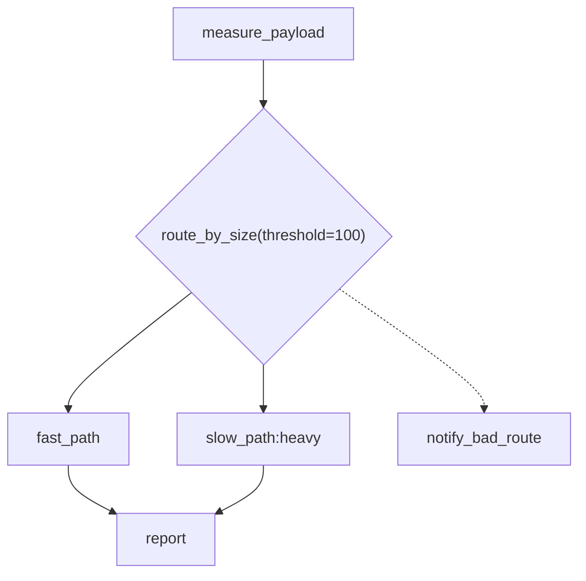
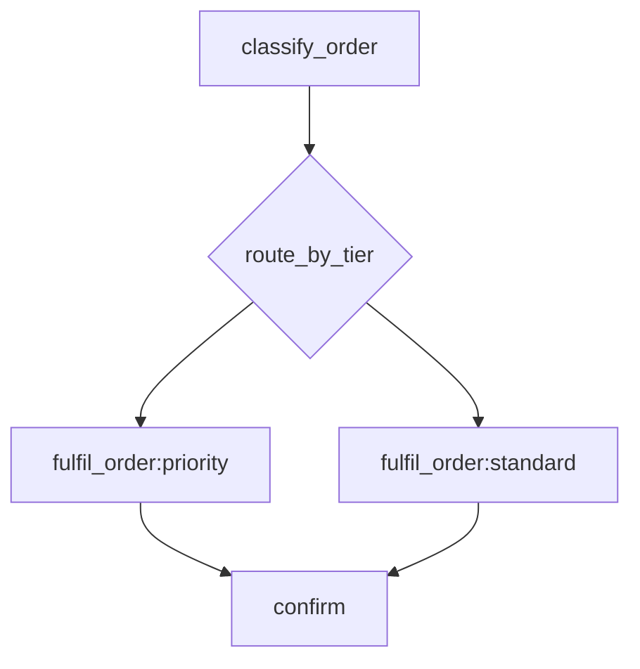

# Router Nodes & the Lane / Queue Split — Design Plan

Status: **implemented** (2026-09-19). Both parts landed; 1893 tests pass, `ruff`/`mypy`
clean. Deviations from the plan as approved are noted inline below with **[impl]**.

- **Part 1** (§2–§5) — split the conflated "queue" concept into **lane**
  (requested, logical) and **queue** (physical). Foundational; independently
  useful even if routers were dropped.
- **Part 2** (§6–§10) — router nodes: mermaid rhombus nodes that pick a lane and
  a task at runtime.

Backwards compatibility with running systems is explicitly out of scope: field
names, request bodies, and SQL tables change in place (§5.4).

---

## 1. Context

### 1.1 The gap routers fill

Jobbers DAGs are static in shape. The only runtime-variable structure is
`DynamicFanOutCallback` (`-->>`), which varies the *number* of identical arms but
never the *identity* of the next task. There is no way to say "look at what this
task produced, then decide which task handles it next." Today that decision has
to be smuggled into a task body, which hides the branch from the diagram, from
`GET /task-status/{id}`, and from the DAG-run view.
`.claude/plans/airflow-comparison.md:114` already names this gap: no conditional
branching primitive versus Airflow's `BranchPythonOperator`.

### 1.2 Why the lane/queue split comes first

Designing routers surfaced a pre-existing modelling bug. `StateManager.resolve_queue`
(`jobbers/state_manager.py:1180`) **discards the requested queue entirely** once a
`RoutingConfig` exists:

```python
routing = await self.get_routing_config(task.name, task.version)
if routing is None:
    return task.queue          # requested queue honoured
match routing.strategy:        # requested queue ignored from here on
    case SINGLE:   final = routing.queues[0]
    case WEIGHTED: final = random.choices(routing.queues, routing.weights)[0]
```

A `SINGLE` config for `fulfil_order@1` collapses `fulfil_order:priority` and
`fulfil_order:standard` — two distinct DAG nodes — onto one queue, with no record
that they ever differed. The same erasure hits every `submit(queue=...)` call.

The root cause is that one word, "queue", is doing two jobs: *what the author
asked for* and *where the work physically runs*. Naming them separately makes the
bug impossible to express, and makes routers describable without contortion.

---

## 2. The distinction

| | **Lane** | **Queue** |
| --- | --- | --- |
| Answers | Which logical destination should handle this work? | Which physical bucket do workers pull from? |
| Declared by | The developer, in the diagram / submit call / router | The operator, via `POST /queues` |
| Varies with | The payload (a router can pick per-item) | Nothing — it is a static resource |
| Carries | A name, nothing else | Concurrency cap, rate limit, role membership |
| Lives in | `DAGTaskSpec.lane`, `Task.lane`, mermaid `name:lane` | `QueueConfig`, `tasks:{queue}` keys, roles, metrics |

`RoutingConfig` is the **only** thing that spans them: it maps
`(task_name, task_version, lane) → queue(s)`.

### 2.1 The identity default

**An unmapped lane resolves to the queue of the same name.** A user who never
installs a routing rule never has to think about the distinction: they create a
queue `heavy`, write `["fetch_data:heavy"]`, and the work runs on queue `heavy`.
The word "lane" is just what that segment is now called.

Lanes are never declared or registered. A lane is valid at submit time if
*either* a routing rule matches it *or* a queue of that name exists (§4.3).
Lanes only become a separate concept the moment someone installs a rule —
`gold-tier` → `[priority-shard-a, priority-shard-b]` — and at that point the
separation is exactly what they want.

---

## 3. Part 1 — lane-scoped routing rules

`RoutingConfig` becomes a **list of rules**, each optionally scoped to the lane
the submitter asked for. A rule with `from_lane=None` is the wildcard and
reproduces today's blanket-override behaviour.

```python
class RoutingRule(BaseModel):
    from_lane: str | None = None       # None = wildcard: matches any lane
    strategy: RoutingStrategy          # SINGLE | WEIGHTED
    queues: list[str]                  # physical targets
    weights: list[float] | None = None


class RoutingConfig(BaseModel):
    task_name: str = ""
    task_version: int = 0
    rules: list[RoutingRule]
```

`resolve_queue(task)` becomes: fetch the one config for `(name, version)`; take
the rule whose `from_lane == task.lane`; else the wildcard rule; else return
`task.lane` unchanged (the §2.1 identity default). Still one round trip,
unchanged storage key, unchanged `TaskRoutingConfigProtocol` signature — it still
returns `RoutingConfig | None`. Keep the method name: it takes a lane and returns
a queue, so `resolve_queue` stays honest.

What this buys:

- **Lane preservation by default.** With no wildcard rule, a diagram's
  `:priority` / `:standard` distinction survives; an operator can re-point one
  lane without touching the other.
- **Composition with `WEIGHTED`.** A router picks the lane; a weighted rule
  scoped to that lane spreads it across shards. Orthogonal concerns, orthogonal
  knobs.
- **The blunt lever survives.** A wildcard rule still overrides everything — the
  drain-this-task-type case — but is now an explicit choice rather than the only
  expressible shape.
- **Two lanes may intentionally share a queue.** Previously indistinguishable
  from the bug; now a legitimate configuration.

### 3.1 Resolution is one-shot

`resolve_queue` is called at first submit (`state_manager.py:1208`) and at
`schedule_new_task` (`state_manager.py:482`). Retries (`queue_retry_task`,
`schedule_retry_task`) and `dispatch_scheduled_task` reuse the already-resolved
`task.queue` and **continue to do so**. A retry should land where the original
attempt was routed; re-rolling a `WEIGHTED` rule per attempt would scatter a
task's retries across shards and make failures harder to trace. `task.lane` is
retained on the task for display and for any future explicit re-resolution, but
nothing re-resolves implicitly.

---

## 4. Part 1 — what gets renamed (and what must not)

### 4.1 Becomes `lane`

| Location | Change |
| --- | --- |
| `jobbers/models/dag.py` | `DAGTaskSpec.queue` → `lane`; `DAGNode(queue=)` → `(lane=)`, `_queue` → `_lane`; `to_task()`/`to_spec()` propagate `lane` |
| `jobbers/models/task.py:58` | **add** `lane: str = "default"`; `queue` stays as the *resolved* physical queue (§4.2) |
| `jobbers/models/task.py:205` | `_build_callback_task` copies `lane=spec.lane` |
| `jobbers/registry.py` | `TaskWrapper.submit/schedule/node(queue=...)` → `lane=...` |
| `jobbers/utils/mermaid_dag.py` | label segment `name[@version][:lane]`; `_LABEL_RE` group and `ParsedLabel.queue` → `lane`; `_spec_label` emits `:lane` |
| `jobbers/models/task_routing.py` | `RoutingRule.from_lane` (§3) |
| `jobbers/models/router.py` | `RouteTo(task, lane=..., version=...)` (§7) |
| `jobbers/task_routes.py` | `POST /submit-task`, `POST /schedule-task` bodies take `lane`; task/DLQ/DAG responses expose **both** `lane` and `queue` |

The mermaid **grammar is unchanged** — `["fetch_data:heavy"]` still parses
identically; only the name of the captured segment changes. Existing diagrams
keep working, which is the §2.1 promise made concrete.

### 4.2 `Task` carries both

`Task.lane` is what was asked for; `Task.queue` is where it went. Today the
former is destroyed at submit time and is unrecoverable — which is precisely why
the collapse bug was invisible. Keeping both means `GET /task-status/{id}` and
the DAG detail view can show `lane priority → queue priority-shard-a`, and an
operator can see at a glance whether a routing rule moved something.

Storage: `Task` is a Pydantic model, so the Redis msgpack and RedisJSON blobs
pick `lane` up from `model_dump` for free. SQL needs a `lane` column on `tasks`
(`jobbers/migrations/schema.py:69`) plus the two row mappings in
`jobbers/adapters/sql/task_state.py:51,87`. The `tasks_by_queue` index
(`schema.py:40`) stays on `queue` — it serves queue-scoped listing, which is a
physical concern.

### 4.3 Validation

`jobbers/validation.py:23` currently checks queue existence only when no routing
config exists. It becomes a lane check:

> A lane is valid if a routing rule matches it, **or** a queue of that name
> exists. When a rule matches, validate that the rule's target queues exist.

Error text should name the concept: `Unknown lane 'gold': no routing rule matches
it and no queue named 'gold' exists.`

### 4.4 Stays `queue` — explicit non-goals

A careless rename would swallow the physical concept. These are all physical and
must not change:

- `QueueConfig`, `max_concurrent`, rate limiting, `period_in_seconds`
- Roles as sets of **queues**; `WORKER_ROLE`; `queue-config-refresh:{role}`
- `POST /queues`, `PUT /queues/{name}`, `DELETE /queues/{name}`, `/roles/*`
- `jobbers/task_generator.py` queue polling, capacity filtering, `TaskQueueProtocol`
- Redis `tasks:{queue}` keys; the `task_queue`, `dead_letter_queue`, `task_schedule` tables
- `TaskPagination.queue` (`models/task.py:379`) — filters by physical queue
- Metric tags `queue` on `time_in_queue`, `tasks_selected`, `cancellations_requested`

New observability instead of renaming: add a `lane` tag alongside the existing
`queue` tag on `tasks_selected` (the `Task` is in hand in `task_generator.py`),
and a `lane_resolutions` counter in `state_manager.resolve_queue` tagged `lane`,
`queue`, `strategy` — so a lane silently resolving somewhere unexpected is
visible without reading config.

### 4.5 Docs and frontend

New `docs/lanes-and-queues.md` carrying §2 and §3 as the canonical explanation,
linked from the others. Then a sweep of every doc that uses "queue" in an
*authoring* context: `mermaid-dag-spec.md`, `dag-composition.md`,
`interacting-with-tasks.md`, `interacting-with-dags.md`,
`task-definition-reference.md`, `quickstart.md`, `resource-management.md`,
`routing-backend-feature-matrix.md`, `faas-overview.md`, and `CLAUDE.md`'s metrics
table and env-var table.

Frontend: `TaskDetail.jsx`, `TaskList.jsx`, `ActiveTasks.jsx` gain a Lane column
next to Queue; `SubmitTask.jsx`'s field becomes Lane with helper text "defaults to
the queue of the same name"; `Queues.jsx` is untouched (physical).

---

## 5. Part 1 — storage changes

Backwards compatibility is out of scope, which removes the awkward part of this
change. `jobbers/migrations/runner.py:37` is `metadata.create_all` only — no
`ALTER` path — so:

1. `tasks` gains a `lane` column (`schema.py:69`).
2. `task_routing` is **replaced** by `task_routing_rules(task_name, task_version,
   from_lane, strategy, queues, weights)`, `from_lane` defaulting to `""` for the
   wildcard (avoids NULL-in-primary-key semantics). Swap it into
   `TABLE_GROUPS["routing"]` (`schema.py:273`).
3. Redis / RedisJSON: the value at `config:routing:{name}:{version}`
   (`adapters/redis/routing_backend.py:175`) is a serialised `RoutingConfig` blob,
   so this is a model change only — no key or index change.

**Existing deployments must drop `task_routing` and `tasks` (or accept null
lanes) before upgrading.** Call this out in the release notes; do not add a
compatibility shim.

---

## 6. Part 2 — router node syntax

### 6.1 Node shape

```text
router_id{"router_name[@version][(key=val, ...)]"}
```

Same label grammar as task nodes (`_LABEL_RE`, `jobbers/utils/mermaid_dag.py:170`)
minus the `:lane` segment — a router does not execute anywhere, so `:lane` on a
router label is a parse error. The reserved `{...}` status suffix still applies
*inside* the quotes for generated diagrams, e.g. `R{"route_by_size{small}"}`
recording the branch actually taken.

### 6.2 Edges

| Edge | Meaning |
| --- | --- |
| `A --> R` | Router runs **once** over `A`'s results. |
| `A -->> R` | Router runs **once per item** in `A.results[items_key]`; each item routed independently. `--"key">> R` works the same way. |
| `R --> B` | `B` is a **candidate**. A router needs ≥ 1. |
| `R -.-> err` | Router's own error callback — fires when the router raises or resolves to no candidate. |

Rejected at parse time, each with a specific `MermaidParseError`:

- `A -.-> R` — error edges must target a task, not a router.
- `R -->> X` / `R --o X` — a router is not a dispatcher or an arm terminal.
- `R1 --> R2` — router chaining is not supported in v1 (candidates must be tasks).
- A router with no incoming edge (routers cannot be DAG roots) or no outgoing `-->`.
- Two candidates of the same router with an identical `(name, version, lane)`
  triple — indistinguishable to the return value. Same task name on a *different
  lane* or version is allowed and is the point of §7.2.

### 6.3 Example — simple branch



`D` has two incoming `-->` edges but both predecessors are alternatives of `R`,
so `D` is wired as a plain `SimpleCallback` on each — not a fan-in.

### 6.4 Example — per-item routing across lanes

```mermaid
flowchart TD
    A["fetch_records"]
    R{"route_by_region"}
    US["process_record:us"]
    EU["process_record:eu"]
    C["aggregate"]

    A -->> R
    R --> US
    R --> EU
    US --o C
    EU --o C
```

Each entry of `A.results["items"]` is routed on its own, so a single fan-out can
spread arms across lanes. The fan-in set for `C` is sized at routing time from
the arms actually spawned, exactly as the existing dynamic fan-out path does.

---

## 7. Part 2 — Python API

New module `jobbers/models/router.py`:

```python
@dataclass(frozen=True)
class RouteTo:
    """Selector over a router's candidate nodes. Must match exactly one."""
    task: str
    lane: str | None = None       # None = don't filter on lane
    version: int | None = None    # None = don't filter on version


class RouterConfig(BaseModel):    # mirrors TaskConfig's shape
    name: str
    version: int
    function: Callable[..., Any]
```

New decorator in `jobbers/registry.py` alongside `register_task`, reusing its
duplicate-registration rules (`registry.py:80-90`):

```python
from jobbers.registry import register_router
from jobbers.models.router import RouteTo

@register_router(name="route_by_size", version=1)
def route_by_size(results: dict[str, Any], *, threshold: int) -> str | RouteTo | None:
    if results["bytes"] < threshold:
        return "fast_path"
    return RouteTo("slow_path")
```

- `results` is the parent task's result dict in simple mode, and the **item
  dict** in per-item mode.
- Remaining keyword arguments come from the node label's `(key=val, ...)`.
- Must be a plain `def`, not `async def` — enforced at registration. It runs
  inline on the worker's event loop, so it must be fast, pure, and do no I/O.
  Documented as a hard contract; not enforced at runtime.
- Backing store `_router_function_map: dict[tuple[str, int], RouterConfig]`, with
  `get_router_config()`, `get_routers()`, and `clear_registry()` extended to clear
  both maps.

**Loading**: routers are picked up by the existing `_load_task_module`
(`jobbers/runners/worker_proc.py:139`, `manager_proc.py:20`) — no runner change is
needed as long as `@register_router` functions live in the same module tree as
the tasks. Document this in the quickstart rather than adding a second CLI flag.

### 7.1 Settled semantics

1. The router returns a **task name**, or `RouteTo(task, lane=..., version=...)`.
2. **Exactly one target, or `None`** to end that path.
3. Two branches of the same router **may converge**; the usual "≥2 incoming
   `-->` edges ⇒ fan-in" promotion is suppressed for mutually-exclusive router
   alternatives.
4. A router that raises, or resolves to no candidate, is a **post-process
   failure**: the parent stays `COMPLETED`, the error is recorded, and the
   router's own `-.->` edge fires.

### 7.2 Same task, different lanes

`RouteTo` is a **selector over the candidate set, not a free-form target** — it
narrows candidates by whichever fields it specifies and must leave exactly one
survivor:



```python
@register_router(name="route_by_tier", version=1)
def route_by_tier(results) -> RouteTo:
    return RouteTo("fulfil_order",
                   lane="priority" if results["tier"] == "gold" else "standard")
```

| Return value | Behaviour |
| --- | --- |
| `None` | Path ends; nothing submitted. |
| `"fulfil_order"` (bare `str`) | Equivalent to `RouteTo("fulfil_order")`. |
| `RouteTo(task)` | Filter by name only. Exactly one match ⇒ selected. **Two or more ⇒ ambiguity error** naming the candidate lanes, so the single-candidate case stays terse while this case is forced to be explicit. |
| `RouteTo(task, lane="priority")` | Filter by name **and** lane. |
| `RouteTo(task, version=2)` | Filter by name **and** version; combine with `lane` as needed. |
| Zero matches | Unknown-candidate error (§9 failure path). |

Because the lane is a *selector*, a router cannot target a lane absent from the
diagram. That is the deliberate trade-off of a selector over a free-form target:
adding a destination is a diagram edit, reviewable in the same diff as the code.
Where that lane physically runs remains the operator's call, via §3 — which is
exactly the separation Part 1 buys.

---

## 8. Part 2 — serialisation model (`jobbers/models/dag.py`)

```python
class RouterSpec(BaseModel):
    id: ULID = Field(default_factory=ULID)   # stable node id for generated diagrams
    router: str
    version: int = 0
    parameters: dict[str, Any] = {}
    candidates: list[DAGTaskSpec] = []


class RouterCallback(BaseModel):
    type: Literal["router"] = "router"
    router: RouterSpec
    error_callback: DAGTaskSpec | None = None
```

- `RouterCallback` joins the `DAGCallback` discriminated union (`dag.py:207`).
- `DAGTaskSpec._remap` (`dag.py:102`) gains a branch remapping the router's id and
  every candidate subtree.
- `collect_fan_in_keys` (`dag.py:213`) **skips** `RouterCallback` candidate
  subtrees, exactly as it already skips `DynamicFanOutCallback.arm_root`. Fan-in
  sets inside the chosen branch are initialised at routing time via the existing
  `init_fan_in`, so unchosen branches never leave orphaned sets behind.
- `DAGNode` gains `add_router_callback(cb)` mirroring `add_fanout_callback`
  (`dag.py:388`), plus handling in `_callbacks_recursive` and
  `fan_in_predecessors`.
- `DynamicFanOutCallback` gains `arm_router: RouterSpec | None = None`, and
  `arm_root` becomes optional, with a model validator requiring exactly one. This
  is the lowest-blast-radius way to express "the arm root is chosen per item"; it
  leaves `collector`, `items_key`, `fan_in_ttl`, and `propagate_fan_in` untouched.

---

## 9. Part 2 — parser, generator, runtime

### 9.1 Parser (`jobbers/utils/mermaid_dag.py`)

**Lexing** — add `_ROUTER_NODE_RE` (`(\w+)\{(?:"…"|'…'|[^{}"']+)\}(?:::\w+)?`) and
collect router labels in `_lex_mermaid` (`mermaid_dag.py:404`). Router node
definitions must be stripped from the line — same `_NODE_RE.sub` trick at
`mermaid_dag.py:435` — *before* `_extract_edges_from_line` runs, or the braces
corrupt edge parsing. Labels parse with the existing `_parse_label`, which already
strips the `{status}` suffix; a non-empty `lane` group raises.

**Parsing** (`parse_mermaid_dag`, `mermaid_dag.py:447`), ordered against the
existing steps:

1. Validate router edge shape (§6.2) and candidate `(name, version, lane)`
   uniqueness.
2. Tag branch membership: BFS from each candidate through `-->` edges, labelling
   reachable nodes with `(router_id, candidate_id)` — mirrors the existing
   `arm_node_ids` fixpoint loop at `mermaid_dag.py:530`.
3. Fan-in suppression: when computing `fan_in_collectors` (`mermaid_dag.py:558`),
   a destination whose predecessors all carry the same `router_id` with distinct
   `candidate_id`s is **not** promoted to fan-in — each predecessor gets a plain
   `.then()`. A destination mixing router-tagged and untagged predecessors is a
   `MermaidParseError`: the pre-populated set cannot be sized when one
   predecessor is conditional. Stated v1 limitation.
4. Build `RouterCallback`s and attach via `add_router_callback`, or — for a `-->>`
   incoming edge — build the `DynamicFanOutCallback` with `arm_router=` instead of
   `arm_root=`. `_find_arm_collector` (`mermaid_dag.py:600`) needs a router hop:
   when the arm root is a router, search from each candidate for the `--o` edge and
   require all candidates to resolve to the same collector.
5. Root detection (`mermaid_dag.py:661`) excludes router ids and candidate-subtree
   ids.

### 9.2 Generator

`_walk` emits `R{"label"}` for a `RouterCallback`, one `-->` per candidate, then
walks each candidate subtree; `_walk_arm` / `_walk_compact_arm` handle `arm_router`
the same way. Add `classDef router fill:#E6D7FF,stroke:#7A4FBF,color:#000` to
`_CLASS_DEFS` (`mermaid_dag.py:221`). Round-tripping a generated diagram back
through `parse_mermaid_dag` must produce an equivalent spec — the primary parser
test. Candidates sharing a task name across lanes need no special handling: node
ids are ULIDs and `_spec_label` (`mermaid_dag.py:692`) already emits the `:lane`
segment whenever it differs from `default`.

### 9.3 Runtime (`jobbers/task_processor.py`)

**Simple mode** — in `post_process` (`task_processor.py:363`), after the
`DynamicFanOutCallback` loop and before `task.has_callbacks()`:

```python
for cb in task.dag_callbacks:
    if isinstance(cb, RouterCallback):
        await self._handle_router(task, cb)
```

`_handle_router` resolves the config via `registry.get_router_config`, calls
`fn(task.results, **cb.router.parameters)`, and:

- `None` → nothing submitted; debug log, `router_decisions` metric with
  `target="<none>"`.
- `str` / `RouteTo` → resolve against `cb.router.candidates` with the §7.2
  selector rules. Use the matched candidate spec as-is, keeping its pre-assigned
  ULID so the live diagram lines up with the submitted task — no `fresh_copy()` is
  needed because a simple-mode router fires at most once. Build the task with
  `parent_ids=[task.id]` the way `Task._build_callback_task` does; `init_fan_in`
  any keys from `collect_fan_in_keys(chosen)`; resolve lane → queue through
  `StateManager.resolve_queue` (§3) and submit via `submit_tasks_batch`.
- Zero or multiple matches, or an exception → raise; the existing
  `_handle_post_process_failure` (`task_processor.py:417`) records it on the task
  and increments `post_process_failures`, and the error-callback submission path
  fires `cb.error_callback` if present.

`Task.generate_callbacks` (`models/task.py:250`) gets a `case RouterCallback():
continue` so the processor owns this path, as it already does for
`DynamicFanOutCallback`. Check `Task.has_callbacks()` still reports `True` for a
router-only node.

**Per-item mode** — `_handle_declarative_fanout` (`task_processor.py:432`) branches
on `cb.arm_router`: for each item it runs the router over the item dict, skips
items returning `None`, `fresh_copy()`s the chosen candidate (each item needs its
own ULIDs) with the item's params shallow-merged, and appends the resulting
`_spec_to_dag_node`. Everything downstream (`DynamicFanOut`, terminal discovery,
fan-in init, grandcollector delegation) is unchanged, because it already operates
on a list of arm `DAGNode`s. A router raising on one item fails the whole fan-out
through the same post-process failure path — partial dispatch is worse than none.

Note arm submission already bypasses queue rate limits and warns
(`task_processor.py:606-615`); a lane resolving to a rate-limited queue inherits
that caveat unchanged.

**Metrics** — new `router_decisions` Counter tagged `router`, `target`, `mode`
(`simple` / `per_item`), added to the `CLAUDE.md` table alongside
`lane_resolutions` from §4.4.

### 9.4 Submission-time validation

`_validate_dag_against_registry` (`jobbers/task_routes.py:398`) walks
`_successors` only today; extend it to descend into `_fanout_callbacks` and router
callbacks, checking `registry.get_router_config(...)` per router and
`get_task_config(...)` per candidate. Unknown router → 400 naming
`@register_router`, matching the existing wording.

Frontend: mermaid renders `{...}` rhombuses natively, so `DagDetail.jsx` and
`CronDags.jsx` need no change beyond the Lane column from §4.5. Confirm
`SubmitDAG.jsx`'s client-side validation passes router nodes through untouched.

---

## 10. Files touched

### Part 1 — lane/queue split

| File | Change |
| --- | --- |
| `jobbers/models/task_routing.py` | `RoutingRule`, `RoutingConfig.rules` |
| `jobbers/models/task.py` | add `lane`; `_build_callback_task` propagates it |
| `jobbers/models/dag.py` | `DAGTaskSpec.lane`, `DAGNode(lane=)` |
| `jobbers/registry.py` | `TaskWrapper.submit/schedule/node(lane=)` |
| `jobbers/state_manager.py` | `resolve_queue` rule matching; `lane_resolutions` metric |
| `jobbers/validation.py` | lane validity check (§4.3) |
| `jobbers/utils/mermaid_dag.py` | `:lane` label segment naming |
| `jobbers/migrations/schema.py` | `tasks.lane`; `task_routing_rules` replaces `task_routing` |
| `jobbers/adapters/sql/{task_state,routing_backend}.py` | lane column mapping; rules table CRUD |
| `jobbers/adapters/{redis,redis_json,static}/routing_backend.py` | rules-shaped config |
| `jobbers/task_routes.py` | `lane` in request bodies; both fields in responses |
| `frontend/src/pages/{TaskDetail,TaskList,ActiveTasks,SubmitTask}.jsx` | Lane column / field |
| `docs/lanes-and-queues.md` + the doc sweep in §4.5 | glossary and terminology |

### Part 2 — routers

| File | Change |
| --- | --- |
| `jobbers/models/router.py` | **new** — `RouteTo`, `RouterConfig` |
| `jobbers/registry.py` | `register_router`, `_router_function_map`, `get_router_config`, `get_routers`, `clear_registry` |
| `jobbers/models/dag.py` | `RouterSpec`, `RouterCallback`, union member, `_remap`, `collect_fan_in_keys`, `add_router_callback`, `DynamicFanOutCallback.arm_router` |
| `jobbers/utils/mermaid_dag.py` | router lexing, edge validation, branch tagging, fan-in suppression, generator |
| `jobbers/task_processor.py` | `_handle_router`, per-item branch, `router_decisions` |
| `jobbers/models/task.py` | `generate_callbacks` skip case |
| `jobbers/task_routes.py` | registry validation walk |
| `docs/mermaid-dag-spec.md`, `docs/dag-composition.md`, `docs/task-definition-reference.md`, `CLAUDE.md` | spec, guide, decorator reference, metrics |

Docs note: `docs/dag-composition.md:111` already uses "Diamond" for the
fan-out/fan-in pattern. Title the new section **"Router nodes"** and avoid
"diamond" as a concept name.

---

## 11. Implementation order

1. `RoutingRule` / `RoutingConfig.rules` + `resolve_queue` rule matching.
2. `Task.lane`, `DAGTaskSpec.lane`, `DAGNode(lane=)`, registry kwargs, mermaid
   label naming — the rename sweep, guided by §4.4's non-goals list.
3. SQL schema (`tasks.lane`, `task_routing_rules`) and the three routing backends.
4. Validation, routes, frontend, `docs/lanes-and-queues.md` and the doc sweep.
5. `models/router.py` + `register_router` + registry tests.
6. `RouterSpec` / `RouterCallback` / `_remap` / `collect_fan_in_keys` + model tests.
7. Parser and generator, including round-trip and every rejection case.
8. `_handle_router` (simple mode).
9. `arm_router` per-item mode.
10. Router validation in routes, metrics, router docs.

Steps 1–4 ship independently. Steps 5–7 are testable without touching the worker.

---

## 12. Known limitations (to document)

| Limitation | Rationale |
| --- | --- |
| Lanes are not declared anywhere | Deliberate: a lane is a free string, valid if a rule matches or a same-named queue exists (§2.1). Typos fail at submit, as they do today. |
| A wildcard routing rule still overrides every lane | Operator override is intentional; visible via `lane_resolutions` (§4.4). |
| Resolution is one-shot; retries do not re-resolve | Keeps a task's attempts on one queue (§3.1). |
| Routers cannot chain (`R1 --> R2`) | Candidates must be tasks; keeps resolution single-hop. |
| Candidate `(name, version, lane)` triples must be unique per router | The return value is a selector; identical triples are indistinguishable. |
| A bare `str` return is ambiguous when several candidates share that name | Return `RouteTo(name, lane=...)`; the error lists the available lanes. |
| A router cannot target a lane absent from the diagram | Deliberate: the diagram stays the complete description of possible outcomes. |
| A node fed by both router branches and ordinary edges is rejected | The pre-populated fan-in set cannot be sized when one predecessor is conditional. |
| Routers must be pure and synchronous | They run inline on the worker's event loop during callback handling. |
| A router cannot select multiple candidates | Settled design decision; conditional broadcast is a future extension. |

---

## 13. Verification

### Part 1

- Extend the parametrized `task_routing_config_adapter` fixture tests
  (`tests/adapters/test_task_routing_config_common.py`, already running against
  `sql` / `redis` / `redis_json`) with lane-scoped rules and wildcard fallback —
  exactly the "add behaviour to the common file" case `CLAUDE.md` calls for.
- `tests/test_state_manager.py:2134` — `resolve_queue` for lane match, wildcard
  fallback, and the §2.1 identity default (no config at all).
- `tests/adapters/test_task_adapter_common.py` — `lane` round-trips across all
  three task-state backends, and survives a save/load cycle distinct from `queue`.
- `tests/test_validation.py` — lane valid via rule, valid via same-named queue,
  invalid via neither.
- `tests/utils/test_mermaid_dag.py` — `:lane` label round-trip (an existing
  diagram must parse identically post-rename).

### Part 2

- `tests/utils/test_mermaid_dag.py` — parse simple router, per-item router,
  converging branches (asserting `SimpleCallback`, not `FanInCallback`), generator
  round-trip, and one test per rejection case in §6.2 and §9.1.3.
- `tests/test_registry.py` — `register_router` duplicate/re-registration rules,
  `async def` rejection, `clear_registry` clearing both maps.
- `tests/models/` — `_remap` over a `RouterCallback` tree; `collect_fan_in_keys`
  skipping candidate subtrees.
- `tests/test_task_processor.py` — `DummyTaskAdapter` orchestration tests for
  branch selection, `None`, unknown-name → error callback + `post_process_failures`,
  and the §7.2 selector matrix: same task name on two lanes resolved by
  `RouteTo(..., lane=...)`; a bare `str` against those candidates raising the
  ambiguity error.
- **Real-backend tests are mandatory here** per `CLAUDE.md`'s test-architecture
  rule — routing touches fan-in sizing and dispatch. Add `state_manager_real_ta`
  tests (real Lua scripts via FakeRedis) for (a) the converging-branch case: the
  collector runs exactly once and no fan-in set is left pending; and (b) per-item
  routing spawning arms across two lanes whose shared fan-in set still closes
  exactly once.
- `tests/test_task_routes.py` — `POST /submit-dag` with an unregistered router
  returns 400; with a registered one returns root ids and a `GET` round-trips the
  diagram.

**Quality gates**: `pytest --cov=jobbers --cov-report=term-missing`,
`ruff check .`, `ruff format --check .`, `mypy jobbers`.

**End-to-end**: `docker compose up`; register `route_by_tier` and `fulfil_order`;
`POST /submit-dag` with the §7.2 diagram and confirm via `GET /dag-runs/{id}` that
only the selected candidate ran, with `lane=priority, queue=priority`. Then
`PUT /task-routing/fulfil_order/1` with a rule `from_lane="priority" → ["priority-v2"]`
and re-submit: the task should show `lane=priority, queue=priority-v2` while the
`standard` lane is untouched.

---

## Implementation notes

Things that turned out differently from the design, recorded for anyone reading
this plan against the code:

- **[impl] `RoutingConfig.from_row` became `from_rows`.** A config is now several
  rows (one per rule), so the single-row constructor could not survive. The SQL
  adapter reads all rows for a `(task_name, task_version)` and `save_routing_config`
  replaces the whole set rather than upserting one row.
- **[impl] The mixed-predecessor rule needed a third case.** The plan described
  "all predecessors tagged ⇒ alternatives" and "some tagged ⇒ error". A fan-in
  *inside* one branch has every predecessor tagged with the **same** branch, and
  those all run — an ordinary fan-in. `_classify_predecessors` distinguishes
  `fan_in` / `alternatives` / `mixed` accordingly.
- **[impl] Router lexing must run after task-node stripping.** A task label may
  carry a reserved `{STATUS}` suffix (`fetch_data:heavy{COMPLETED}`), which the
  rhombus pattern would otherwise read as a router named after the lane. The
  lexer now strips `_NODE_RE` matches before scanning `_ROUTER_NODE_RE`.
- **[impl] Fan-out arm collectors keep their existing fresh-copy behaviour.**
  `_handle_dynamic_fanout` clones the collector template, so the submitted
  collector's ULID is not `cb.collector.id` and it is pre-saved rather than
  submitted (so absent from the run's task index until it fires). Tests locate it
  through an arm's `FanInCallback`, not the template id.
- **[impl] Arm and collector tasks now resolve their own lanes.** They are
  submitted via `submit_tasks_batch`, which does not resolve queues, so
  `_handle_dynamic_fanout` resolves them explicitly. Same for the cron dispatch
  path, which stages its submit directly. Without this the lane/queue split would
  have silently sent every arm to `default`.
- **[impl] `RouterError`** (in `task_processor.py`) is the concrete exception for
  an unregistered router, a router that raised, or a selection matching zero or
  several candidates. It propagates into the existing
  `_handle_post_process_failure`, as the plan specified.
- **[impl] Router parser/generator tests live in `tests/utils/test_mermaid_router.py`**
  and runtime tests in `tests/test_router_processing.py`, rather than being
  appended to the existing files — the router surface was large enough to warrant
  its own files.
