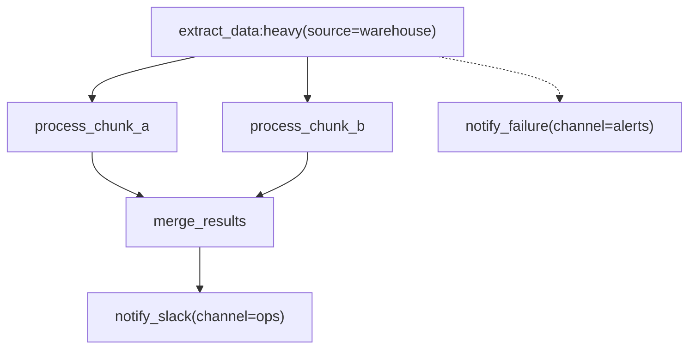

# Jobbers

Jobbers is a distributed background task execution framework for Python. It offloads work from your application's request cycle to a pool of workers, and keeps full state on every task so that failures, retries, and slow jobs are surfaced rather than silently lost.

---

## Why stateful execution?

Most task queues are fire-and-forget: once a task is enqueued, the framework delivers it to a worker and moves on. If the worker crashes mid-task, the record is gone. If a task silently hangs, nothing notices. Any visibility beyond that requires building custom observability on top.

Jobbers takes the opposite approach: **every task has a persistent state record** that is updated at each transition. The current state of a task is always stored and queryable:

| State | Meaning |
| --- | --- |
| `unsubmitted` | Initial task state; has not been queued or scheduled. |
| `submitted` | Waiting in the queue |
| `started` | Actively executing on a worker |
| `completed` | Finished successfully |
| `failed` | Exhausted all retries or raised an unexpected error |
| `scheduled` | Waiting for a future time (delayed retry or future run) |
| `cancelled` | User-initiated cancellation |
| `stalled` | Heartbeat went silent — possible hang |
| `dropped` | No registered handler on this worker |

Because state is durable, you can always query what is running, what failed, and why — without log scraping.

---

## Reliability

### Retries and backoff

Tasks declare their retry policy at registration time:

```python
@register_task(
    name="call_external_api",
    max_retries=5,
    retry_delay=10,
    backoff_strategy=BackoffStrategy.EXPONENTIAL_JITTER,
    max_retry_delay=300,
    expected_exceptions=(httpx.TimeoutException, ConnectionError),
)
async def call_external_api(**kwargs): ...
```

Only exceptions listed in `expected_exceptions` trigger a retry. Any other exception immediately transitions the task to `failed`, making bugs and unrecoverable errors distinct from transient failures. Backoff strategies range from `CONSTANT` to `EXPONENTIAL_JITTER` (randomized to avoid thundering-herd on retry storms). See [task definition reference](docs/task-definition-reference.md#retry-behaviour) for the full retry and backoff reference.

### Dead letter queue

Tasks configured with `dead_letter_policy=SAVE` are preserved in the DLQ when they exhaust their retries. From there they can be inspected (full error history, input parameters) and bulk-resubmitted once the underlying issue is fixed. Tasks without this policy are simply marked `failed` and discarded.

### Heartbeat monitoring and stall detection

Long-running tasks call `await task.heartbeat()` periodically. The Cleaner process checks heartbeat timestamps on a cron schedule and marks any task whose heartbeat is older than `max_heartbeat_interval` as `stalled`. This catches hung tasks that would otherwise hold concurrency slots indefinitely without any timeout mechanism.

### Graceful shutdown

Workers respond to SIGTERM according to a per-task `on_shutdown` policy (see [task definition reference](docs/task-definition-reference.md#shutdown-behavior)):

| Policy | Behaviour |
| --- | --- |
| `STOP` | Interrupt at next `await`; task moves to `stalled` |
| `RESUBMIT` | Re-enqueue for another worker to pick up |
| `CONTINUE` | Shield with `asyncio.shield()`; finish before exiting |

---

## Task composition: DAGs

Individual tasks can be composed into directed acyclic graphs (DAGs) where results flow forward through the graph and each node waits for its predecessors to complete before starting.

Graphs are authored and exchanged as **Mermaid flowcharts**. The same format is used for submission, cron scheduling, and live status monitoring — the system renders task state back into the diagram with colour-coded nodes, so a diagram copied from the UI can be resubmitted without modification. See [DAG patterns](docs/dag-composition.md) for the Python `DAGNode` API and [Mermaid DAG spec](docs/mermaid-dag-spec.md) for the full diagram grammar.



`-->` is a success callback. `-.->` is an error callback — it fires if the source task fails permanently. Fan-in is inferred automatically: when two or more edges point at the same node, that node becomes a collector that waits for all predecessors.

Diagrams are submitted via the REST API:

```bash
# Ad-hoc DAG
curl -X POST http://localhost:8000/submit-dag \
  -H "Content-Type: application/json" \
  -d '{"diagram": "flowchart TD\n    A[\"extract\"] --> B[\"transform\"] --> C[\"load\"]"}'

# Live status — dag_diagram field on the response is the same format with status annotations
curl http://localhost:8000/task-status/01JXXX...
```

### Patterns

Chains, fan-out, fan-in, and diamond (fan-out followed by fan-in) are all expressed naturally through the edge structure. A task can also produce a **dynamic fan-out** at runtime — returning a variable number of child tasks based on its output — using the Python `DAGNode` / `DynamicFanOut` API when the branch count is not known at authoring time. Static and dynamic patterns compose freely within the same graph.

> TODO: Design syntax to support dynamic fan-out

Downstream tasks receive upstream results via `parent_results()` inside the function body, or via an injected `parent_results` parameter when `inject_parent_results=True` is set on the edge. A single-parent node receives a `dict`; a fan-in collector receives a `list[dict]`.

### Cron DAGs

A cron entry fires a DAG on a recurring schedule. The same Mermaid diagram format is used:

```bash
curl -X POST http://localhost:8000/cron-dags \
  -H "Content-Type: application/json" \
  -d '{
    "name": "nightly_etl",
    "cron_expr": "0 2 * * *",
    "diagram": "flowchart TD\n    A[\"extract:heavy\"] --> B[\"transform\"] --> C[\"load\"]",
    "concurrency_policy": "skip_if_running"
  }'
```

`skip_if_running` prevents overlapping runs if the previous fire is still active. Entries can be paused (`enabled: false`) without deleting them — the schedule is preserved and resumes when re-enabled. See [cron DAGs](docs/trigger-tasks.md#cron-configuration) for the full API reference and concurrency policy options.

---

## Observability

All four Jobbers processes — Manager, Worker, Cleaner, and Scheduler — emit structured metrics via **OpenTelemetry OTLP** without requiring any instrumentation code in task functions.

### Key metrics

| Metric | What it tells you |
| --- | --- |
| `tasks_processed{status=...}` | Throughput by outcome (completed, failed, stalled, dropped) |
| `task_execution_time` | How long tasks actually run |
| `task_end_to_end_latency` | Total time from submission to completion |
| `time_in_queue` | Queue depth / worker capacity pressure |
| `tasks_retried` | Upstream flakiness; tune retry policy or back-pressure |
| `tasks_dead_lettered` | Permanent failures reaching the DLQ |
| `queue_config_refreshes` | Live config reloads on workers |
| `refresh_lag_ms` | How quickly workers pick up routing changes |

### Derived signals

- `time_in_queue` rising → workers are undersized or queues need splitting
- `tasks_processed{status="dropped"}` > 0 → workers are running a stale task version
- `tasks_retried` high → expected-exception policy may be too broad, or upstream dependency is flaky
- `refresh_lag_ms` high → a worker may be stalled or not subscribed to the refresh pub/sub channel

The included Docker Compose stack wires all processes to an OpenTelemetry Collector, which forwards to OpenObserve. Any OTLP-compatible backend works by pointing the `OTEL_EXPORTER_OTLP_*` environment variables at a different endpoint. See the [operations guide](docs/operations.md) for the full metrics reference and setup instructions.

### Admin UI and API

A React admin UI (port 3000) provides a live view of active tasks, the retry delay queue, the dead letter queue, and queue/role configuration. All data is available through the Manager REST API at port 8000 (`/task-list`, `/active-tasks`, `/scheduled-tasks`, `/dead-letter-queue`).

---

## Resource management and task routing

### Layered concurrency controls

A task must clear three independent layers before execution begins:

```text
Submission time
  └─ Per-queue rate limit (atomic Redis Lua script — no races)

Fetch time
  └─ Worker semaphore (WORKER_CONCURRENT_TASKS)
        └─ Per-queue concurrency cap — keeps a busy queue from monopolizing worker slots (max_concurrent)

Execution time
  └─ Per-task-type timeout
        └─ Heartbeat monitoring by Cleaner
```

Each layer is independently tunable without restarting workers. See [resource management](docs/resource-management.md) for configuration details and traffic direction patterns.

### Queues and roles

**Queues** are named work buckets. Each has:

- `max_concurrent` — how many tasks from this queue can run simultaneously per worker
- Optional rate limit (`rate_numerator / rate_denominator / rate_period`) — enforced atomically at submission via a Lua sorted-set script

**Roles** are named sets of queues assigned to a worker via `WORKER_ROLE`. A worker consumes exactly the queues in its role. Roles can be reconfigured at runtime — workers detect changes via a `refresh_tag` mechanism without restarting.

### Live traffic direction

Queue assignments can be changed without any worker restart:

- **Drain a queue** — remove it from a role; workers stop polling it within one refresh cycle
- **Shift capacity** — add a queue to a role to redirect workers immediately
- **Isolate a task type** — create a dedicated queue and role, deploy workers with `WORKER_ROLE=<role>`
- **Emergency throttle** — update `max_concurrent` or add a rate limit on a live queue

Workers subscribe to a Redis pub/sub channel per role for near-instant notification in addition to polling.

---

## The Cleaner

The Cleaner is a one-shot process designed to be run on a cron schedule. It serves two purposes:

**Issue detection:**

- Scans heartbeat timestamps and marks any task that has gone silent as `stalled`
- This is the only component that can detect a hung task not caught by SIGTERM

**Memory pressure management:**

- Prunes stored state for terminal tasks older than a configurable age
- Removes expired dead letter queue entries
- Cleans up stale rate-limiter sorted set entries
- Compensates for partial writes in saga mode (when using non-atomic backends)

```cron
# Every 5 minutes: stall detection
*/5 * * * * jobbers_cleaner --stale-time 300

# Nightly: prune old state and DLQ
0 2 * * * jobbers_cleaner --completed-task-age 86400 --dlq-age 2592000 --rate-limit-age 604800
```

Tasks registered with `cleanup_on` have their state deleted automatically by the worker when they reach a matching terminal status:

```python
@register_task(
    name="my_task",
    cleanup_on=frozenset({TaskStatus.COMPLETED, TaskStatus.CANCELLED}),
)
async def my_task(**kwargs): ...
```

For DAG tasks, cleanup is deferred until all tasks in the run are terminal, so no sibling loses access to its parent's results prematurely.

Tasks that do not configure `cleanup_on`, or that reach a status not in the set, still accumulate state in Redis. The Cleaner is essential for those tasks, and remains the only mechanism for stall detection and rate-limiter cleanup regardless of per-task configuration. See the [operations guide](docs/operations.md#cleaner) for the full argument reference and recommended cron setup.

---

## Storage backends

Jobbers uses pluggable adapters for every storage concern. Each dimension is independently configurable:

| Dimension | Options |
| --- | --- |
| Task state + submit | Redis (JSON/RediSearch), Redis (msgpack), SQL |
| Dead letter queue | Redis (JSON/RediSearch), Redis (sorted sets), SQL |
| Task scheduler | Redis, SQL |
| Cron DAG scheduler | Redis, SQL, Static (in-memory) |
| Routing backend | Redis, Redis JSON, SQL, Static (in-memory) |

All adapters implement the same `@runtime_checkable Protocol` interfaces defined in `protocols.py`. `StateManager` selects between **atomic pipeline mode** (Redis MULTI/EXEC — all related writes committed or rolled back together) and **saga mode** (sequential writes with Cleaner compensation) based on which protocols the configured adapters implement.

### Choosing an adapter

| Scenario | Recommendation |
| --- | --- |
| Default — Redis Stack available | `TASK_BACKEND=redis_json` (default): server-side filtered queries, exact pagination, sorted DLQ results |
| Plain Redis (no modules) | `TASK_BACKEND=redis`: same worker hot-path performance, smaller payloads, Python-side filtering |
| No Redis / SQL-only infra | `TASK_BACKEND=sql`: full filtered queries via SQL |
| Fixed queue topology at deploy time | `ROUTING_BACKEND=static`: load config from file or env vars, no database required |
| Cron schedules defined in code | `CRON_DAG_SCHEDULER_BACKEND=static`: no cron state database, resets on restart |

The worker hot path (enqueue, dequeue, state transitions) is equivalent across Redis adapters — both use atomic Lua scripts for submission and `BZPOPMIN` for dequeue. Adapter differences affect API query performance and operational features, not task throughput. See [adapter selection](docs/adapter-selection.md) for a detailed comparison and guidance on mixed-backend configurations.

---

## The four processes

| Process | Role |
| --- | --- |
| **Manager** | FastAPI server (port 8000): task submission, status queries, cancellation, DLQ, queue/role CRUD |
| **Worker** | Pulls tasks from queues and executes them; handles retries, heartbeats, cancellation, shutdown policy |
| **Cleaner** | One-shot maintenance: stall detection, state pruning, rate-limiter cleanup, saga compensation |
| **Scheduler** | Long-running: re-enqueues delayed retries and fires cron DAG runs when due |

All four are independent processes that coordinate only through Redis and SQL. Workers and Manager instances scale horizontally without configuration changes. See the [operations guide](docs/operations.md) for installation, environment variables, and Docker Compose setup.
