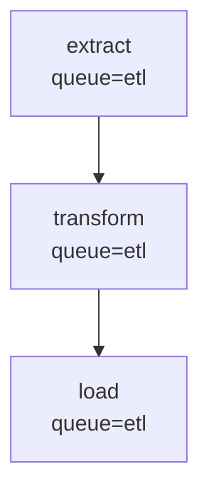

# Jobbers vs Celery: Feature Comparison

This document provides a detailed comparison of Jobbers and Celery across the dimensions most relevant to production task queue deployments. It is intended as a deep-dive companion to the quick-reference table in the [README](../README.md).

---

## 1. Philosophy and Design Goals

**Celery** is the de-facto standard Python task queue. It is broker-agnostic, supports sync and async workloads, and has a large ecosystem of plugins and integrations. It optimizes for breadth: many brokers, many concurrency models, many result backends.

**Jobbers** is opinionated and narrowly focused. It assumes Redis, assumes asyncio, and trades broker flexibility for depth in the areas that matter most at runtime: observable task state, fine-grained traffic control, and safe recovery from failures. The result is fewer knobs to configure upfront and more leverage over a running system.

---

## 2. Getting Started

**Celery:**

```bash
pip install celery[redis]
```

```python
from celery import Celery
app = Celery("tasks", broker="redis://localhost:6379/0")

@app.task
def add(x, y):
    return x + y
```

One process to start. Familiar decorator. Minimal infrastructure required.

**Jobbers:**

```bash
pip install -e ".[test]"
jobbers_migrate                        # creates SQL tables for queue/role config
jobbers_manager my_tasks               # FastAPI server on :8000
jobbers_worker my_tasks                # task executor
jobbers_cleaner                        # stall detection + state pruning (cron-friendly)
jobbers_scheduler                      # retry delay re-queuing
```

```python
from jobbers.registry import register_task

@register_task(name="add", version=1)
async def add(x, y):
    return {"result": x + y}
```

Four separate processes (separate containers in production). The Docker Compose file in the repo starts the full stack including Redis, an OTEL collector, and the OpenObserve UI. More infrastructure to stand up, but the system is observable from the first task.

**Verdict:** Celery wins for initial simplicity. Jobbers' setup overhead pays off quickly in production.

---

## 3. Async Python Support

**Celery:** `async def` tasks are supported but require the `asyncio` worker pool (`--pool=gevent` or `-P threads`), which is not the default. Async support was added incrementally and is not deeply integrated into the task lifecycle.

**Jobbers:** asyncio is the only execution model. Every task function is `async def`. Worker concurrency is managed via `asyncio.Semaphore`, so thousands of I/O-bound tasks can be in flight on a single worker without thread overhead. Task lifecycle events (heartbeats, cancellation signals, timeout wrappers) are all native asyncio.

**Verdict:** Jobbers wins for async-heavy workloads. Celery is a better fit if you have legacy sync tasks you cannot rewrite.

---

## 4. Monitoring and Observability

**Celery:** [Flower](https://flower.readthedocs.io/) provides a web UI for inspecting workers and tasks. No built-in OpenTelemetry support; third-party integrations (e.g., `celery-opentelemetry`) are available but not maintained by the core team.

**Jobbers:**

- **OpenTelemetry** traces, metrics, and logs are emitted out of the box via OTLP. No instrumentation code needed in task functions.
- **Emitted metrics:**

  | Metric | Type | Labels |
  | --- | --- | --- |
  | `tasks_processed` | Counter | queue, task, status |
  | `tasks_retried` | Counter | queue, task, version |
  | `execution_time` | Histogram (ms) | queue, task, status |
  | `end_to_end_latency` | Histogram (ms) | queue, task, status |
  | `time_in_queue` | Histogram | queue, task |
  | `tasks_selected` | Counter | queue |
  | `scheduled_task_dispatch_latency_seconds` | Histogram | — |
  | `tasks_dead_lettered` | Counter | — |

- **React admin UI** provides live task inspection, DLQ management, and queue/role configuration.
- Docker Compose includes an OpenObserve instance pre-wired to the OTEL collector.

**Verdict:** Jobbers wins. First-class OTEL without any additional setup is a significant operational advantage.

---

## 5. Retry Policies

**Celery:**

```python
@app.task(bind=True, max_retries=5, default_retry_delay=10)
def my_task(self, x):
    try:
        ...
    except SomeError as e:
        raise self.retry(exc=e, countdown=30, max_retries=3)
```

Retries require explicit `self.retry()` calls inside the task body. Backoff can be configured via `retry_backoff=True` and `retry_backoff_max`. Retry jitter is available.

**Jobbers:**

```python
@register_task(
    name="my_task",
    version=1,
    max_retries=5,
    retry_delay=10,
    backoff_strategy=BackoffStrategy.EXPONENTIAL,
    max_retry_delay=3600,
)
async def my_task(**kwargs):
    ...  # just raise — retry logic is automatic
```

Retry behaviour is entirely declared in the decorator. The task body raises an exception and the framework handles the rest. Available strategies:

| Strategy | Computed Delay |
| --- | --- |
| `CONSTANT` | `retry_delay` |
| `LINEAR` | `retry_delay × attempt` |
| `EXPONENTIAL` | `retry_delay × 2^attempt` |
| `EXPONENTIAL_JITTER` | `uniform(0, retry_delay × 2^attempt)` |

All results are capped at `max_retry_delay`. When a delay is configured, the task transitions to `SCHEDULED` and the Scheduler process re-enqueues it when it comes due, freeing the worker immediately.

**Verdict:** Comparable feature sets. Jobbers' declarative approach keeps retry logic out of task bodies; Celery's explicit `self.retry()` offers more conditional control.

---

## 6. Dead Letter Queues

**Celery:** No built-in DLQ. The common pattern is to catch all exceptions in a task body or use a `task_failure` signal to manually publish to a secondary queue. Management and resubmission are left entirely to the user.

**Jobbers:** First-class DLQ support via `DeadLetterPolicy.SAVE`. When a task exhausts its retries it is automatically written to the DLQ with its full history. The DLQ is queryable and manageable via API:

| Endpoint | Purpose |
| --- | --- |
| `GET /dead-letter-queue` | List DLQ entries (filter by task name, queue, date range) |
| `GET /dead-letter-queue/{id}` | Inspect a single entry |
| `POST /dead-letter-queue/resubmit` | Bulk resubmit by task name with optional retry count reset |
| `DELETE /dead-letter-queue/{id}` | Remove a single entry |

Two DLQ implementations are available: `RedisDeadQueue` (plain Redis sorted set) and `RedisJSONDeadQueue` (Redis Stack JSON, supports richer filtering).

**Verdict:** Jobbers wins. A production-ready DLQ with a management API is significantly more useful than building one from signals.

---

## 7. Traffic Management

**Celery:** Worker concurrency is set at startup (`-c N`). Per-task rate limiting is available (`rate_limit="10/m"`). Task routing to specific queues is supported via `task_routes`. Changing any of these requires redeploying workers.

**Jobbers:** Four composable controls, all adjustable at runtime without worker restarts. For full details see [docs/resource-management.md](resource-management.md).

| Control | Scope | Live update? |
| --- | --- | --- |
| `WORKER_CONCURRENT_TASKS` | Per worker process | No (env var) |
| Queue `max_concurrent` | Per queue, per worker | Yes — `PUT /queues/{name}` |
| Queue rate limit | Per queue, at submission | Yes — `PUT /queues/{name}` |
| Role → queue mapping | Which queues a worker polls | Yes — `PUT /roles/{name}` |

Role and queue changes are detected within `config_ttl` seconds (default 60 s) by all workers running that role, with no restarts required. This enables live traffic patterns such as:

- **Drain a queue:** remove it from a role; workers stop polling it within one TTL window; in-flight tasks complete normally.
- **Emergency throttle:** add or tighten a rate limit on a queue; takes effect on the next submission cycle.
- **Isolate a workload:** create a new queue + role; deploy dedicated workers with `WORKER_ROLE=new-role`.

**Verdict:** Jobbers wins on operational flexibility. Celery requires worker restarts to change concurrency or routing.

---

## 8. Task Composition

**Celery** provides a full canvas API for building workflows:

```python
from celery import chain, group, chord

# Chain: output of each task feeds the next
result = chain(add.s(2, 2), multiply.s(3))()

# Group: fan-out, run in parallel
result = group(add.s(i, i) for i in range(10))()

# Chord: group + callback when all complete
result = chord(group(add.s(i, i) for i in range(10)))(sum_results.s())
```

Also available: `starmap`, `chunks`, nested workflows.

**Jobbers** provides a DAG API for describing task dependency graphs. Two approaches can be freely mixed. For full details and examples see [docs/dags.md](dags.md).

**Mermaid as the DAG format** — Jobbers uses standard [Mermaid](https://mermaid.js.org/) `flowchart TD` diagrams as the serialisation format for all DAGs. This means DAGs can be defined as plain text, submitted via the API, and rendered natively in GitHub, VS Code, Obsidian, and any Mermaid-compatible tool without additional tooling. The API accepts Mermaid text as input and returns it as output — including in task status responses.



```bash
# Submit an ad-hoc DAG directly via the API
curl -X POST /dags -d '{"diagram": "flowchart TD\n  A[\"extract\"]\n  B[\"transform\"]\n  A --> B"}'

# Retrieve a running DAG — response includes dag_diagram for immediate rendering
GET /task-status/{id}  →  { ..., "dag_diagram": "flowchart TD\n  ..." }
```

**Static DAGs** — the full graph is described before submission using `DAGNode` and `StateManager.submit_dag`. All task IDs are pre-assigned at construction time.

```python
from jobbers.models.dag import DAGNode

# Chain: extract → transform → load
extract   = DAGNode("extract",   version=1, parameters={"source_url": url})
transform = DAGNode("transform", version=1)
load      = DAGNode("load",      version=1)
extract.then(transform)
transform.then(load)
await state_manager.submit_dag(extract)

# Fan-out: one root triggers parallel branches
root = DAGNode("split_dataset", version=1)
root.then(
    DAGNode("process_region", version=1, parameters={"region": "A"}),
    DAGNode("process_region", version=1, parameters={"region": "B"}),
)
await state_manager.submit_dag(root)

# Fan-in (chord equivalent): collector runs after all predecessors complete
branch_a  = DAGNode("score_model", version=1, parameters={"model_id": "a"})
branch_b  = DAGNode("score_model", version=1, parameters={"model_id": "b"})
collector = DAGNode("pick_best",   version=1)
DAGNode.merge(branch_a, branch_b, into=collector)
await state_manager.submit_dag(branch_a, branch_b)
```

When the registered task wrappers are in scope, nodes can be created inline using `.node()` — name and version are inferred from the wrapper, similar to Celery's `.s()` signatures:

```python
# Chain using wrapper style
e = extract.node(source_url=url)
t = transform.node()
e.then(t)
t.then(load.node())
await state_manager.submit_dag(e)
```

**Dynamic DAGs** — a task function returns a `TaskResult` with a `DynamicFanOut` when the number of children can only be determined at runtime (equivalent to Celery's `starmap`/`chunks`).

```python
from jobbers.models.dag import DAGNode, DynamicFanOut, TaskResult

@register_task(name="fetch_records", version=1)
async def fetch_records(**kwargs):
    records = await db.query("SELECT id FROM items WHERE status = 'pending'")
    children = [
        DAGNode("process_record", version=1, parameters={"record_id": r["id"]})
        for r in records
    ]
    return TaskResult(
        results={"total": len(records)},
        fanout=DynamicFanOut(children=children, collector=DAGNode("records_done", version=1)),
    )
```

The framework wires the fan-in and submits all children automatically. Static and dynamic patterns can be nested arbitrarily.

**Error callbacks** — pass `on_error` to `then()` or `merge()` to submit a task when a node fails permanently. The error task receives the failing task's ID as its parent so it can inspect results and errors:

```python
err = DAGNode("notify_failure", parameters={"channel": "ops"})

# Chain error callback: fires if "transform" fails
extract.then(transform, on_error=err)

# Fan-in error callback: fires if any predecessor of "collector" fails
DAGNode.merge(branch_a, branch_b, into=collector, on_error=err)
```

Error callbacks fire only when a task reaches `FAILED` status (retries exhausted or an unexpected exception). Tasks that end in `CANCELLED`, `STALLED`, or `DROPPED` do **not** trigger error callbacks, and neither do tasks that are still being retried.

**Key differences from Celery canvas:**

| Dimension | Celery | Jobbers |
| --- | --- | --- |
| Graph shape | Single composable expression (define + submit inline) | `DAGNode` graph or Mermaid text submitted separately; `.node()` wrappers allow call-site construction |
| Graph format | Python API only | Mermaid text (portable, renderable, API-submittable) |
| Result passing | Automatic argument injection (`self.s()`) | Manual `await get_current_task().parent_results()` **or** automatic injection via `inject_parent_results=True` on `then()`/`merge()` |
| Fan-in (chord) | `chord(group)(callback)` | `DAGNode.merge(..., into=collector)` or `DynamicFanOut` |
| Runtime fan-out | `group(task.s(x) for x in items)` | `TaskResult(fanout=DynamicFanOut(...))` return value |
| Error routing | `link_error` on any signature | `on_error=` on `then()` / `merge()` |
| DAG introspection | No standard visual format | `dag_diagram` field in task status: render anywhere Mermaid is supported |

**Verdict:** Jobbers edges ahead for DAG-heavy workloads. The Mermaid format makes DAG authoring, sharing, and debugging significantly more ergonomic — a graph can be pasted into a GitHub comment or a wiki page and rendered immediately. Both frameworks support call-site node construction (Celery via `.s()`, Jobbers via `.node()`); the real difference is that Celery's canvas is a single composable expression that defines and submits in one call, while Jobbers separates graph construction from `submit_dag`. Jobbers supports both explicit result fetching (`await get_current_task().parent_results()`) and automatic injection (`inject_parent_results=True` on `then()`/`merge()`), so the data-flow style is a matter of preference.

---

## 9. Risk of Data Loss

### Graceful restart (SIGTERM)

**Celery** finishes running tasks before exiting (warm shutdown). Queued tasks remain in the broker.

**Jobbers** applies a per-task shutdown policy:

| Policy | Behaviour |
| --- | --- |
| `STOP` | Cancel immediately; task moves to `STALLED` for later resubmission |
| `RESUBMIT` | Re-enqueue as `UNSUBMITTED`; another worker picks it up |
| `CONTINUE` | Shield with `asyncio.shield()`; task runs to completion before the worker exits |

Both frameworks handle graceful restarts safely.

### Hard crash (no SIGTERM)

**Celery with Redis broker:** Tasks acknowledged on dequeue by default. A worker crash loses in-flight tasks unless `acks_late=True` is set, which re-delivers unacknowledged tasks after a visibility timeout.

**Jobbers:** Task state is written to Redis as `STARTED` immediately when execution begins. If a worker crashes without SIGTERM, the Cleaner process detects the missing heartbeat and marks the task `STALLED`. Stalled tasks can be manually resubmitted or (if `DeadLetterPolicy.SAVE`) are accessible via the DLQ API. The detection window is `max_heartbeat_interval` + Cleaner poll interval, which can be minutes.

### Broker durability

**Celery** supports durable message delivery when using RabbitMQ with persistent messages and durable queues — tasks survive broker restarts without data loss.

**Jobbers** is Redis-only. Durability depends entirely on Redis persistence configuration (AOF vs RDB). A Redis crash before AOF fsync can lose recently submitted tasks. This is a fundamental constraint of the Redis-only architecture.

**Verdict:** Draw for graceful restarts. Celery with RabbitMQ offers stronger durability guarantees than Jobbers for hard crashes and broker failures.

---

## 10. Broker and Backend Flexibility

**Celery:**

- **Brokers:** Redis, RabbitMQ, Amazon SQS, Kafka (via `celery-kafka`), Azure Service Bus
- **Result backends:** Redis, RabbitMQ, SQLAlchemy (any SQL DB), Django ORM, MongoDB, Cassandra, Elasticsearch, S3

**Jobbers:**

- **Broker:** Redis only
- **Task adapters** (`TASK_ADAPTER`): how task state is stored in Redis
  - `RedisTaskState` / `RedisTaskSubmit` — plain Redis + msgpack; works with any standard Redis instance
  - `RedisJSONTaskState` / `RedisJSONTaskSubmit` — Redis Stack with JSON module + RediSearch; enables richer query filtering
- **Dead letter adapters:** `RedisDeadQueue` (plain Redis sorted set) or `RedisJSONDeadQueue` (Redis Stack JSON; supports richer DLQ filtering). Selection follows the task adapter.
- **Routing backends** (`ROUTING_BACKEND`): where queue, role, and task-routing config is stored

  | Backend | Storage | SQL? | Redis Stack? | Dynamic CRUD? |
  | --- | --- | --- | --- | --- |
  | `static` | In-process memory | No | No | No — config from file/env, read-only |
  | `sql` (default) | SQLAlchemy (SQLite or Postgres) | Yes | No | Yes |
  | `redis` | Plain Redis keys | No | No | Yes |
  | `redis_json` | RedisJSON + RediSearch | No | Yes | Yes |

  The `static` backend is notable: it eliminates the SQL dependency entirely, loading routing config once from a JSON/YAML file (`STATIC_CONFIG_FILE`) or inline env vars (`STATIC_QUEUES`, `STATIC_ROLES`). With `static` + `RedisTaskState` / `RedisTaskSubmit`, Jobbers runs on a single plain Redis instance with no other database — analogous to Celery's Redis-only setup. The `redis` and `redis_json` backends add live CRUD without introducing SQL.

- **Results:** Stored as part of task state in Redis; no separate result backend. Cleanup is handled by Cleaner's `--completed-task-age`.

**Verdict:** Celery wins for transport-layer flexibility — RabbitMQ durability, SQS for cloud-native deployments, Kafka for streaming pipelines. Jobbers' Redis-only broker is a deliberate trade-off. Within that constraint, Jobbers offers meaningful flexibility: four routing backend options spanning zero-dependency (`static`), SQL-backed, and Redis-only configurations; two task adapters; and two DLQ implementations.

---

## 11. Scheduling and Periodic Tasks

**Celery Beat** provides a full scheduler as a separate process:

```python
app.conf.beat_schedule = {
    "every-30-seconds": {
        "task": "tasks.add",
        "schedule": 30.0,
    },
    "every-monday-morning": {
        "task": "tasks.report",
        "schedule": crontab(hour=7, minute=30, day_of_week=1),
    },
}
```

Full crontab expressions, interval scheduling, `@periodic_task` decorator. Beat schedules are defined in Python config or stored in a database backend.

**Jobbers** handles two scheduling concerns in the same Scheduler process:

1. **Retry delays** — re-queuing tasks that are waiting out a backoff delay after a failure.
2. **Cron DAGs** — recurring scheduled DAG runs driven by standard 5-field cron expressions. Each `CronDAGEntry` stores a cron expression, a `DAGTaskSpec` describing the root task, and a `ConcurrencyPolicy` that controls whether to skip a run when the previous one is still active.

```python
from jobbers.models.cron_dag import ConcurrencyPolicy, CronDAGEntry
from jobbers.models.dag import DAGTaskSpec

spec = DAGTaskSpec(name="generate_report", queue="reports", version=1)
entry = CronDAGEntry(
    name="daily_report",
    cron_expr="0 6 * * 1-5",   # 06:00 UTC Mon–Fri
    dag_spec=spec,
    concurrency_policy=ConcurrencyPolicy.SKIP_IF_RUNNING,
)
```

Cron entries are managed at runtime via a full REST API — no code deploy or Redis access required:

| Endpoint | Purpose |
| --- | --- |
| `POST /cron-dags` | Create a new cron-scheduled DAG (validates cron expression and Mermaid diagram) |
| `GET /cron-dags` | List all entries ordered by next run time (paginated) |
| `GET /cron-dags/{id}` | Inspect a single entry |
| `PUT /cron-dags/{id}` | Replace the diagram or cron expression; reschedules to next occurrence |
| `DELETE /cron-dags/{id}` | Remove a cron entry |

The DAG is specified as a Mermaid flowchart, so the same diagram that renders in a GitHub comment is the exact payload you `POST` to the API. Celery Beat stores schedules in Python config or a database backend; Jobbers stores them in Redis and exposes them through the same FastAPI server used for all other task management.

The full pattern is described in [docs/cron-dags.md](cron-dags.md).

**Verdict:** Jobbers edges ahead for cron-scheduled DAG workloads. It matches Celery Beat for runtime-modifiable schedules and exceeds it by integrating scheduling directly with the DAG model, `SKIP_IF_RUNNING` concurrency control, and Mermaid-format definitions. Standard cron step syntax (`*/5 * * * *`) covers virtually all "every N minutes/hours" use cases. The only remaining gap is sub-minute intervals: Celery Beat's `schedule=30.0` has no cron equivalent.

---

## 12. Task Introspection and Cancellation

**Celery:**

```python
result = add.delay(2, 2)
result.revoke()            # cancel if not yet started
result.state               # PENDING / STARTED / SUCCESS / FAILURE
```

`AsyncResult` gives basic status. Cancelling a running task requires `terminate=True` (sends SIGTERM to the worker process, which is coarse and may affect other tasks on the same worker).

**Jobbers** provides a full task lifecycle API:

| Endpoint | Purpose |
| --- | --- |
| `GET /task-status/{id}` | Full task detail: status, queue, results, retry count, heartbeat |
| `GET /tasks?status=STARTED&queue=q` | Query tasks by status, queue, name, date range |
| `GET /active-tasks` | All tasks with live heartbeat records |
| `POST /cancel-task` | Cancel a task in any cancellable state (SUBMITTED, STARTED, SCHEDULED) |

Cancellation is cooperative: a running task checks for a cancellation signal at each `await` point (or heartbeat call). The worker does not need to be interrupted.

**Verdict:** Jobbers wins. Per-task cancellation without process interruption and a queryable task history API are significant production advantages.

---

## 13. Security

**Celery** supports task message signing via `task_serializer='auth'` using a PKI keypair. This is available but rarely used in practice. Broker-level authentication (Redis ACLs, RabbitMQ user permissions) is the primary security surface.

**Jobbers** has no built-in API authentication and no task signing. The FastAPI server accepts unauthenticated requests. All security must be enforced at the deployment layer: reverse proxy with auth (e.g., nginx + basic auth or OAuth proxy), network policies restricting access to port 8000, and Redis ACLs.

**Verdict:** Neither framework has strong built-in security. Both require network-layer hardening. Celery has the option of message signing; Jobbers does not.

---

## Summary

| Feature | Celery | Jobbers | Notes |
| --- | --- | --- | --- |
| **Getting started** | Simple | Moderate | Celery: 1 process. Jobbers: 4 processes + migrate |
| **Async Python** | Partial | Native | Jobbers built on asyncio throughout |
| **Observability** | Flower UI only | OTEL + React UI | Jobbers emits traces, metrics, logs out of the box |
| **Retry policies** | Explicit (`self.retry()`) | Declarative (automatic) | Both support exponential backoff + jitter |
| **Dead letter queue** | Not built-in | First-class | Jobbers: queryable API + bulk resubmit |
| **Traffic management** | Restart required | Live, no restart | Jobbers: dynamic roles/queues, per-queue caps |
| **Task composition** | Full canvas API | DAG API + Mermaid | Celery: canvas signatures. Jobbers: `DAGNode` + `DynamicFanOut` + `on_error` callbacks; DAGs defined and returned as Mermaid |
| **Graceful restart safety** | Good | Good | Both handle SIGTERM correctly |
| **Hard crash recovery** | `acks_late` required | Heartbeat + Cleaner | Detection window can be several minutes in Jobbers |
| **Broker durability** | RabbitMQ: strong | Redis only | Celery + RabbitMQ offers stronger durability |
| **Broker flexibility** | Redis, AMQP, SQS, Kafka | Redis only (4 routing backends, 2 task adapters) | Celery wins for transport; Jobbers flexible within Redis |
| **Periodic/cron scheduling** | Celery Beat (full) | Cron DAGs + REST CRUD | Jobbers: full management API, `SKIP_IF_RUNNING`, Mermaid diagrams; Celery Beat: intervals + `@periodic_task` decorator |
| **Task introspection** | Basic `AsyncResult` | Full lifecycle API | Jobbers: query by status/queue/name, cancel cooperatively |
| **Security** | Broker-layer + optional signing | Proxy-layer only | Neither has strong built-in auth |

### When to choose Jobbers

- Your workload is async Python and you want I/O-bound tasks without threading overhead.
- You need live, fine-grained traffic control (reroute queues, throttle rate, cap concurrency without worker restarts).
- Operational visibility is a first-class concern and you want OTEL without additional instrumentation work.
- You want a built-in, queryable DLQ with bulk resubmit.
- You are already running Redis and do not need a second broker.
- You need multi-step DAG workflows (chain, fan-out, fan-in, runtime-determined fan-out, error callbacks) with either explicit result fetching or automatic parent result injection.
- You want recurring scheduled jobs that integrate natively with the DAG model and `SKIP_IF_RUNNING` concurrency control, manageable via REST API without code deploys.
- You want DAG workflows defined in a standard, portable format (Mermaid) that renders natively in GitHub, VS Code, and documentation tools.

### When to choose Celery

- You need **sub-minute** recurring tasks (Celery Beat supports `schedule=30.0`; cron expressions bottom out at 1-minute resolution, so `*/5 * * * *` covers "every 5 minutes" but not "every 30 seconds").
- You require broker flexibility (RabbitMQ for durability, SQS for cloud-native deployments).
- Your tasks are sync, or you have a large existing Celery codebase.
- You need stronger message durability guarantees than Redis provides.
- You prefer defining and submitting a workflow as a single inline expression (`chain(a.s(), b.s())()`) rather than building a graph and calling `submit_dag` separately.
