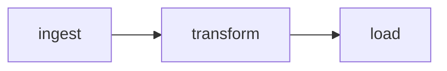
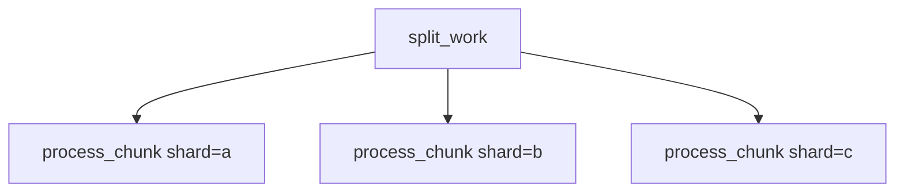
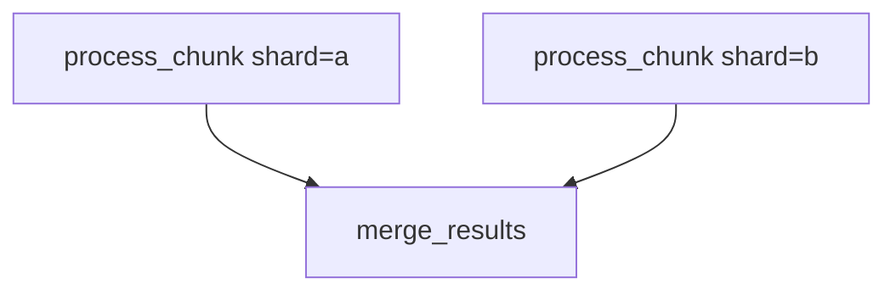
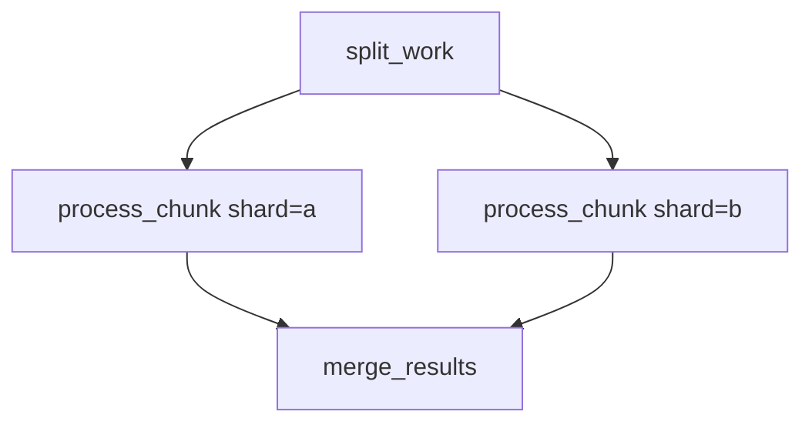
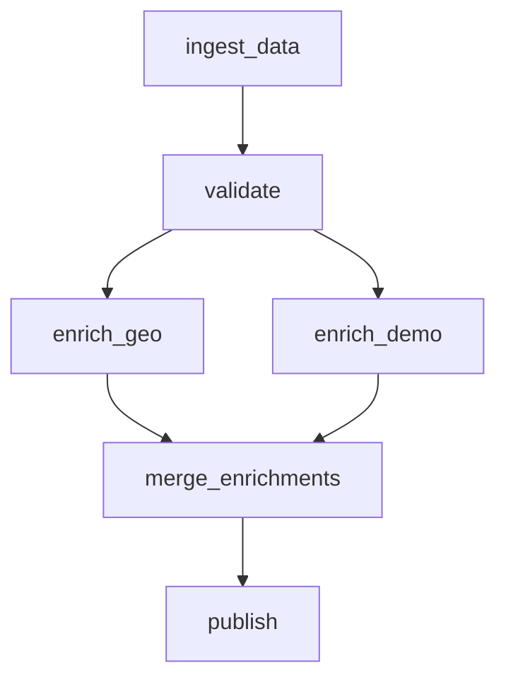
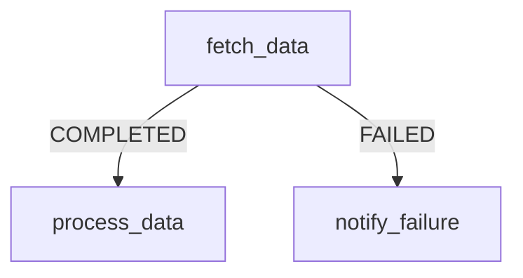

# Task Composition: Programmatic DAGs

Jobbers supports directed acyclic graphs (DAGs) of tasks using a fluent builder API. A DAG lets you express dependencies between tasks — fan-out to parallelise work, fan-in to collect results, and error callbacks to handle permanent failures — all described in Python before any task runs.

## Core Concepts

- **`DAGNode`** — a builder object that represents one task in the graph. Each node holds a task name, optional parameters, and links to its successors.
- **`DAGTaskSpec`** — the serialisable form stored inside Redis. Created automatically when you call `to_task()` or `submit_dag()`.
- **`dag_run_id`** — a ULID shared by every task in a single run. Generated once at submission time and propagated to all descendants.
- **Fan-in key** — a Redis set (`dag:fan-in:{collector_id}`) that tracks how many predecessors must complete before a fan-in (merge) task is submitted.

## Building a DAG

### Step 1 — Describe the graph

```python
from jobbers.models.dag import DAGNode

root = DAGNode("fetch_data")
process = DAGNode("process_data")
save = DAGNode("save_results")

root.then(process)
process.then(save)
```

`then()` returns `self`. The graph is fully described before anything is submitted.

### Step 2 — Submit

```python
from jobbers.db import get_state_manager

sm = get_state_manager()
await sm.submit_dag(root)
```

`submit_dag` generates a shared `dag_run_id`, pre-populates Redis fan-in sets, and submits all root tasks. For multi-root DAGs pass all roots:

```python
await sm.submit_dag(root_a, root_b)
```

---

## Patterns

### Linear Chain

```python
a = DAGNode("ingest")
b = DAGNode("transform")
c = DAGNode("load")
a.then(b)
b.then(c)
```



Each task starts as soon as its predecessor reaches `COMPLETED`.

---

### Fan-Out

```python
root = DAGNode("split_work")
chunk_a = DAGNode("process_chunk", parameters={"shard": "a"})
chunk_b = DAGNode("process_chunk", parameters={"shard": "b"})
chunk_c = DAGNode("process_chunk", parameters={"shard": "c"})

root.then(chunk_a, chunk_b, chunk_c)
```



All three `process_chunk` tasks are submitted simultaneously when `split_work` completes. They run concurrently, limited only by queue concurrency settings.

---

### Fan-In (Merge)

```python
a = DAGNode("process_chunk", parameters={"shard": "a"})
b = DAGNode("process_chunk", parameters={"shard": "b"})
collector = DAGNode("merge_results")

DAGNode.merge(a, b, into=collector)
```



`merge_results` is submitted only after **all** predecessors have completed. Under the hood, `submit_dag` pre-populates a Redis set with both predecessor IDs; each predecessor atomically removes itself from the set on completion, and the last one out triggers the collector.

---

### Diamond (Fan-Out + Fan-In)

```python
root = DAGNode("split_work")
a = DAGNode("process_chunk", parameters={"shard": "a"})
b = DAGNode("process_chunk", parameters={"shard": "b"})
collector = DAGNode("merge_results")

root.then(a, b)
DAGNode.merge(a, b, into=collector)
```



`merge` returns `collector` so you can keep chaining:

```python
root.then(a, b)
collector = DAGNode.merge(a, b, into=collector)
collector.then(DAGNode("notify_done"))
```

---

### Multi-Stage Pipeline

```python
ingest = DAGNode("ingest_data")
validate = DAGNode("validate")
enrich_a = DAGNode("enrich_geo")
enrich_b = DAGNode("enrich_demo")
merge = DAGNode("merge_enrichments")
publish = DAGNode("publish")

ingest.then(validate)
validate.then(enrich_a, enrich_b)
merge = DAGNode.merge(enrich_a, enrich_b, into=merge)
merge.then(publish)
```



---

## Options

### `inject_parent_results`

Pass `inject_parent_results=True` to `then()` or `merge()` to have the worker automatically fetch the parent task's results and inject them as a `parent_results` keyword argument into the successor's function:

```python
fetch = DAGNode("fetch_records")
process = DAGNode("process_records")
fetch.then(process, inject_parent_results=True)
```

```python
@register_task(name="process_records")
async def process_records(parent_results, **kwargs):
    # parent_results is a dict for a single parent,
    # or a dict[ULID, dict] for fan-in collectors (keyed by predecessor task ID).
    rows = parent_results["rows"]
    ...
```

For fan-in collectors, `parent_results` is a `dict[ULID, dict]` keyed by predecessor task ID — iterate over `.values()` to process results without assuming any order.

### Error Callbacks

Pass `on_error` to `then()` or `merge()` to submit a task when a node fails **permanently** (all retries exhausted, status `FAILED`):

```python
notify = DAGNode("notify_failure", parameters={"channel": "ops-alerts"})
a.then(b, on_error=notify)
```



The error task receives `parent_ids=[failing_task.id]` so it can inspect the failure:

```python
@register_task(name="notify_failure")
async def notify_failure(**kwargs):
    task = get_current_task()
    parent = next(iter((await task.parent_results()).values()))
    # parent contains the failed task's stored result/error info
    ...
```

Error callbacks only fire on **permanent** failure — tasks still in their retry window do not trigger them.

For fan-in, a single `on_error` node fires when **any** predecessor fails:

```python
err = DAGNode("handle_pipeline_error")
DAGNode.merge(branch_a, branch_b, into=collector, on_error=err)
```

The error node itself is a plain `DAGNode` and can have its own `then()` chain for multi-step failure handling.

### Dynamic Fan-Out

When the number of arms is not known until runtime, declare it in the mermaid diagram using `-->>` (fan-out) and `--o` (fan-in boundary) edges:

```mermaid
flowchart TD
    D["dispatch_records"]
    B["process_record"]
    C["aggregate_results"]

    D -->> B
    B --o C
```

The dispatcher task returns a plain dict with an `"items"` key containing a list of parameter dicts — one per arm to spawn:

```python
@register_task(name="dispatch_records", version=1)
async def dispatch_records(**kwargs) -> dict:
    records = await fetch_pending_records()
    return {
        "count": len(records),
        "items": [{"record_id": r["id"]} for r in records],
    }
```

The processor reads `results["items"]` and spawns one `process_record` instance per entry, merging the entry dict into the arm template's parameters.  The fan-in is wired automatically — `aggregate_results` is submitted once all arm instances complete.

#### Result data conventions

| Convention | Details |
| ---------- | ------- |
| Default key | `"items"` — the processor reads `results["items"]` by default |
| Custom key | Add a label to the `-->>` edge: `D --"batches">> B` reads `results["batches"]` |
| Entry shape | Each entry is a `dict`; its keys are merged into the arm template's static parameters (entry values take precedence) |
| Non-list / missing | Processor submits the collector immediately with zero arms and logs a warning |
| Other result fields | Any other keys in the returned dict (`"count"`, etc.) are stored on the dispatcher task and accessible via `parent_results()` |

#### Multi-step arm chains

Connect arm nodes with `-->` edges before the `--o` terminal:

```mermaid
flowchart TD
    D["dispatch_records"]
    B["start_processing"]
    E["finish_processing"]
    C["aggregate_results"]

    D -->> B
    B --> E
    E --o C
```

Each arm instance runs `B → E`.  The `--o` edge on `E` marks it as the terminal.

#### Programmatic API (advanced)

For cases where the arm structure itself must be computed in Python (e.g., different task types per arm, or arms that are themselves DAGs determined at runtime), use `DynamicFanOut` directly:

```python
from jobbers.models.dag import DAGNode, DynamicFanOut

@register_task(name="dispatch_records")
async def dispatch_records(**kwargs):
    task = get_current_task()
    records = await fetch_pending_records()
    arms = [
        DAGNode("process_record", parameters={"record_id": r["id"]})
        for r in records
    ]
    collector = DAGNode("aggregate_results")
    return task.make_result(
        results={"count": len(records)},
        fanout=DynamicFanOut(arms=arms, collector=collector),
    )
```

The processor wires the fan-in automatically.  Do **not** call `DAGNode.merge()` yourself — the processor does it.

---

## Recurring DAGs (Cron)

A `CronDAGEntry` wraps a `DAGTaskSpec` with a cron schedule. Submit it once; the Scheduler process fires it repeatedly:

```python
from croniter import croniter
from jobbers.models.cron_dag import CronDAGEntry, ConcurrencyPolicy
from jobbers.models.dag import DAGNode

root = DAGNode("nightly_ingest")
process = DAGNode("nightly_process")
root.then(process)

entry = CronDAGEntry(
    name="nightly_pipeline",
    cron_expr="0 2 * * *",           # 02:00 UTC every day
    dag_spec=root.to_spec(),
    concurrency_policy=ConcurrencyPolicy.SKIP_IF_RUNNING,
)

sm = get_state_manager()
await sm.cron_dag_scheduler.add(entry, next_run_at)
```

`ConcurrencyPolicy` options:

| Value | Behaviour |
| --- | --- |
| `ALWAYS` (default) | Fire even if the previous run is still active |
| `SKIP_IF_RUNNING` | Skip this fire if any task from the previous run is still active |

Each cron fire generates fresh ULIDs for every node so runs never share Redis keys.

---

## Fetching Parent Results Manually

Inside a task function, call `await task.parent_results()` to fetch parent task blobs without using `inject_parent_results`:

```python
@register_task(name="merge_results")
async def merge_results(**kwargs):
    task = get_current_task()
    parents = await task.parent_results()
    # Single parent → dict; multiple parents → dict[ULID, dict]
    ...
```

---

## Limitations

### No Cycles

The graph must be a **DAG** — no cycles. Jobbers does not detect cycles at build time. A cycle would cause tasks to wait on each other forever (fan-in sets that never reach zero).

### Fan-In Key Lifetime

Fan-in tracking sets are created with a TTL (default 24 hours for dynamic fan-out; permanent for static DAGs until all predecessors complete). If a predecessor task is abandoned without reaching a terminal status within the TTL, the collector will never fire. Use heartbeat monitoring and the Cleaner process to detect stalled tasks early.

### No Cross-Run Dependencies

A `DAGNode` graph describes a **single run**. You cannot make one cron run depend on the completion of a previous cron run; use a separate application-level gate (e.g., check a status in your own database) inside the root task if you need that.

### Nested Dynamic Fan-Out

When using the mermaid syntax (`-->>` / `--o`), nesting is supported — an arm task can itself be a dispatcher with its own `-->>` / `--o` pair (see the mermaid spec for the nested example).  When using the programmatic `DynamicFanOut` API directly, nesting requires the inner `DynamicFanOut` to be returned from the arm task function, which the processor handles via `propagate_fan_in`.

### Static DAG Shape

For non-dynamic DAGs, the graph shape (which tasks exist and how they connect) is fixed at submission time. You cannot add new nodes to an in-flight DAG after it has started. For variable-length pipelines, use dynamic fan-out.

### Fan-In Result Access

For fan-in collectors (static or dynamic), `parent_results()` returns a `dict[ULID, dict]` keyed by predecessor task ID. There is no ordering guarantee — iterate over `.values()` and key results by a field inside each result dict if you need to identify them.

### SQL Task State and Optimistic Dispatch

The SQL task state adapter does not implement the Redis WATCH/MULTI optimistic locking protocol. If you use `TASK_BACKEND=sql`, the scheduler dispatches tasks in saga mode (sequential calls) rather than an atomic pipeline. This means a crash between the state update and the queue push is possible; the Cleaner process reconciles this on its next run.

### FanIn multiple-predecessors failure note

When multiple FanIn predecessors fail concurrently, each will try to submit an error callback task with the same pre-assigned ULID. The first writer wins; subsequent submissions overwrite or conflict depending on the adapter. This is acceptable for the initial implementation — in practice most DAGs have at most one failing predecessor per fan-in. This can be addressed later with a Redis-set guard similar to the fan-in tracking set.
