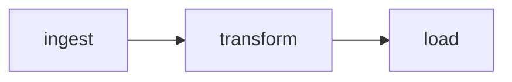
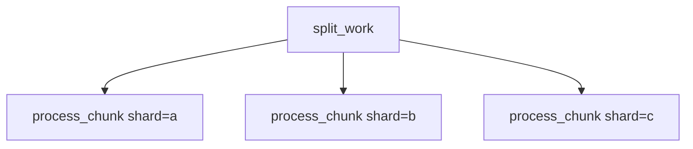
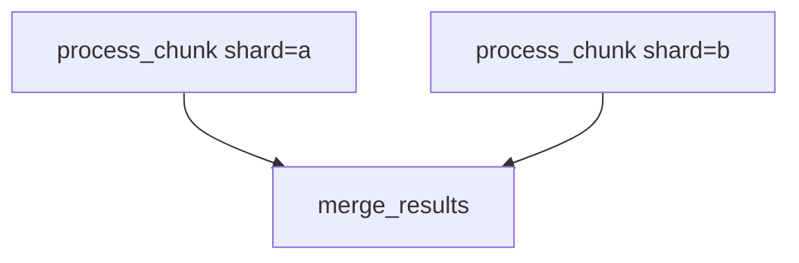
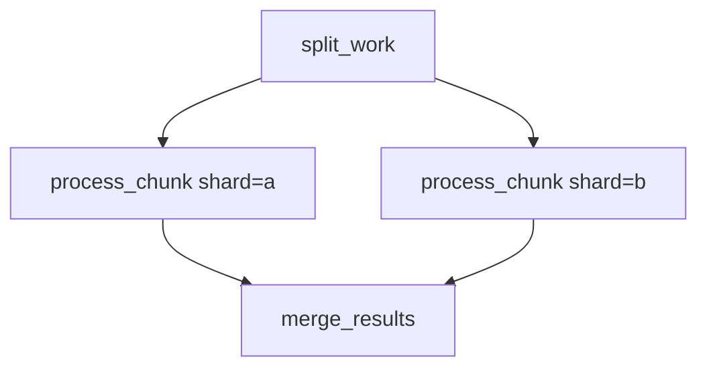
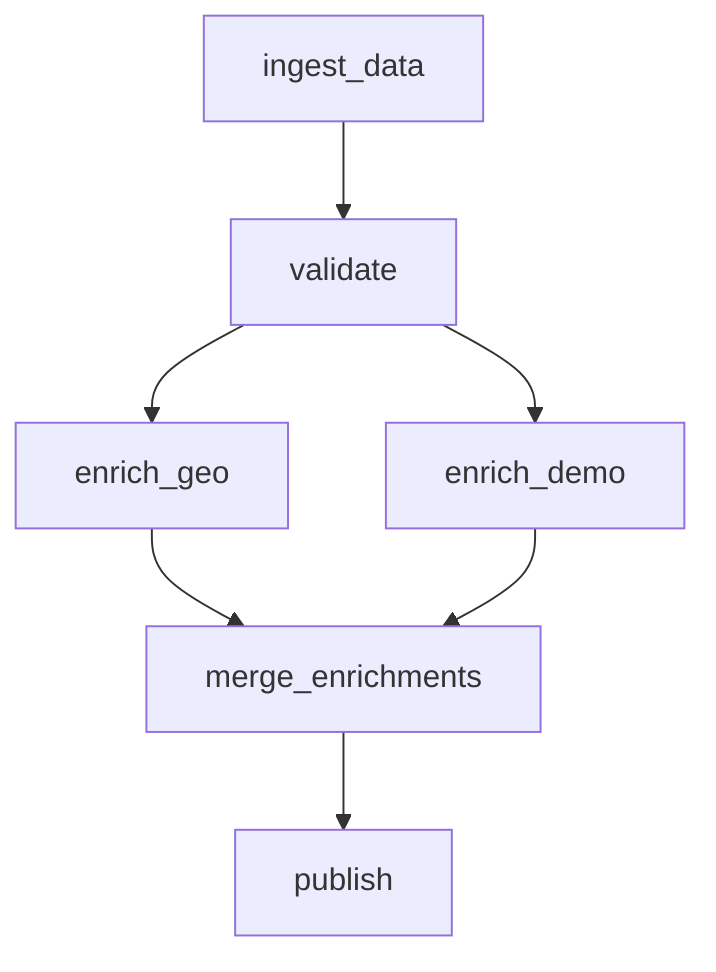
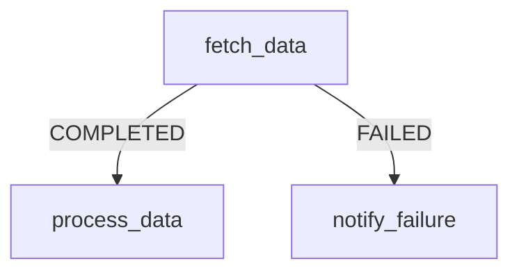

# Task Composition: Programmatic DAGs

Jobbers supports directed acyclic graphs (DAGs) of tasks using a fluent builder API. A DAG lets you express dependencies between tasks — fan-out to parallelise work, fan-in to collect results, and error callbacks to handle permanent failures — all described in Python before any task runs.

## Core Concepts

- **`DAGNode`** — a builder object that represents one task in the graph. Each node holds a task name, optional parameters, and links to its successors.
- **`DAGTaskSpec`** — the serialisable form stored inside Redis. Created automatically when you call `to_task()` or `submit_dag()`.
- **`dag_run_id`** — a ULID shared by every task in a single run. Generated once at submission time and propagated to all descendants.
- **Fan-in key** — a Redis set (`dag:fan-in:{collector_id}`) that tracks how many predecessors must complete before a fan-in (merge) task is submitted.

## Building a DAG

### Step 1 — Describe the graph

```python
from jobbers.models.dag import DAGNode

root = DAGNode("fetch_data")
process = DAGNode("process_data")
save = DAGNode("save_results")

root.then(process)
process.then(save)
```

`then()` returns `self`. The graph is fully described before anything is submitted.

### Step 2 — Submit

```python
from jobbers.db import get_state_manager

sm = get_state_manager()
await sm.submit_dag(root)
```

`submit_dag` generates a shared `dag_run_id`, pre-populates Redis fan-in sets, and submits all root tasks. For multi-root DAGs pass all roots:

```python
await sm.submit_dag(root_a, root_b)
```

---

## Patterns

### Linear Chain

```python
a = DAGNode("ingest")
b = DAGNode("transform")
c = DAGNode("load")
a.then(b)
b.then(c)
```


```mermaid
graph LR
    A[ingest] --> B[transform] --> C[load]
```

Each task starts as soon as its predecessor reaches `COMPLETED`.

---

### Fan-Out

```python
root = DAGNode("split_work")
chunk_a = DAGNode("process_chunk", parameters={"shard": "a"})
chunk_b = DAGNode("process_chunk", parameters={"shard": "b"})
chunk_c = DAGNode("process_chunk", parameters={"shard": "c"})

root.then(chunk_a, chunk_b, chunk_c)
```


```mermaid
graph TD
    R[split_work] --> A[process_chunk shard=a]
    R --> B[process_chunk shard=b]
    R --> C[process_chunk shard=c]
```

All three `process_chunk` tasks are submitted simultaneously when `split_work` completes. They run concurrently, limited only by queue concurrency settings.

---

### Fan-In (Merge)

```python
a = DAGNode("process_chunk", parameters={"shard": "a"})
b = DAGNode("process_chunk", parameters={"shard": "b"})
collector = DAGNode("merge_results")

DAGNode.merge(a, b, into=collector)
```


```mermaid
graph TD
    A[process_chunk shard=a] --> C[merge_results]
    B[process_chunk shard=b] --> C
```

`merge_results` is submitted only after **all** predecessors have completed. Under the hood, `submit_dag` pre-populates a Redis set with both predecessor IDs; each predecessor atomically removes itself from the set on completion, and the last one out triggers the collector.

Because `merge()` always supplies 2+ parents, `merge_results` must use `FromParent(key, many=True)` for anything it reads from its parents (see "Options" above) — a singular (`many=False`) `FromParent` param on `merge_results` raises `FanInCardinalityError` as soon as `DAGNode.merge(a, b, into=collector)` is called, not later at task-execution time.

---

### Diamond (Fan-Out + Fan-In)

```python
root = DAGNode("split_work")
a = DAGNode("process_chunk", parameters={"shard": "a"})
b = DAGNode("process_chunk", parameters={"shard": "b"})
collector = DAGNode("merge_results")

root.then(a, b)
DAGNode.merge(a, b, into=collector)
```


```mermaid
graph TD
    R[split_work] --> A[process_chunk shard=a]
    R --> B[process_chunk shard=b]
    A --> C[merge_results]
    B --> C
```

`merge` returns `collector` so you can keep chaining:

```python
root.then(a, b)
collector = DAGNode.merge(a, b, into=collector)
collector.then(DAGNode("notify_done"))
```

---

### Multi-Stage Pipeline

```python
ingest = DAGNode("ingest_data")
validate = DAGNode("validate")
enrich_a = DAGNode("enrich_geo")
enrich_b = DAGNode("enrich_demo")
merge = DAGNode("merge_enrichments")
publish = DAGNode("publish")

ingest.then(validate)
validate.then(enrich_a, enrich_b)
merge = DAGNode.merge(enrich_a, enrich_b, into=merge)
merge.then(publish)
```


```mermaid
graph TD
    I[ingest_data] --> V[validate]
    V --> EA[enrich_geo]
    V --> EB[enrich_demo]
    EA --> M[merge_enrichments]
    EB --> M
    M --> P[publish]
```

---

## Options

### `FromParent`

Annotate a task function's parameter with `FromParent(key)` to have the worker pull a specific field out of the parent's results and inject it directly — no edge-level flag needed, and no need to destructure a raw results dict inside the function body:

```python
fetch = DAGNode("fetch_records")
process = DAGNode("process_records")
fetch.then(process)
```

```python
from typing import Annotated
from jobbers.models.dag import FromParent

@register_task(name="process_records")
async def process_records(rows: Annotated[int, FromParent("rows")], **kwargs):
    ...
```

`FromParent(key)` (`many=False`, the default) requires the task to have **exactly one parent when it has any** — a structural (DAG-shape) contract, not a data one: it's about chain position, not about whether the data happens to look right. If the key is absent from that one parent's results, the parameter is simply left unset, so the function's own Python default applies (or a standard `TypeError` if it has none):

```python
async def process_records(rows: Annotated[int, FromParent("rows")] = 0, **kwargs):
    ...  # rows falls back to 0 if the parent didn't produce "rows"
```

`FromParent()` with no key argument resolves using the parameter's own name — `Annotated[int, FromParent()]` on a parameter named `rows` reads `results["rows"]`.

**Root nodes are not a shape violation.** A task with **zero** parents leaves a `FromParent`-annotated parameter unset entirely, the same as a missing key — it does not raise (singular mode) or force an empty list (`many=True`). This is what makes a `FromParent`-annotated task usable as a root node, or callable/submittable directly in a test without fabricating a parent: submit the value as an ordinary parameter (`DAGNode(name, parameters={"rows": 5})` or `my_task.submit(rows=5)`), or give the function its own Python default. Only a genuinely wrong parent count — 2+ parents on a singular slot — still raises unconditionally.

For fan-in collectors, use `FromParent(key, many=True)` — with one or more parents this always resolves to a `list[T]` (0, 1, or N entries — every parent that produced the key), never a bare scalar, and never raises for "too many" or "too few":

```python
@register_task(name="merge_results")
async def merge_results(rows: Annotated[list[int], FromParent("rows", many=True)], **kwargs):
    total = sum(rows)
    ...
```

Because a singular (`many=False`) `FromParent` param can never be satisfied by a fan-in edge (`merge()` always supplies 2+ parents), `DAGNode.merge()` raises `FanInCardinalityError` immediately, at graph-construction time, if `into`'s registered task declares one — see "Fan-In (Merge)" below.

There's no ordering guarantee for `many=True` results, matching `parent_results()` — iterate/reduce without assuming order, or key results by a field inside each entry if you need to identify them.

**Don't stack multiple `many=True` params expecting their lists to line up positionally.** Each one is resolved independently, filtered by its own key's presence across parents:

```python
async def combine(
    count: Annotated[list[int], FromParent("count", many=True)],
    name: Annotated[list[str], FromParent("name", many=True)],
    **kwargs,
):
    # DANGEROUS: count[i] and name[i] only match up if every parent that
    # contributes to one list also contributes to the other.
    for c, n in zip(count, name):
        ...
```

If parent A produced `"count"` but not `"name"`, and parent B the reverse, the two lists differ in length and `zip()` silently truncates and mispairs — no error, no warning. When several fields need to come from the *same* parent, fetch the raw per-parent dicts instead and destructure each one directly:

```python
async def combine(**kwargs):
    task = get_current_task()
    parents = await task.parent_results()
    for r in parents.values():
        c, n = r["count"], r["name"]  # same dict `r` -- guaranteed same parent
        ...
```

### Error Callbacks

Pass `on_error` to `then()` or `merge()` to submit a task when a node fails **permanently** (all retries exhausted, status `FAILED`):

```python
notify = DAGNode("notify_failure", parameters={"channel": "ops-alerts"})
a.then(b, on_error=notify)
```


```mermaid
graph TD
    A[fetch_data] -->|COMPLETED| B[process_data]
    A -->|FAILED| E[notify_failure]
```

The error task receives `parent_ids=[failing_task.id]` so it can inspect the failure. Use `parent_errors()`, not `parent_results()`, to see *why* it failed — a permanently-failed task's `results` stays `{}` (the function raised before returning anything); the error text lives in `errors`:

```python
@register_task(name="notify_failure")
async def notify_failure(**kwargs):
    task = get_current_task()
    errors = next(iter((await task.parent_errors()).values()), [])
    last_error = errors[-1] if errors else "unknown error"
    ...
```

`parent_results()` is still the right call if the failing task saved partial results via `task.make_result(...)` before raising — the two accessors are independent and can be combined.

Error callbacks only fire on **permanent** failure — tasks still in their retry window do not trigger them.

For fan-in, a single `on_error` node fires when **any** predecessor fails:

```python
err = DAGNode("handle_pipeline_error")
DAGNode.merge(branch_a, branch_b, into=collector, on_error=err)
```

The error node itself is a plain `DAGNode` and can have its own `then()` chain for multi-step failure handling.

### Dynamic Fan-Out

When the number of arms is not known until runtime, declare it in the mermaid diagram using `-->>` (fan-out) and `--o` (fan-in boundary) edges:

```mermaid
flowchart TD
    D["dispatch_records"]
    B["process_record"]
    C["aggregate_results"]

    D -->> B
    B --o C
```

The dispatcher task returns a plain dict with an `"items"` key containing a list of parameter dicts — one per arm to spawn:

```python
@register_task(name="dispatch_records", version=1)
async def dispatch_records(**kwargs) -> dict:
    records = await fetch_pending_records()
    return {
        "count": len(records),
        "items": [{"record_id": r["id"]} for r in records],
    }
```

The processor reads `results["items"]` and spawns one `process_record` instance per entry, merging the entry dict into the arm template's parameters.  The fan-in is wired automatically — `aggregate_results` is submitted once all arm instances complete.

#### Result data conventions

| Convention | Details |
| ---------- | ------- |
| Default key | `"items"` — the processor reads `results["items"]` by default |
| Custom key | Add a label to the `-->>` edge: `D --"batches">> B` reads `results["batches"]` |
| Entry shape | Each entry is a `dict`; its keys are merged into the arm template's static parameters (entry values take precedence) |
| Non-list / missing | Processor submits the collector immediately with zero arms and logs a warning |
| Other result fields | Any other keys in the returned dict (`"count"`, etc.) are stored on the dispatcher task and accessible via `parent_results()` |

#### Multi-step arm chains

Connect arm nodes with `-->` edges before the `--o` terminal:

```mermaid
flowchart TD
    D["dispatch_records"]
    B["start_processing"]
    E["finish_processing"]
    C["aggregate_results"]

    D -->> B
    B --> E
    E --o C
```

Each arm instance runs `B → E`.  The `--o` edge on `E` marks it as the terminal.

#### Programmatic API (advanced)

For cases where the arm structure itself must be computed in Python (e.g., different task types per arm, or arms that are themselves DAGs determined at runtime), use `DynamicFanOut` directly:

```python
from jobbers.models.dag import DAGNode, DynamicFanOut

@register_task(name="dispatch_records")
async def dispatch_records(**kwargs):
    task = get_current_task()
    records = await fetch_pending_records()
    arms = [
        DAGNode("process_record", parameters={"record_id": r["id"]})
        for r in records
    ]
    collector = DAGNode("aggregate_results")
    return task.make_result(
        results={"count": len(records)},
        fanout=DynamicFanOut(arms=arms, collector=collector),
    )
```

The processor wires the fan-in automatically.  Do **not** call `DAGNode.merge()` yourself — the processor does it.

---

## Recurring DAGs (Cron)

A `CronDAGEntry` wraps a `DAGTaskSpec` with a cron schedule. Submit it once; the Scheduler process fires it repeatedly:

```python
from croniter import croniter
from jobbers.models.cron_dag import CronDAGEntry, ConcurrencyPolicy
from jobbers.models.dag import DAGNode

root = DAGNode("nightly_ingest")
process = DAGNode("nightly_process")
root.then(process)

entry = CronDAGEntry(
    name="nightly_pipeline",
    cron_expr="0 2 * * *",           # 02:00 UTC every day
    dag_spec=root.to_spec(),
    concurrency_policy=ConcurrencyPolicy.SKIP_IF_RUNNING,
)

sm = get_state_manager()
await sm.cron_dag_scheduler.add(entry, next_run_at)
```

`ConcurrencyPolicy` options:

| Value | Behaviour |
| --- | --- |
| `ALWAYS` (default) | Fire even if the previous run is still active |
| `SKIP_IF_RUNNING` | Skip this fire if any task from the previous run is still active |

Each cron fire generates fresh ULIDs for every node so runs never share Redis keys.

---

## Fetching Parent Results Manually

`FromParent` covers the common cases, but for anything it can't express — needing a producer's task ID rather than just its results, or deciding at runtime which keys to read — call `await task.parent_results()` directly inside the task function:

```python
@register_task(name="merge_results")
async def merge_results(**kwargs):
    task = get_current_task()
    parents = await task.parent_results()
    # dict[ULID, dict] keyed by predecessor task ID -- one entry for a chain-position
    # task, many for a fan-in collector.
    ...
```

---

## Limitations

### No Cycles

The graph must be a **DAG** — no cycles. Jobbers does not detect cycles at build time. A cycle would cause tasks to wait on each other forever (fan-in sets that never reach zero).

### Fan-In Key Lifetime

Fan-in tracking sets are created with a TTL (default 24 hours for dynamic fan-out; permanent for static DAGs until all predecessors complete). If a predecessor task is abandoned without reaching a terminal status within the TTL, the collector will never fire. Use heartbeat monitoring and the Cleaner process to detect stalled tasks early.

See [dag-run-completion-tracking.md](dag-run-completion-tracking.md) for how fan-in state is consolidated per DAG run and cleaned up in a fixed number of keys, instead of relying purely on independent per-key TTLs.

### No Cross-Run Dependencies

A `DAGNode` graph describes a **single run**. You cannot make one cron run depend on the completion of a previous cron run; use a separate application-level gate (e.g., check a status in your own database) inside the root task if you need that.

### Nested Dynamic Fan-Out

When using the mermaid syntax (`-->>` / `--o`), nesting is supported — an arm task can itself be a dispatcher with its own `-->>` / `--o` pair (see the mermaid spec for the nested example).  When using the programmatic `DynamicFanOut` API directly, nesting requires the inner `DynamicFanOut` to be returned from the arm task function, which the processor handles via `propagate_fan_in`.

Deep/wide nesting can put thousands of tasks in a single DAG run. See [dag-run-completion-tracking.md](dag-run-completion-tracking.md) for how DAG-run completion tracking stays O(1) per task completion at that scale, including a real ordering hazard that was found and fixed along the way.

### Static DAG Shape

For non-dynamic DAGs, the graph shape (which tasks exist and how they connect) is fixed at submission time. You cannot add new nodes to an in-flight DAG after it has started. For variable-length pipelines, use dynamic fan-out.

### Fan-In Result Access

For fan-in collectors (static or dynamic), `parent_results()` returns a `dict[ULID, dict]` keyed by predecessor task ID. There is no ordering guarantee — iterate over `.values()` and key results by a field inside each result dict if you need to identify them. `FromParent(key, many=True)` (see "Options" above) covers the common case of pulling one field out of every predecessor without touching `parent_results()` directly, and inherits the same lack of ordering guarantee.

### SQL Task State and Optimistic Dispatch

The SQL task state adapter does not implement the Redis WATCH/MULTI optimistic locking protocol. If you use `TASK_BACKEND=sql`, the scheduler dispatches tasks in saga mode (sequential calls) rather than an atomic pipeline. This means a crash between the state update and the queue push is possible; the Cleaner process reconciles this on its next run.

### FanIn multiple-predecessors failure note

When multiple FanIn predecessors fail concurrently, each will try to submit an error callback task with the same pre-assigned ULID. The first writer wins; subsequent submissions overwrite or conflict depending on the adapter. This is acceptable for the initial implementation — in practice most DAGs have at most one failing predecessor per fan-in. This can be addressed later with a Redis-set guard similar to the fan-in tracking set.
