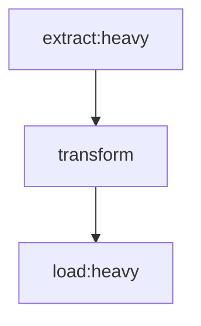
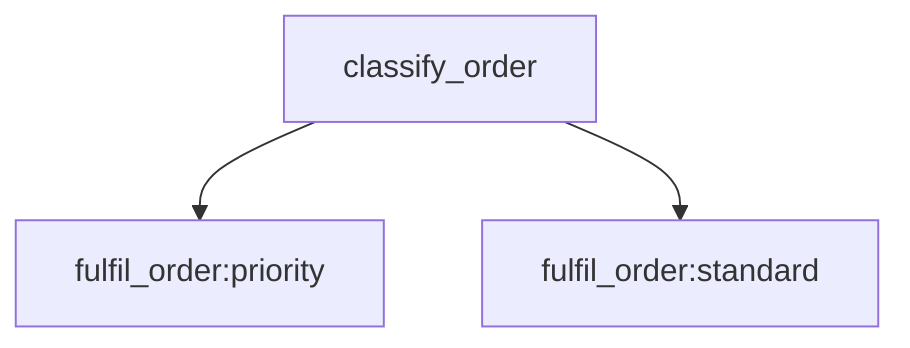

# Lanes and Queues

Jobbers separates **where you ask work to go** from **where it physically runs**.

- A **lane** is the logical destination named by whoever created the work — a DAG
  node's `:lane` segment, a `submit(lane=...)` call, or a router node's choice.
- A **queue** is the physical bucket workers pull from. It carries a concurrency
  cap, optional rate limiting, and membership in worker roles.

`RoutingConfig` is the only thing that spans the two: it maps
`(task_name, task_version, lane) → queue(s)`.

---

## The short version

**By default a lane resolves to the queue of the same name.** Create a queue
called `heavy`, write `["fetch_data:heavy"]`, and the task runs on queue `heavy`.
If you never install a routing rule, that is the whole story and "lane" is just
what that part of the label is called.

The distinction starts paying off the moment you want the two to differ.

---

## Why they are separate

| | **Lane** | **Queue** |
| --- | --- | --- |
| Answers | Which logical destination should handle this work? | Which physical bucket do workers pull from? |
| Declared by | The developer, in the diagram / submit call / router | The operator, via `POST /queues` |
| Varies with | The payload — a router can pick one per item | Nothing; it is a static resource |
| Carries | A name, nothing else | Concurrency cap, rate limit, role membership |
| Lives in | `DAGTaskSpec.lane`, `Task.lane`, mermaid `name:lane` | `QueueConfig`, worker roles, queue metrics |

Before lanes existed, a routing config *replaced* the requested queue outright.
That meant a `SINGLE` config for `fulfil_order@1` silently collapsed
`fulfil_order:priority` and `fulfil_order:standard` — two distinct DAG nodes —
onto the same queue, with no record that they had ever differed. Naming the two
concepts separately makes that class of mistake inexpressible: a rule now maps a
*lane* to a queue, so lanes the rule does not mention keep their own
destinations.

---

## Lanes are never declared

There is no lane registry and no lane CRUD. A lane is just a string. At submit
time it is valid if **either**:

1. a routing rule for that task type matches it, **or**
2. a queue of the same name exists (the identity default).

Otherwise submission fails:

```text
Unknown lane gold: no routing rule matches it and no queue named gold exists
```

A typo in a lane name fails exactly like a typo in a queue name used to.

---

## Routing rules

A routing config is a list of rules. Each rule is optionally scoped to the lane
the submitter asked for; a rule with no `from_lane` is the **wildcard** and
matches any lane.

```http
PUT /task-routing/fulfil_order/1
Content-Type: application/json

{
  "rules": [
    {"from_lane": "priority", "strategy": "single", "queues": ["priority-shard-a"]},
    {"from_lane": "standard", "strategy": "weighted",
     "queues": ["bulk-a", "bulk-b"], "weights": [2.0, 1.0]},
    {"strategy": "single", "queues": ["catch-all"]}
  ]
}
```

Resolution order, in `StateManager.resolve_queue`:

1. The rule whose `from_lane` equals the task's lane.
2. Otherwise the wildcard rule, if there is one.
3. Otherwise the identity default — the queue named after the lane.

Which means:

- **Lane preservation is the default.** With no wildcard rule, lanes the config
  does not mention are left alone.
- **One lane can be re-pointed without touching the others.** Drain
  `priority` onto a new shard while `standard` keeps running where it was.
- **`weighted` composes with lanes.** The lane chooses the tier; a weighted rule
  scoped to that lane spreads it across shards.
- **The blunt lever is still available.** A wildcard rule overrides every lane —
  the "move all of this task type somewhere else, now" case — but it is an
  explicit choice rather than the only expressible shape.
- **Two lanes may deliberately share a queue.** Previously indistinguishable
  from the collapse bug; now a legitimate configuration.

---

## Resolution happens once

A task's lane is resolved to a queue when it is first submitted or scheduled.
Both are then stored on the task: `Task.lane` is what was asked for,
`Task.queue` is where it went, and `GET /task-status/{id}` returns both.

Retries and scheduler dispatch **reuse the resolved queue** rather than
re-resolving. A retry should land where the original attempt was routed;
re-rolling a `weighted` rule on every attempt would scatter one task's retries
across shards and make failures harder to trace.

---

## What stays a queue

Everything operational is still keyed on the physical queue, not the lane:

- `QueueConfig` — `max_concurrent`, rate limiting
- Roles: a role is a set of **queues**, and a worker consumes its role's queues
- `POST /queues`, `PUT /queues/{name}`, `DELETE /queues/{name}`, `/roles/*`
- Queue-scoped task listing and the `queue` filter on `GET /tasks`
- The `queue` tag on the `time_in_queue`, `tasks_selected`, and
  `cancellations_requested` metrics

The `lane_resolutions` counter (tagged `lane`, `queue`, `strategy`) records every
resolution, so a lane landing somewhere unexpected is visible without reading
config.

---

## Examples

### Nothing special — lane and queue are the same



No routing config. `heavy` → queue `heavy`, `default` → queue `default`.

### Two tiers of the same task



With no routing config, this needs queues named `priority` and `standard`. Add a
rule later to move just the `priority` lane onto dedicated shards without
touching the diagram.

### Logical lane with no matching queue

```json
{"rules": [{"from_lane": "gold-tier", "strategy": "weighted",
            "queues": ["shard-a", "shard-b"], "weights": [1.0, 1.0]}]}
```

`gold-tier` never needs to exist as a queue — the rule gives it a destination.

---

## See also

- [mermaid-dag-spec.md](mermaid-dag-spec.md) — the `:lane` label segment
- [dag-composition.md](dag-composition.md) — `DAGNode(lane=...)`
- [resource-management.md](resource-management.md) — queue concurrency and rate limits
- [routing-backend-feature-matrix.md](routing-backend-feature-matrix.md) — where routing config is stored
