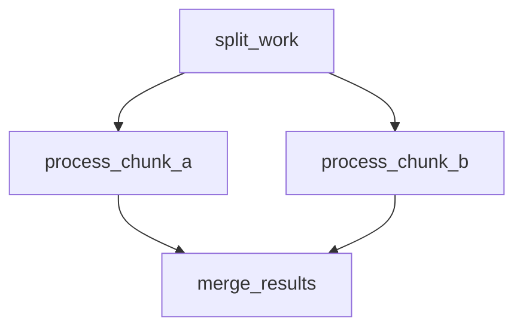
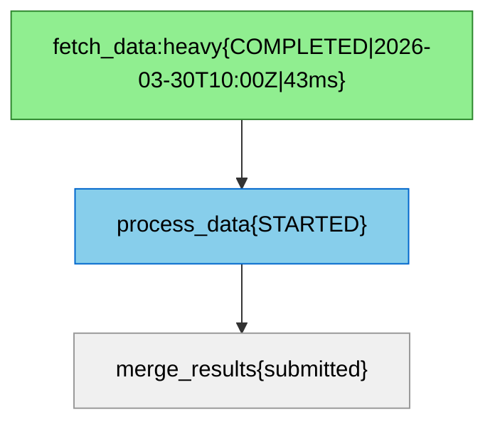
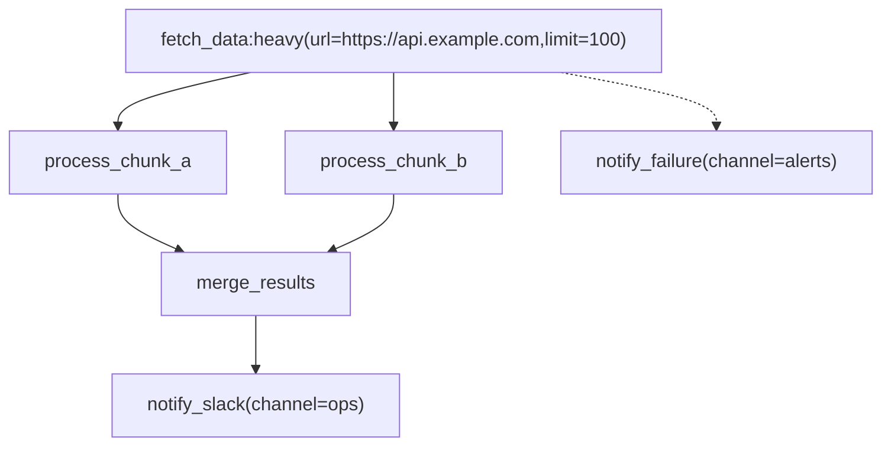

# Jobbers Mermaid DAG Spec

Jobbers uses a subset of the [Mermaid](https://mermaid.js.org/) `flowchart TD` dialect to represent task dependency graphs.  The format is human-writable, renders natively in GitHub / GitLab markdown, and is the canonical serialisation for:

- **Cron DAG CRUD** (`POST /cron-dags`, `GET /cron-dags/{id}`, etc.)
- **Ad-hoc DAG submission** (`POST /submit-dag`)
- **Task detail DAG view** (`GET /task-status/{id}` → `dag_diagram` field)

---

## Node label grammar

Every node uses a **quoted rectangular-bracket label**:

```text
node_id["task_name[@version][:queue][(param=val, ...)]"]
```

| Section | Required | Meaning |
| --- | --- | --- |
| `task_name` | yes | Registered task name — must match a `@register_task(name=...)` declaration |
| `@version` | no | Integer task version; defaults to `0` when omitted |
| `:queue` | no | Target queue; defaults to `"default"` |
| `(key=val, …)` | no | Task parameters passed to the task function; values are type-coerced (see below) |
| `{…}` | **reserved** | Output-only; appended by the generator for status / timestamps / metrics. **Stripped silently on parse** so UI-exported diagrams can be re-submitted without editing. |

### Parameter value coercion

Values inside `(...)` are coerced in this order:

| Input | Result type |
| --- | --- |
| `~<base64>` | base64-decoded JSON — any JSON type (list, dict, `null`, etc.) |
| `null` (case-insensitive) | `None` |
| `true` / `false` (case-insensitive) | `bool` |
| Integer literal (`42`, `-7`) | `int` |
| Float literal (`3.14`) | `float` |
| Quoted string (`"hello"`, `'world'`) | `str` (quotes stripped) |
| Anything else | `str` |

Quoted values may contain commas and spaces: `msg="hello, world"`.

The serializer emits human-readable `key=val` for all scalar types and `null`. For complex values (lists, dicts) it emits `key=~<base64-JSON>` — a Mermaid-safe encoding that keeps the key name readable while hiding the value in a compact blob:

```text
fetch_data(limit=100, ids=~WzEsMiwzXQ==, config=~eyJyZXRyaWVzIjozfQ==)
```

---

## Edge semantics

| Arrow | Meaning |
| ----- | ------- |
| `-->` | **Success callback** — fires when the source task completes successfully. Automatically promoted to a `FanInCallback` when the destination has ≥ 2 incoming `-->` edges. |
| `-.->` | **Error callback** — fires only when the source reaches `FAILED` status (retries exhausted or unexpected exception). `CANCELLED`, `STALLED`, and `DROPPED` outcomes do **not** trigger this, nor do tasks that are still retrying. Each source node may have **at most one** `-.->` target. Diagrams with more than one `-.->` from the same source are rejected with a parse error. |
| `-->>` | **Dynamic fan-out** — the source task's results drive a runtime fan-out. The destination is the arm-chain root template. See the Dynamic fan-out section below. |
| `--"key">>` | **Dynamic fan-out with custom items key** — same as `-->>` but reads `results["key"]` instead of `results["items"]` for the list of arm parameters. |
| `--o` | **Fan-in boundary** — marks the arm terminal. The destination is the collector task submitted once all arm instances have completed. |

---

## Fan-in detection

Fan-in is inferred automatically from edge structure — no special syntax needed.

If two or more `-->` edges point at the same destination node, all predecessors are wired as `FanInCallback` predecessors.  The destination (collector) task is only submitted once *all* predecessors have completed successfully.



`D` is the fan-in collector.  It runs only after both `B` and `C` finish.

---

## Node ID rules

- In **user-authored diagrams**: node IDs can be any alphanumeric identifier (`A`, `fetch_step`, `branch_1`).  A fresh ULID is assigned to each on submission.
- In **system-generated diagrams** (task detail, cron DAG response): node IDs are the actual task ULIDs.  This lets the diagram be used as a lossless round-trip representation.

---

## Reserved `{...}` section

The generator appends a status section inside the label and colourises nodes when task status is available:



The `{...}` section is **always stripped** by the parser, so copying a live-status diagram from the UI and submitting it via `POST /submit-dag` works without any edits.

---

## Full example



What this describes:

1. `A` (`fetch_data`, queue `heavy`, params `url` and `limit`) runs first.
2. `A` fans out to `B` and `C` in parallel.
3. `B` and `C` fan in to `D` — `D` runs only once both complete.
4. `D` chains to `E` (`notify_slack`).
5. If `A` fails permanently, `err` (`notify_failure`) is submitted instead.

---

## API usage

### Submit an ad-hoc DAG

```http
POST /submit-dag
Content-Type: application/json

{
  "diagram": "flowchart TD\n    A[\"fetch_data\"] --> B[\"process_data\"]"
}
```

Response:

```json
{ "root_task_ids": ["01JXXX..."] }
```

### Create a cron-scheduled DAG

```http
POST /cron-dags
Content-Type: application/json

{
  "name": "nightly_etl",
  "cron_expr": "0 2 * * *",
  "diagram": "flowchart TD\n    A[\"extract:heavy\"] --> B[\"transform\"] --> C[\"load\"]",
  "enabled": true,
  "concurrency_policy": "skip_if_running"
}
```

The `diagram` field is regenerated from the stored `DAGTaskSpec` on every `GET` response, so ULIDs replace the original node identifiers.

### View task DAG

```http
GET /task-status/01JXXX...
```

If the task is the root of a DAG (`dag_callbacks` is non-empty), the response includes:

```json
{
  "id": "01JXXX...",
  "name": "fetch_data",
  "status": "completed",
  "dag_diagram": "flowchart TD\n..."
}
```

---

## Dynamic fan-out

Dynamic fan-out lets a diagram declare that a dispatcher task's output determines how many arm instances to spawn at runtime.  The number of arms is unknown at submission time; the dispatcher task returns a list of parameter dicts and the processor spawns one arm instance per entry.

### Syntax

```mermaid
flowchart TD
    A["fetch_records"]
    B["process_record"]
    C["aggregate_results"]

    A -->> B
    B --o C
```

| Edge | Meaning |
| ---- | ------- |
| `A -->> B` | `A` is the **dispatcher**; `B` is the **arm template** (root of each arm instance). |
| `B --o C` | `B` is the **arm terminal** (last step of each arm); `C` is the **collector** submitted once all arms complete. |

### Result data convention

The dispatcher task returns a plain dict.  The processor reads a list under a configured key and spawns one arm instance per entry:

```python
@register_task(name="fetch_records", version=1)
async def fetch_records(**kwargs) -> dict:
    records = await db.fetch_pending()
    return {"items": [{"record_id": r.id} for r in records]}
```

**Default key:** `"items"`.  Each entry is shallow-merged into the arm template's static parameters (entry values take precedence over template defaults).

**Custom key:** specify it in the edge label:

```mermaid
A --"batches">> B
```

This reads `results["batches"]` instead.

If the key is missing or its value is not a list, the processor submits the collector immediately (zero-arm degenerate case) and logs a warning.

### Multi-step arm chain

The arm template can itself be a chain of tasks connected by `-->` edges:

```mermaid
flowchart TD
    A["fetch_records"]
    B["start_processing"]
    E["finish_processing"]
    C["aggregate_results"]

    A -->> B
    B --> E
    E --o C
```

Each arm instance runs `B → E`.  The `--o` edge identifies `E` as the terminal that fans into `C`.

### Static fan-in within each arm

An arm chain can contain its own static fan-in:

```mermaid
flowchart TD
    A["fetch_records"]
    B["split_chunk"]
    B1["process_part_a"]
    B2["process_part_b"]
    D["merge_chunk"]
    C["aggregate_all"]

    A -->> B
    B --> B1
    B --> B2
    B1 --> D
    B2 --> D
    D --o C
```

`B1` and `B2` are a static fan-in within each arm instance.  `D` is the arm terminal.

### Nested fan-out

An arm task can itself be a dispatcher, producing a nested fan-out:

```mermaid
flowchart TD
    A["split_batches"]
    B["process_batch"]
    D["aggregate_batch"]
    R["process_record"]
    C["aggregate_all"]

    A -->> B
    B -->> R
    R --o D
    D --o C
```

`B` dispatches an inner fan-out over `R`.  `R` instances fan into `D` (inner collector); `D` instances fan into `C` (outer collector).  `propagate_fan_in=True` (the default) ensures `D` does not decrement the outer fan-in set until its own inner arms complete.

### Node IDs in live diagrams

In system-generated diagrams (task detail view), arm nodes are expanded with their actual execution ULIDs.  This means each arm instance appears as a distinct node in the diagram, and the manager UI can link each node to `GET /task-status/{id}` for per-arm statistics.

### Constraints

- Each dispatcher node may have **at most one** `-->>` edge.  Multiple fan-out edges from the same source are rejected with a parse error.
- Each arm terminal may have **at most one** `--o` edge.
- `--o` cannot be used as a generic Mermaid circle-head arrow in Jobbers diagrams; it always means "fan-in boundary".
- Error callbacks (`-.->`) on the dispatcher work as normal.  Per-arm error callbacks are not expressible in the diagram; use the Python `DynamicFanOut` / `DAGNode` API directly if per-arm error handling is needed.

---

## Known limitations

| Feature | Status |
| ------- | ------ |
| Multiple `-.->` error edges from the same source node | **Parse error.** The parser rejects diagrams with more than one error edge per source. |
| Per-arm error callbacks | **Not expressible.** Use the `DAGNode` API directly. |
| Multiple arm template chains from one dispatcher | **Not supported.** Each dispatcher has a single arm template. |

---

## Implementation notes

- **Parser**: custom regex-based (`jobbers/utils/mermaid_dag.py`), no third-party mermaid library required.  The grammar is small enough that a purpose-built parser is simpler and has zero extra dependencies.  If the grammar grows substantially, [`lark`](https://github.com/lark-parser/lark) (pure Python) is the recommended upgrade path.
- **Frontend rendering**: [`mermaid`](https://www.npmjs.com/package/mermaid) npm package.
- **Frontend validation**: [`@mermaid-js/parser`](https://www.npmjs.com/package/@mermaid-js/parser) npm package for real-time syntax checking in the editor.
