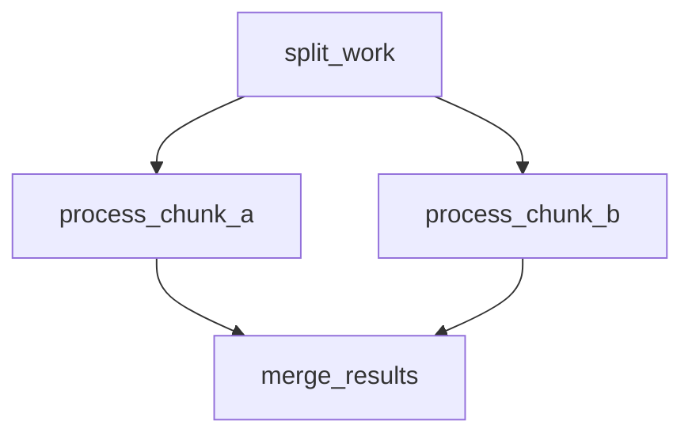
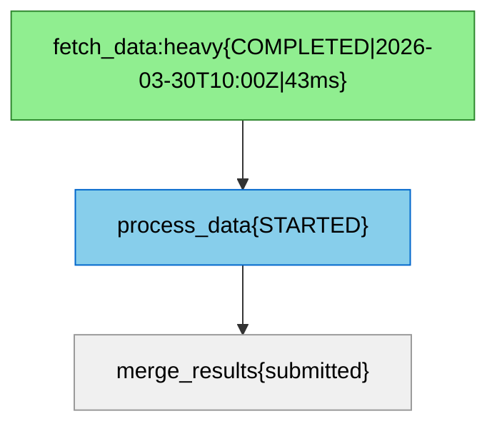
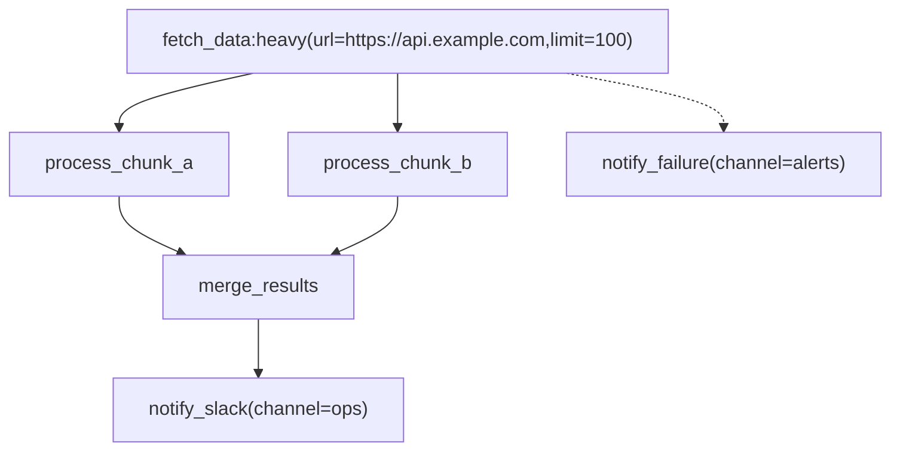
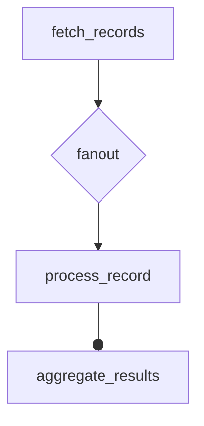
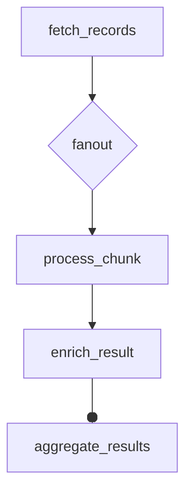
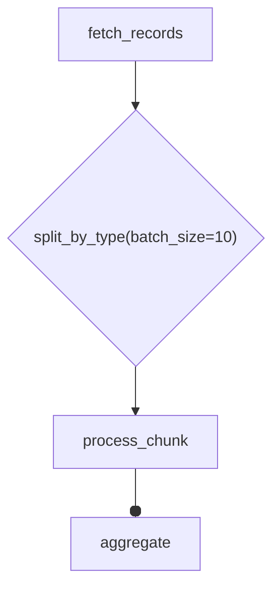

# Jobbers Mermaid DAG Spec

Jobbers uses a subset of the [Mermaid](https://mermaid.js.org/) `flowchart TD` dialect to represent task dependency graphs.  The format is human-writable, renders natively in GitHub / GitLab markdown, and is the canonical serialisation for:

- **Cron DAG CRUD** (`POST /cron-dags`, `GET /cron-dags/{id}`, etc.)
- **Ad-hoc DAG submission** (`POST /submit-dag`)
- **Task detail DAG view** (`GET /task-status/{id}` → `dag_diagram` field)

---

## Node label grammar

Every node uses a **quoted rectangular-bracket label**:

```text
node_id["task_name[@version][:queue][(param=val, ...)]"]
```

| Section | Required | Meaning |
| --- | --- | --- |
| `task_name` | yes | Registered task name — must match a `@register_task(name=...)` declaration |
| `@version` | no | Integer task version; defaults to `0` when omitted |
| `:queue` | no | Target queue; defaults to `"default"` |
| `(key=val, …)` | no | Task parameters passed to the task function; values are type-coerced (see below) |
| `{…}` | **reserved** | Output-only; appended by the generator for status / timestamps / metrics. **Stripped silently on parse** so UI-exported diagrams can be re-submitted without editing. |

### Parameter value coercion

Values inside `(...)` are coerced in this order:

| Input | Result type |
| --- | --- |
| `~<base64>` | base64-decoded JSON — any JSON type (list, dict, `null`, etc.) |
| `null` (case-insensitive) | `None` |
| `true` / `false` (case-insensitive) | `bool` |
| Integer literal (`42`, `-7`) | `int` |
| Float literal (`3.14`) | `float` |
| Quoted string (`"hello"`, `'world'`) | `str` (quotes stripped) |
| Anything else | `str` |

Quoted values may contain commas and spaces: `msg="hello, world"`.

The serializer emits human-readable `key=val` for all scalar types and `null`. For complex values (lists, dicts) it emits `key=~<base64-JSON>` — a Mermaid-safe encoding that keeps the key name readable while hiding the value in a compact blob:

```text
fetch_data(limit=100, ids=~WzEsMiwzXQ==, config=~eyJyZXRyaWVzIjozfQ==)
```

---

## Edge semantics

| Arrow | Meaning |
| ----- | ------- |
| `-->` | **Success callback** — fires when the source task completes successfully. Automatically promoted to a `FanInCallback` when the destination has ≥ 2 incoming `-->` edges. |
| `-.->` | **Error callback** — fires only when the source reaches `FAILED` status (retries exhausted or unexpected exception). `CANCELLED`, `STALLED`, and `DROPPED` outcomes do **not** trigger this, nor do tasks that are still retrying. Each source node may have **at most one** `-.->` target. Diagrams with more than one `-.->` from the same source are rejected with a parse error. |

---

## Fan-in detection

Fan-in is inferred automatically from edge structure — no special syntax needed.

If two or more `-->` edges point at the same destination node, all predecessors are wired as `FanInCallback` predecessors.  The destination (collector) task is only submitted once *all* predecessors have completed successfully.



`D` is the fan-in collector.  It runs only after both `B` and `C` finish.

---

## Node ID rules

- In **user-authored diagrams**: node IDs can be any alphanumeric identifier (`A`, `fetch_step`, `branch_1`).  A fresh ULID is assigned to each on submission.
- In **system-generated diagrams** (task detail, cron DAG response): node IDs are the actual task ULIDs.  This lets the diagram be used as a lossless round-trip representation.

---

## Reserved `{...}` section

The generator appends a status section inside the label and colourises nodes when task status is available:



The `{...}` section is **always stripped** by the parser, so copying a live-status diagram from the UI and submitting it via `POST /submit-dag` works without any edits.

---

## Full example



What this describes:

1. `A` (`fetch_data`, queue `heavy`, params `url` and `limit`) runs first.
2. `A` fans out to `B` and `C` in parallel.
3. `B` and `C` fan in to `D` — `D` runs only once both complete.
4. `D` chains to `E` (`notify_slack`).
5. If `A` fails permanently, `err` (`notify_failure`) is submitted instead.

---

## API usage

### Submit an ad-hoc DAG

```http
POST /submit-dag
Content-Type: application/json

{
  "diagram": "flowchart TD\n    A[\"fetch_data\"] --> B[\"process_data\"]"
}
```

Response:

```json
{ "root_task_ids": ["01JXXX..."] }
```

### Create a cron-scheduled DAG

```http
POST /cron-dags
Content-Type: application/json

{
  "name": "nightly_etl",
  "cron_expr": "0 2 * * *",
  "diagram": "flowchart TD\n    A[\"extract:heavy\"] --> B[\"transform\"] --> C[\"load\"]",
  "enabled": true,
  "concurrency_policy": "skip_if_running"
}
```

The `diagram` field is regenerated from the stored `DAGTaskSpec` on every `GET` response, so ULIDs replace the original node identifiers.

### View task DAG

```http
GET /task-status/01JXXX...
```

If the task is the root of a DAG (`dag_callbacks` is non-empty), the response includes:

```json
{
  "id": "01JXXX...",
  "name": "fetch_data",
  "status": "completed",
  "dag_diagram": "flowchart TD\n..."
}
```

---

## Known limitations

The mermaid format is a **static** representation of a DAG.  Some features of the Python `DAGNode` / `DAGTaskSpec` API cannot be expressed in a diagram:

| Feature | Status |
| ------- | ------ |
| `DynamicFanOut` returned from a task function at runtime | **Not representable in mermaid.** `DynamicFanOut` is produced inside a task function during execution; the number of branches cannot be known at authoring time. Use the Python `DAGNode` API directly when this pattern is required. *(A Mermaid decision-node syntax is proposed but not yet implemented — see "Proposed changes" below.)* |
| Multiple `-.->` error edges from the same source node | **Parse error.** The parser rejects diagrams with more than one error edge per source and raises `MermaidParseError`. This matches the underlying model constraint that each node has at most one error callback. |

---

## Implementation notes

- **Parser**: custom regex-based (`jobbers/utils/mermaid_dag.py`), no third-party mermaid library required.  The grammar is small enough that a purpose-built parser is simpler and has zero extra dependencies.  If the grammar grows substantially, [`lark`](https://github.com/lark-parser/lark) (pure Python) is the recommended upgrade path.
- **Frontend rendering**: [`mermaid`](https://www.npmjs.com/package/mermaid) npm package.
- **Frontend validation**: [`@mermaid-js/parser`](https://www.npmjs.com/package/@mermaid-js/parser) npm package for real-time syntax checking in the editor.

---

## Proposed changes

> **NOT YET IMPLEMENTED.** The decision-node syntax, `@register_router`, `--o` fan-in edges from decision nodes, and diamond `D{...}` shapes described in this section do not exist in the current parser. Submitting a diagram containing `D{...}` nodes will produce a parse error. For runtime fan-out today, use the `TaskResult` + `DynamicFanOut` Python API described in [DAG Patterns](dags.md).

### Decision nodes (dynamic fan-out)

A diamond-shaped decision node would declare a dynamic fan-out whose number of children is determined at runtime by a registered routing function:

```text
D{"router_name[(key=val, ...)]"}
```

The routing function is called inline by the worker (not as a full task) with the dispatcher task's results and the optional router params. It returns a list of parameter dicts — one per child instance to spawn.

#### Syntax



What this describes:

1. `A` completes and its results are passed to the `fanout` routing function.
2. The router returns N parameter dicts; one instance of `B` is spawned per dict, with the dict merged into `B`'s parameters.
3. All `B` instances fan in to `C` — `C` runs once all branches complete.

**With a multi-step branch chain** (`B --> E` before collecting):



Each branch runs `B → E`; all `E` instances fan into `C`.

**With router params:**



#### Edge contract

| Edge | Meaning |
| ---- | ------- |
| `A --> D{...}` | `A` is the dispatcher; `D` is the routing node. |
| `D --> B` | `B` is the first node in each per-branch chain. |
| `B --> E` | Normal chain within the branch (zero or more intermediate steps). |
| `E --o C` | `C` is the collector; `--o` marks the fan-in boundary. |

`C` is a plain `["..."]` task node — no special shape needed.

#### Router registry

Routing functions would be registered with `@register_router`:

```python
from jobbers.registry import register_router

@register_router("split_by_type")
def split_by_type(parent_results: dict, batch_size: int = 1) -> list[dict]:
    items = parent_results.get("items", [])
    return [{"item": item} for item in items]
```

**Signature:** `(parent_results: dict[str, Any], **router_params) -> list[dict[str, Any]]`

- `parent_results` — the `results` dict stored on the completed dispatcher task.
- `**router_params` — any params declared in the decision node label, type-coerced using the same rules as task parameters.
- Return value — a list of parameter dicts; one child instance is spawned per entry, with the dict shallow-merged into the branch template's declared parameters.

**Built-in routers:**

| Name | Behaviour |
| ---- | --------- |
| `fanout` | Expects `parent_results["items"]` to be a list; returns `[{"item": x} for x in items]`. |

#### Constraints / scope

- **Single child template chain per decision node.** Multiple diverging templates from one decision node (routing to different task types) is future work.
- Decision nodes have **no task lifecycle**: no SUBMITTED/STARTED/COMPLETED, no retries, no DLQ. If the router function raises, the dispatcher task fails.
- **`--o` is co-opted** for fan-in edges only; it cannot be used as a generic Mermaid circle-head arrow in Jobbers diagrams.
- **Error callbacks**: `A -.-> err` on the dispatcher works as normal. Per-child-instance error callbacks are not expressible.
- **Nested decision nodes** (a branch that itself fans out) are not supported.
