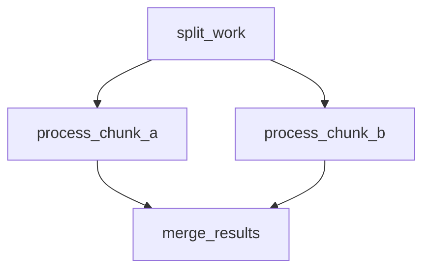
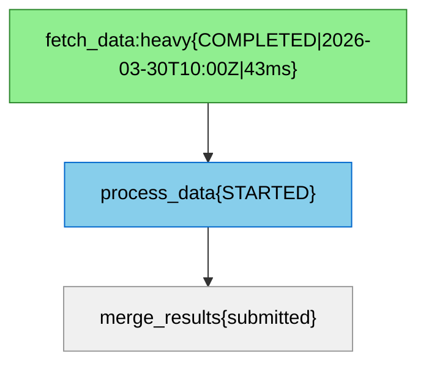
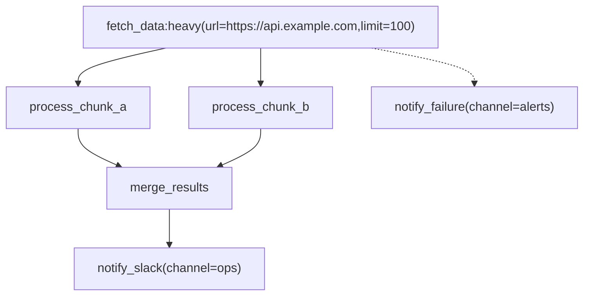

# Jobbers Mermaid DAG Spec

Jobbers uses a subset of the [Mermaid](https://mermaid.js.org/) `flowchart TD` dialect to represent task dependency graphs.  The format is human-writable, renders natively in GitHub / GitLab markdown, and is the canonical serialisation for:

- **Cron DAG CRUD** (`POST /cron-dags`, `GET /cron-dags/{id}`, etc.)
- **Ad-hoc DAG submission** (`POST /submit-dag`)
- **Task detail DAG view** (`GET /task-status/{id}` → `dag_diagram` field)

---

## Node label grammar

Every node uses a **quoted rectangular-bracket label**:

```
node_id["task_name[:queue][(param=val, ...)]"]
```

| Section | Required | Meaning |
|---|---|---|
| `task_name` | yes | Registered task name — must match a `@register_task(name=...)` declaration |
| `:queue` | no | Target queue; defaults to `"default"` |
| `(key=val, …)` | no | Task parameters passed to the task function; values are type-coerced (see below) |
| `{…}` | **reserved** | Output-only; appended by the generator for status / timestamps / metrics. **Stripped silently on parse** so UI-exported diagrams can be re-submitted without editing. |

### Parameter value coercion

Values inside `(...)` are coerced in this order:

| Input | Result type |
|---|---|
| `true` / `false` (case-insensitive) | `bool` |
| Integer literal (`42`, `-7`) | `int` |
| Float literal (`3.14`) | `float` |
| Quoted string (`"hello"`, `'world'`) | `str` (quotes stripped) |
| Anything else | `str` |

Quoted values may contain commas and spaces: `msg="hello, world"`.

---

## Edge semantics

| Arrow | Meaning |
|---|---|
| `-->` | **Success callback** — fires when the source task completes successfully. Automatically promoted to a `FanInCallback` when the destination has ≥ 2 incoming `-->` edges. |
| `-.->` | **Error callback** — fires when the source fails *permanently* (`FAILED`, `CANCELLED`, `STALLED`, `DROPPED`). Tasks that are still retrying do **not** trigger this. Each source node may have **at most one** `-.->` target. |

---

## Fan-in detection

Fan-in is inferred automatically from edge structure — no special syntax needed.

If two or more `-->` edges point at the same destination node, all predecessors are wired as `FanInCallback` predecessors.  The destination (collector) task is only submitted once *all* predecessors have completed successfully.



`D` is the fan-in collector.  It runs only after both `B` and `C` finish.

---

## Node ID rules

- In **user-authored diagrams**: node IDs can be any alphanumeric identifier (`A`, `fetch_step`, `branch_1`).  A fresh ULID is assigned to each on submission.
- In **system-generated diagrams** (task detail, cron DAG response): node IDs are the actual task ULIDs.  This lets the diagram be used as a lossless round-trip representation.

---

## Reserved `{...}` section

The generator appends a status section inside the label and colourises nodes when task status is available:



The `{...}` section is **always stripped** by the parser, so copying a live-status diagram from the UI and submitting it via `POST /submit-dag` works without any edits.

---

## Full example



What this describes:

1. `A` (`fetch_data`, queue `heavy`, params `url` and `limit`) runs first.
2. `A` fans out to `B` and `C` in parallel.
3. `B` and `C` fan in to `D` — `D` runs only once both complete.
4. `D` chains to `E` (`notify_slack`).
5. If `A` fails permanently, `err` (`notify_failure`) is submitted instead.

---

## API usage

### Submit an ad-hoc DAG

```
POST /submit-dag
Content-Type: application/json

{
  "diagram": "flowchart TD\n    A[\"fetch_data\"] --> B[\"process_data\"]"
}
```

Response:

```json
{ "root_task_ids": ["01JXXX..."] }
```

### Create a cron-scheduled DAG

```
POST /cron-dags
Content-Type: application/json

{
  "name": "nightly_etl",
  "cron_expr": "0 2 * * *",
  "diagram": "flowchart TD\n    A[\"extract:heavy\"] --> B[\"transform\"] --> C[\"load\"]",
  "enabled": true,
  "concurrency_policy": "skip_if_running"
}
```

The `diagram` field is regenerated from the stored `DAGTaskSpec` on every `GET` response, so ULIDs replace the original node identifiers.

### View task DAG

```
GET /task-status/01JXXX...
```

If the task is the root of a DAG (`dag_callbacks` is non-empty), the response includes:

```json
{
  "id": "01JXXX...",
  "name": "fetch_data",
  "status": "completed",
  "dag_diagram": "flowchart TD\n..."
}
```

---

## Implementation notes

- **Parser**: custom regex-based (`jobbers/utils/mermaid_dag.py`), no third-party mermaid library required.  The grammar is small enough that a purpose-built parser is simpler and has zero extra dependencies.  If the grammar grows substantially, [`lark`](https://github.com/lark-parser/lark) (pure Python) is the recommended upgrade path.
- **Frontend rendering**: [`mermaid`](https://www.npmjs.com/package/mermaid) npm package.
- **Frontend validation**: [`@mermaid-js/parser`](https://www.npmjs.com/package/@mermaid-js/parser) npm package for real-time syntax checking in the editor.
