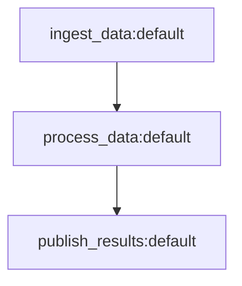

# Quickstart

This guide covers the minimum setup to get a working Jobbers instance backed by Redis: register a task, wire up queues, and run the processes that execute work.

## Prerequisites

- Python 3.11+
- Redis (plain Redis or Redis Stack — see [task-backend-feature-matrix.md](task-backend-feature-matrix.md))

```bash
pip install -e .
```

This registers the CLI entry points: `jobbers_worker`, `jobbers_scheduler`, `jobbers_cleaner`, and `jobbers_manager`.

---

## Step 1 — Register a task

A task is an async function decorated with `@register_task`. Put your task definitions in a module your workers will import.

```python
# myapp/tasks.py
import datetime as dt
from jobbers.registry import register_task

@register_task(
    name="send_email",
    version=1,
    max_retries=3,
    retry_delay=60,
)
async def send_email(recipient: str, subject: str, **kwargs):
    # do the work
    ...
```

The `name` and `version` together identify the task. Workers that receive a task with an unrecognised `(name, version)` pair set it to `DROPPED`. See [task-definition-reference.md](task-definition-reference.md) for the full list of options (timeouts, backoff strategies, dead-letter policy, heartbeats, shutdown behaviour).

### Submitting work

Once the process that runs your code has initialised the state manager, submit with the wrapper the decorator returns:

```python
from myapp.tasks import send_email

task = await send_email.submit(queue="default", recipient="user@example.com", subject="Hello")
print(task.id, task.status)  # SUBMITTED
```

See [interacting-with-tasks.md](interacting-with-tasks.md) for all submission paths including the HTTP API, one-shot scheduling, cron, cancellation, and DLQ recovery.

### Dependency injection

Task functions can declare shared resources — database sessions, HTTP clients, config objects — as injected parameters using `Depends()`. The worker resolves each dependency before calling the task and tears it down afterwards, regardless of success or failure.

```python
from typing import Annotated, AsyncGenerator
from sqlalchemy.ext.asyncio import AsyncSession
from jobbers.di import Depends
from jobbers.registry import register_task

async def get_db() -> AsyncGenerator[AsyncSession, None]:
    async with session_factory() as session:
        try:
            yield session
        finally:
            pass  # commit, close, release pool connection, etc.

@register_task(name="process_record", version=1)
async def process_record(
    record_id: int,                                # from task parameters (submitted by the caller)
    db: Annotated[AsyncSession, Depends(get_db)],  # injected by the worker; never in the payload
) -> dict:
    row = await db.get(MyModel, record_id)
    ...
    return {"status": "ok"}
```

Parameters annotated with `Depends()` are never part of the submitted task payload — the worker opens them fresh for each execution. See [task-definition-reference.md](task-definition-reference.md#dependency-injection) for the full guide: provider types, nested and shared dependencies, cleanup guarantees, and test overrides.

---

## Step 2 — Define your queues (static config)

The simplest routing setup is a static config file — no database migration required. Create `routing.json`:

```json
{
  "queues": [{"name": "default", "max_concurrent": 10}],
  "roles": {"default": ["default"]},
  "routing": []
}
```

Pass `--static-config routing.json` to any process. A `default` queue and `default` role are the minimum needed to run work.

If you need to create and modify queues at runtime without restarting processes, use a dynamic routing backend instead (`ROUTING_BACKEND=redis`).

---

## Step 3 — Run the Worker

The Worker pulls tasks from queues and executes them. It is the only required process for basic operation.

```bash
jobbers_worker myapp.tasks --static-config routing.json myapp.tasks
```

The positional argument (`myapp.tasks`) is the Python module that registers your tasks — either a dotted import path or an absolute file path. The worker imports it at startup so the `@register_task` decorators run.

**Key environment variables:**

| Variable | Default | Description |
| --- | --- | --- |
| `REDIS_URL` | `redis://localhost:6379` | Redis connection URL |
| `WORKER_ROLE` | `default` | Role this worker consumes. Workers pull from all queues assigned to this role. |
| `WORKER_CONCURRENT_TASKS` | `5` | Maximum tasks running simultaneously in this process. |
| `WORKER_TTL` | `50` | Exit after processing this many tasks (guards against memory leaks). Set to `0` to run indefinitely. |
| `TASK_BACKEND` | `redis_json` | Task storage: `redis_json` (Redis Stack) or `redis` (plain Redis). |

Scale by running multiple worker processes — they coordinate only through Redis.

---

## Step 4 — Run the Scheduler

The Scheduler is required if any of your tasks use retry delays, `.schedule()`, or cron DAGs. Run exactly one Scheduler per Redis instance.

```bash
jobbers_scheduler --static-config routing.json
```

**Key environment variables:**

| Variable | Default | Description |
| --- | --- | --- |
| `REDIS_URL` | `redis://localhost:6379` | Redis connection URL |
| `SCHEDULER_POLL_INTERVAL` | `5.0` | Seconds to sleep between polls when nothing is due. |
| `SCHEDULER_BATCH_SIZE` | `1` | Maximum tasks dispatched per poll iteration. Increase (e.g. `10`) under high scheduled-task volume. |
| `SCHEDULER_ROLE` | `default` | Limits the scheduler to queues visible in this role. |

The Scheduler has no persistent state of its own — restarting it is safe. Tasks whose `run_at` passed while it was down are dispatched on the next poll.

---

## Step 5 — Task composition (optional)

For work with dependencies between steps, Jobbers supports DAGs.

### Programmatic DAGs

Build the graph with `DAGNode`, then submit it through the state manager:

```python
from jobbers.models.dag import DAGNode
from jobbers.db import get_state_manager

ingest   = DAGNode("ingest_data")
process  = DAGNode("process_data")
publish  = DAGNode("publish_results")

ingest.then(process)
process.then(publish)

dag_run_id, roots = await get_state_manager().submit_dag(ingest)
```

Fan-out, fan-in, and error callbacks are all supported. See [dag-composition.md](dag-composition.md) for the full builder API.

### Mermaid DAGs

You can also describe a DAG as a Mermaid `flowchart TD` diagram and submit it over the HTTP API or configure it as a cron DAG:



`-->` means "run B when A succeeds"; `-.->` means "run only when A permanently fails". See [mermaid-dag-spec.md](mermaid-dag-spec.md) for the full node syntax (versions, queues, parameters).

---

## Running the Cleaner

The Cleaner is a one-shot command run on a cron schedule. It prunes expired state, detects stalled tasks, and trims the dead letter queue. It is not required for basic operation but should be run in any persistent deployment.

```bash
# Every 5 minutes: detect stalled tasks (heartbeat older than 10 minutes)
*/5 * * * * jobbers_cleaner --stale-time 600 --static-config /path/to/routing.json

# Nightly: prune old state
0 2 * * * jobbers_cleaner \
  --completed-task-age 86400 \
  --dlq-age 2592000 \
  --rate-limit-age 604800 \
  --static-config /path/to/routing.json
```

| Argument | Description |
| --- | --- |
| `--stale-time <s>` | Mark tasks whose heartbeat is older than this many seconds as `STALLED`. |
| `--completed-task-age <s>` | Delete stored state for terminal tasks older than this. |
| `--dlq-age <s>` | Remove dead letter queue entries older than this. |
| `--rate-limit-age <s>` | Prune rate-limit tracking keys older than this. |
| `--recover-orphaned-scheduled` | Re-add tasks that were acquired by the Scheduler but never dispatched (e.g. a crash mid-dispatch). |
| `--drop-stale-indexes` | Drop RediSearch indexes left behind by older schema versions (RedisJSON backends only; no-op otherwise). |

**Recommended frequencies:**

- **Stall detection** (`--stale-time`): every 1–5 minutes. Pick an interval shorter than your shortest `max_heartbeat_interval` so stalled tasks are caught promptly. The threshold should be slightly longer than your longest expected heartbeat gap to avoid false positives.
- **State pruning** (`--completed-task-age`, `--dlq-age`, `--rate-limit-age`): once daily, off-peak hours.
- **Orphan recovery** (`--recover-orphaned-scheduled`): include in the nightly run or after any unclean Scheduler restart.
- **Stale index cleanup** (`--drop-stale-indexes`): only needed after a Redis Stack schema upgrade; run in the nightly batch, not at deploy time. See [Operations guide](operations.md#cleaner) for why.

---

## The Manager (optional)

The Manager is a FastAPI server that provides an HTTP API and admin UI for submitting tasks, inspecting state, managing queues and roles, and browsing the dead letter queue. It is convenient but not required — you can interact with Redis and the database directly.

```bash
jobbers_manager --static-config routing.json myapp.tasks
# API at http://localhost:8000
# Swagger UI at http://localhost:8000/docs
```

See [operations.md](operations.md) for the full deployment guide including Docker Compose and the frontend admin UI.
