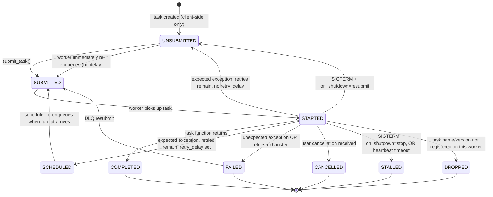

# Task Lifecycle

## State Diagram



## States

| State | Description |
| --- | --- |
| `unsubmitted` | Task exists only on the client; has not been sent to the API. Also used internally during immediate retries (no delay). |
| `submitted` | Task has been accepted by the Manager and placed on a Redis queue. |
| `started` | A worker has pulled the task and is executing it. |
| `completed` | Task function returned successfully. Result is stored. |
| `failed` | Task exhausted its retry budget, or raised an unexpected exception. Stored in DLQ if `dead_letter_policy=save`. |
| `cancelled` | A user-initiated cancel request interrupted the task. |
| `stalled` | Worker received SIGTERM while the task was running and `on_shutdown=stop`, OR the Cleaner detected the heartbeat has gone silent longer than `max_heartbeat_interval`. |
| `dropped` | Worker has no registered function matching the task's name and version. |
| `scheduled` | Task is waiting in the delay queue for a future retry time (`retry_delay` is set). The Scheduler re-enqueues it when `run_at` arrives. |

## How TaskConfig Settings Influence the Lifecycle

### Retries

```python
@register_task(
    name="my_task",
    version=1,
    max_retries=3,          # number of retry attempts before FAILED
    retry_delay=10,         # seconds; omit for immediate re-queue
    backoff_strategy=BackoffStrategy.EXPONENTIAL_JITTER,
    max_retry_delay=300,    # cap on computed delay, in seconds
    expected_exceptions=(httpx.TimeoutException, ConnectionError),
)
```

- `max_retries` — how many times the worker will retry before transitioning to `failed`. Each retry increments `retry_attempt`.
- `retry_delay` — base delay in seconds. When set and retries remain, the task moves to `scheduled`; when `None`, it moves immediately back to `unsubmitted` (re-queued right away).
- `backoff_strategy` — determines how the delay grows per attempt:

  | Strategy | Formula |
  | --- | --- |
  | `constant` | `retry_delay` |
  | `linear` | `retry_delay × attempt` |
  | `exponential` | `retry_delay × 2^attempt` |
  | `exponential_jitter` | `uniform(0, retry_delay × 2^attempt)` — avoids thundering herd |

- `max_retry_delay` — caps the computed delay (default 3600 s).
- `expected_exceptions` — a tuple of exception types that trigger the retry logic. Any other exception causes an immediate transition to `failed` with no retry.
- `timeout` — if the task exceeds this many seconds, it is treated like an expected exception and retried with backoff (if retries remain).

#### Expected vs. unexpected exceptions

Not every exception should trigger a retry. Jobbers distinguishes between the two via the `expected_exceptions` parameter:

- **Expected exceptions** — transient failures you anticipate and want to retry (e.g. `httpx.TimeoutException`, `ConnectionError`). List them in `expected_exceptions`. When one of these is raised, Jobbers applies the backoff strategy and re-enqueues the task (up to `max_retries`).
- **Unexpected exceptions** — bugs or unrecoverable errors not in `expected_exceptions`. These cause the task to move immediately to `FAILED` with no retry attempt, regardless of how many retries remain.
- **Timeouts** — if a `timeout` is configured and the task exceeds it, it is treated like an expected exception and will retry with backoff.

### Dead Letter Queue

```python
dead_letter_policy=DeadLetterPolicy.SAVE   # default: NONE
```

When a task reaches `failed` and `dead_letter_policy=save`, it is written to the DLQ where it can be inspected and bulk-resubmitted. With `dead_letter_policy=none` (the default), failed tasks are discarded.

### Heartbeats and Stall Detection

```python
max_heartbeat_interval=dt.timedelta(minutes=5)
```

The worker records a heartbeat timestamp when the task starts and whenever `await task.heartbeat()` is called inside the task function. The Cleaner periodically checks these timestamps; if a task's last heartbeat is older than `max_heartbeat_interval`, it is marked `stalled`.

Tasks with no `max_heartbeat_interval` are never marked stalled by the Cleaner (they may still stall from SIGTERM).

### Shutdown Policy

```python
on_shutdown=TaskShutdownPolicy.STOP      # default
```

Controls what happens to a running task when the worker receives SIGTERM:

| Policy | Transition |
| --- | --- |
| `stop` | Task is interrupted at the next `await`; moves to `stalled`. |
| `resubmit` | Task is interrupted; re-enqueued as `unsubmitted` without incrementing `retry_attempt`. |
| `continue` | Task is shielded from cancellation; the worker waits for it to finish before exiting. |

### Concurrency

```python
max_concurrent=1   # default: 1
```

Limits how many simultaneous executions of this specific task type are allowed per worker process. This is a per-task guard on top of the queue-level `max_concurrent` setting.

## Timestamps Recorded Per Transition

| Transition | Field set |
| --- | --- |
| `→ submitted` | `submitted_at` |
| `→ started` (first time) | `started_at` |
| `→ started` (retry) | `retried_at` |
| `→ completed / failed / cancelled / stalled / dropped` | `completed_at` |
| heartbeat call | `heartbeat_at` |
