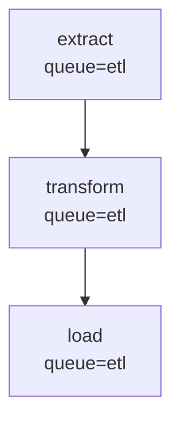

# Jobbers vs TaskIQ: Feature Comparison

This document provides a detailed comparison of Jobbers and TaskIQ across the dimensions most relevant to production task queue deployments. It is intended as a deep-dive companion to the quick-reference table in the [README](../README.md).

---

## 1. Philosophy and Design Goals

**TaskIQ** is an async-first task queue library built around a modular plugin architecture. Every component — broker, result backend, middleware, scheduler — is a separately installable package. TaskIQ positions itself as a modern, asyncio-native replacement for Celery, optimizing for flexibility: it works with RabbitMQ, Redis, NATS, SQS, Kafka, and PostgreSQL without binding you to any one of them. It also provides FastAPI-style dependency injection directly inside task functions.

**Jobbers** is opinionated and narrowly focused. It assumes Redis, assumes asyncio, and trades broker flexibility for depth in the areas that matter most at runtime: observable task state, fine-grained traffic control, and safe recovery from failures. Where TaskIQ solves each concern by composing the right plugin, Jobbers solves them in one integrated system with sensible defaults out of the box: a built-in DLQ, heartbeat monitoring, a stall-detection Cleaner process, dynamic queue/role routing, and OTEL instrumentation that requires zero configuration in task code.

---

## 2. Getting Started

**TaskIQ:**

```bash
pip install taskiq taskiq-redis
```

```python
from taskiq_redis import ListQueueBroker, RedisAsyncResultBackend

result_backend = RedisAsyncResultBackend("redis://localhost:6379")
broker = ListQueueBroker("redis://localhost:6379").with_result_backend(result_backend)

@broker.task
async def add(a: int, b: int) -> int:
    return a + b
```

```bash
taskiq worker mymodule:broker
```

One worker process. The broker and result backend are separate objects you wire together manually. Start adding middleware, a scheduler, and a dashboard and you are pulling in three or four more packages.

**Jobbers:**

```bash
pip install -e ".[test]"
jobbers_migrate                        # creates SQL tables for queue/role config
jobbers_manager my_tasks               # FastAPI server on :8000
jobbers_worker my_tasks                # task executor
jobbers_cleaner                        # stall detection + state pruning
jobbers_scheduler                      # retry delay re-queuing
```

```python
from jobbers.registry import register_task

@register_task(name="add", version=1)
async def add(a: int, b: int) -> dict:
    return {"result": a + b}
```

Four separate processes (separate containers in production). The Docker Compose file in the repo starts the full stack including Redis, an OTEL collector, and the OpenObserve UI. More infrastructure to stand up, but observability and stall detection work from the first task without additional configuration.

**Verdict:** TaskIQ wins for initial simplicity. Jobbers' setup overhead pays off in production where stall detection, traffic control, and built-in OTEL eliminate operational surprises.

---

## 3. Async Python Support

**TaskIQ:** asyncio is the primary execution model. Task functions must be `async def`. Sync tasks can be wrapped, but async is the intended path. Worker concurrency is managed at the worker level.

**Jobbers:** asyncio is the only execution model. Every task function is `async def`. Worker concurrency is managed via `asyncio.Semaphore`, so thousands of I/O-bound tasks can run on a single worker without thread overhead. Task lifecycle events — heartbeats, cancellation signals, timeout wrappers — are all native asyncio.

**Verdict:** Essentially equivalent. Both are built for asyncio-first Python. Neither is a good fit for purely synchronous, CPU-bound tasks.

---

## 4. Monitoring and Observability

**TaskIQ:** Observability is opt-in middleware. Add `PrometheusMiddleware` to expose Prometheus metrics on a configurable port, and add `OpenTelemetryMiddleware` (or use `TaskiqInstrumentor().instrument()`) for distributed traces. The dashboard ([taskiq-dashboard](https://github.com/danfimov/taskiq-dashboard)) is a third-party project that adds a five-state view (Queued, Running, Success, Failure, Abandoned) backed by PostgreSQL or SQLite.

**Jobbers:**

- **OpenTelemetry** traces, metrics, and logs are emitted out of the box via OTLP. No instrumentation code needed in task functions.
- **Emitted metrics:**

  | Metric | Type | Labels |
  | --- | --- | --- |
  | `tasks_processed` | Counter | queue, task, status |
  | `tasks_retried` | Counter | queue, task, version |
  | `execution_time` | Histogram (ms) | queue, task, status |
  | `end_to_end_latency` | Histogram (ms) | queue, task, status |
  | `time_in_queue` | Histogram | queue, task |
  | `tasks_selected` | Counter | queue |
  | `scheduled_task_dispatch_latency_seconds` | Histogram | — |
  | `tasks_dead_lettered` | Counter | — |

- **Heartbeat monitoring**: tasks call `task.heartbeat()` periodically; the Cleaner detects tasks that exceed `max_heartbeat_interval` and marks them `STALLED`. TaskIQ has no equivalent.
- **Built-in React admin UI** provides live task inspection, DLQ management, and queue/role configuration with no extra deployment required.
- Docker Compose includes an OpenObserve instance pre-wired to the OTEL collector.

**Verdict:** Jobbers wins. First-class OTEL without any additional setup, heartbeat-based stall detection, and an integrated admin UI are significant operational advantages over TaskIQ's opt-in middleware stack and third-party dashboard.

---

## 5. Retry Policies

**TaskIQ:**

Two middleware options:

```python
# Simple: retry on any error, up to N times
broker.add_middlewares(SimpleRetryMiddleware(default_retry_count=3))

@broker.task(retry_on_error=True, max_retries=5)
async def my_task(x: int) -> None: ...

# Smart: configurable delay, backoff, jitter
broker.add_middlewares(SmartRetryMiddleware(
    default_retry_count=5,
    default_delay=10,
    use_delay_exponent=True,
    use_jitter=True,
    max_delay_exponent=3600,
))
```

Retry configuration lives in the middleware constructor and is applied globally, with per-task overrides via decorator kwargs.

**Jobbers:**

```python
@register_task(
    name="my_task",
    version=1,
    max_retries=5,
    retry_delay=10,
    backoff_strategy=BackoffStrategy.EXPONENTIAL,
    max_retry_delay=3600,
)
async def my_task(**kwargs):
    ...  # just raise — retry logic is automatic
```

Retry behaviour is fully declared per task in the decorator. Available strategies:

| Strategy | Computed Delay |
| --- | --- |
| `CONSTANT` | `retry_delay` |
| `LINEAR` | `retry_delay × attempt` |
| `EXPONENTIAL` | `retry_delay × 2^attempt` |
| `EXPONENTIAL_JITTER` | `uniform(0, retry_delay × 2^attempt)` |

All results are capped at `max_retry_delay`. When a delay is configured, the task transitions to `SCHEDULED` and the Scheduler process re-enqueues it when the delay expires, freeing the worker immediately.

**Verdict:** Comparable feature sets. TaskIQ's middleware approach applies retry behaviour globally with per-task overrides, which can be convenient for defaults. Jobbers' per-task declarative approach is more explicit and avoids surprising cross-task coupling from middleware state. TaskIQ's SmartRetryMiddleware matches Jobbers' backoff strategies but configures them at the broker level rather than at the task level.

---

## 6. Dead Letter Queues

**TaskIQ:** DLQ support is broker-specific and not first-class. RabbitMQ (via `AioPikaBroker`) can use the native dead-letter exchange plugin. Redis and NATS brokers have no built-in DLQ equivalent. Management of DLQ entries is left entirely to the user.

**Jobbers:** First-class DLQ support via `DeadLetterPolicy.SAVE`. When a task exhausts its retries it is automatically written to the DLQ with its full history. The DLQ is queryable and manageable via API:

| Endpoint | Purpose |
| --- | --- |
| `GET /dead-letter-queue` | List DLQ entries (filter by task name, queue, date range) |
| `GET /dead-letter-queue/{id}` | Inspect a single entry |
| `POST /dead-letter-queue/resubmit` | Bulk resubmit by task name with optional retry count reset |
| `DELETE /dead-letter-queue/{id}` | Remove a single entry |

Two DLQ implementations are available: `DeadQueue` (plain Redis sorted set) and `JsonDeadQueue` (Redis Stack JSON, supports richer filtering).

**Verdict:** Jobbers wins. A production-ready DLQ with a management API is significantly more useful than broker-specific dead-letter support that only works with RabbitMQ or that must be implemented from scratch.

---

## 7. Traffic Management

**TaskIQ:** Concurrency is controlled at the worker level via `--workers N`. Per-queue routing is broker-specific. Rate limiting is not a built-in concept — it must be handled in task code or via external tooling. Changing routing or concurrency requires redeploying workers.

**Jobbers:** Four composable controls, all adjustable at runtime without worker restarts. For full details see [docs/resource-management.md](resource-management.md).

| Control | Scope | Live update? |
| --- | --- | --- |
| `WORKER_CONCURRENT_TASKS` | Per worker process | No (env var) |
| Queue `max_concurrent` | Per queue, per worker | Yes — `PUT /queues/{name}` |
| Queue rate limit | Per queue, at submission | Yes — `PUT /queues/{name}` |
| Role → queue mapping | Which queues a worker polls | Yes — `PUT /roles/{name}` |

Role and queue changes are detected within `config_ttl` seconds (default 60 s) by all workers running that role, with no restarts required. This enables live traffic patterns such as:

- **Drain a queue:** remove it from a role; workers stop polling it within one TTL window; in-flight tasks complete normally.
- **Emergency throttle:** add or tighten a rate limit on a queue; takes effect on the next submission cycle.
- **Isolate a workload:** create a new queue + role; deploy dedicated workers with `WORKER_ROLE=new-role`.

**Verdict:** Jobbers wins. TaskIQ inherits the Celery-era limitation of needing worker restarts to change concurrency or routing. Jobbers' dynamic role/queue system is a significant operational advantage for teams managing live traffic.

---

## 8. Task Composition and Workflows

**TaskIQ:** TaskIQ has no built-in DAG or workflow primitive. Tasks are independent units. Chaining must be implemented manually: a task calls `.kiq()` on the next task before returning, or an application-level coordinator tracks state. There is no fan-out, fan-in, chord, or error-callback equivalent in the core library.

**Jobbers** provides a DAG API for describing task dependency graphs. Two approaches can be freely mixed. For full details and examples see [docs/dags.md](dags.md).

**Mermaid as the DAG format** — Jobbers uses standard [Mermaid](https://mermaid.js.org/) `flowchart TD` diagrams as the serialisation format for all DAGs. This means DAGs can be defined as plain text, submitted via the API, and rendered natively in GitHub, VS Code, Obsidian, and any Mermaid-compatible tool without additional tooling.



```bash
curl -X POST /dags -d '{"diagram": "flowchart TD\n  A[\"extract\"]\n  B[\"transform\"]\n  A --> B"}'
```

**Static DAGs** — the full graph is described before submission using `DAGNode` and `StateManager.submit_dag`.

```python
from jobbers.models.dag import DAGNode

extract   = DAGNode("extract",   version=1, parameters={"source_url": url})
transform = DAGNode("transform", version=1)
load      = DAGNode("load",      version=1)
extract.then(transform)
transform.then(load)
await state_manager.submit_dag(extract)
```

**Dynamic DAGs** — a task returns a `TaskResult` with a `DynamicFanOut` when the number of children can only be determined at runtime.

```python
@register_task(name="fetch_records", version=1)
async def fetch_records(**kwargs):
    records = await db.query("SELECT id FROM items WHERE status = 'pending'")
    children = [
        DAGNode("process_record", version=1, parameters={"record_id": r["id"]})
        for r in records
    ]
    return TaskResult(
        results={"total": len(records)},
        fanout=DynamicFanOut(children=children, collector=DAGNode("records_done", version=1)),
    )
```

**Error callbacks** — pass `on_error` to `then()` or `merge()` to submit a task when a node fails permanently.

```python
err = DAGNode("notify_failure", parameters={"channel": "ops"})
extract.then(transform, on_error=err)
```

**Verdict:** Jobbers wins clearly. TaskIQ has no workflow primitive; any chaining must be handwritten. Jobbers provides chain, fan-out, fan-in, runtime fan-out, and error callbacks, all expressed in a portable Mermaid format that renders in GitHub comments and documentation tools.

---

## 9. Dependency Injection

**TaskIQ:** Provides a FastAPI-style dependency injection system (`taskiq-dependencies`) as a separate installable package. Dependencies are declared as function arguments with `Annotated` type hints, resolved at execution time using a `DependencyGraph`. The same DI system works in both web handlers and task functions, making it straightforward to share session factories, database clients, and configuration objects across the full application.

```python
from taskiq import TaskiqDepends

async def get_db() -> AsyncSession:
    async with session_factory() as session:
        yield session

@broker.task
async def process_record(record_id: int, db: AsyncSession = TaskiqDepends(get_db)) -> None:
    record = await db.get(Record, record_id)
    ...
```

**Jobbers:** Provides the same `Annotated` + `Depends()` pattern as TaskIQ, implemented directly in the framework without a separate package. Provider functions can be async generators (yielding the resource and running cleanup in `finally`), plain async functions, sync generators, or plain sync functions. The dependency graph is built once at `@register_task` decoration time — cycles are detected at import, not at runtime. Generator cleanup is guaranteed even if the task raises, times out, or is cancelled.

```python
from typing import Annotated
from jobbers.di import Depends
from jobbers.registry import register_task

async def get_db() -> AsyncGenerator[AsyncSession, None]:
    async with session_factory() as session:
        try:
            yield session
        finally:
            pass  # any teardown runs here, always

async def get_repo(db: Annotated[AsyncSession, Depends(get_db)]) -> Repository:
    return Repository(db)  # nested dep: get_db resolved first, shared

@register_task(name="process_record", version=1)
async def process_record(
    record_id: int,                                        # from task.parameters
    db: Annotated[AsyncSession, Depends(get_db)],          # injected
    repo: Annotated[Repository, Depends(get_repo)],        # injected; shares the same db instance
) -> dict:
    record = await db.get(Record, record_id)
    ...
```

Key behavioural properties:

- **Single instance per invocation**: if two injected params depend on the same provider, it is called once and the result shared across both.
- **Guaranteed cleanup**: `DependencyResolver` is an async context manager that closes all open generators in reverse order in `__aexit__`, regardless of how the task exits.
- **Cycle detection at decoration time**: `inspect_task_dependencies` walks the graph at `@register_task` time and raises `ValueError` on a cycle — you find out at import, not when a worker picks up the task.
- **Test isolation**: `dependency_overrides({get_db: fake_db})` is a context manager that replaces any provider for the duration of a block, with no monkeypatching of globals needed.

The one difference from TaskIQ's approach: Jobbers uses `Annotated[T, Depends(fn)]` (standard `typing.Annotated`) while TaskIQ uses `T = TaskiqDepends(fn)` as a default argument. Both declare the dependency inline in the function signature; the `Annotated` form is more explicit and does not occupy the default-argument slot.

**Verdict:** Draw. Both frameworks provide first-class `Depends()`-style injection with generator cleanup, nested deps, and shared instances. Jobbers includes it in the core package without an extra install; TaskIQ's `taskiq-dependencies` is a standalone library that also integrates with web frameworks (FastAPI, aiohttp) for cross-cutting use. If your project already uses `taskiq-dependencies` for web handlers, TaskIQ's approach lets you reuse the same dependency graph across both contexts without any additional wiring.

---

## 10. Risk of Data Loss

### Graceful restart (SIGTERM)

**TaskIQ:** Workers complete in-progress tasks before shutting down. Queued tasks remain in the broker.

**Jobbers** applies a per-task shutdown policy:

| Policy | Behaviour |
| --- | --- |
| `STOP` | Cancel immediately; task moves to `STALLED` for later resubmission |
| `RESUBMIT` | Re-enqueue as `UNSUBMITTED`; another worker picks it up |
| `CONTINUE` | Shield with `asyncio.shield()`; task runs to completion before the worker exits |

Both frameworks handle graceful restarts safely. Jobbers adds more control over what happens to in-flight work.

### Hard crash (no SIGTERM)

**TaskIQ:** No built-in crash recovery. Tasks acknowledged on dequeue are gone if the worker crashes mid-execution. Recovery depends on the broker's redelivery semantics (RabbitMQ: redelivery after ACK timeout; Redis: no redelivery).

**Jobbers:** Task state is written to Redis as `STARTED` immediately when execution begins. If a worker crashes without SIGTERM, the Cleaner process detects the missing heartbeat and marks the task `STALLED`. Stalled tasks can be manually resubmitted or (if `DeadLetterPolicy.SAVE`) accessed via the DLQ API. The detection window is `max_heartbeat_interval` + Cleaner poll interval.

### Broker durability

Both frameworks support Redis. Durability depends on Redis persistence configuration (AOF vs RDB). TaskIQ additionally supports RabbitMQ via `AioPikaBroker`, which offers persistent message delivery and durable queues — tasks survive broker restarts without data loss.

**Verdict:** Jobbers wins for hard-crash detection via heartbeat monitoring. TaskIQ with RabbitMQ wins for broker durability. For Redis-only deployments, Jobbers' Cleaner provides meaningful crash recovery that TaskIQ lacks entirely.

---

## 11. Broker and Backend Flexibility

**TaskIQ:**

- **Brokers:** Redis, RabbitMQ (AioPika), NATS, ZeroMQ, SQS, Kafka, PostgreSQL (community)
- **Result backends:** Redis, NATS, PostgreSQL, S3/SQS, YDB, in-memory (dev only)
- Each combination is independently installable; production stacks typically use one broker + one result backend.

**Jobbers:**

- **Broker:** Redis only
- **Task adapters** (`TASK_ADAPTER`): how task state is stored in Redis
  - `MsgpackTaskAdapter` — plain Redis + msgpack; works with any standard Redis instance
  - `JsonTaskAdapter` — Redis Stack with JSON module + RediSearch; enables richer query and filtering support
- **Dead letter adapters:** `DeadQueue` (plain Redis sorted set) or `JsonDeadQueue` (Redis Stack JSON; supports richer DLQ filtering). Selection follows the task adapter.
- **Routing backends** (`ROUTING_BACKEND`): where queue, role, and task-routing config is stored

  | Backend | Storage | SQL? | Redis Stack? | Dynamic CRUD? |
  | --- | --- | --- | --- | --- |
  | `static` | In-process memory | No | No | No — config from file/env, read-only |
  | `sql` (default) | SQLAlchemy (SQLite or Postgres) | Yes | No | Yes |
  | `redis` | Plain Redis keys | No | No | Yes |
  | `redis_json` | RedisJSON + RediSearch | No | Yes | Yes |

  The `static` backend eliminates the SQL dependency entirely; with `static` + `MsgpackTaskAdapter`, Jobbers runs on a single plain Redis instance with no other database. The `redis` and `redis_json` backends support full live CRUD without introducing SQL. For details see [docs/routing-backends.md](routing-backends.md).

- **Results:** Stored as part of task state in Redis; no separate result backend. Cleanup is handled by Cleaner's `--completed-task-age`.

**Verdict:** TaskIQ wins for transport-layer flexibility — RabbitMQ for durability, NATS for low-latency, SQS for cloud-native deployments. Jobbers' Redis-only broker is a deliberate trade-off for operational simplicity. Within that constraint, Jobbers offers meaningful flexibility: four routing backend options spanning zero-dependency to SQL-backed configurations, two task adapters, and two DLQ implementations. If your team needs to swap brokers or wants configurable result TTLs backed by a separate database, TaskIQ is the better fit.

---

## 12. Scheduling and Periodic Tasks

**TaskIQ:** The `TaskiqScheduler` process manages scheduled tasks. Schedules can be defined inline via decorator:

```python
@broker.task(schedule=[{"cron": "*/5 * * * *"}])
async def periodic_cleanup() -> None: ...
```

Or added dynamically at runtime using `ListRedisScheduleSource`:

```python
await source.schedule_by_cron(task=my_task, cron="0 9 * * 1-5", args=[1])
await source.schedule_by_time(task=my_task, time=datetime(2026, 6, 1, 9, 0))
```

TaskIQ's scheduler supports intervals, cron expressions, and timezone-aware datetime targets. Only one scheduler instance should run at a time.

**Jobbers** handles two scheduling concerns in the same Scheduler process:

1. **Retry delays** — re-queuing tasks that are waiting out a backoff delay after a failure.
2. **Cron DAGs** — recurring scheduled DAG runs driven by standard 5-field cron expressions. Each `CronDAGEntry` stores a cron expression, a `DAGTaskSpec`, and a `ConcurrencyPolicy` that controls whether to skip a run when the previous one is still active.

```python
from jobbers.models.cron_dag import ConcurrencyPolicy, CronDAGEntry
from jobbers.models.dag import DAGTaskSpec

spec = DAGTaskSpec(name="generate_report", queue="reports", version=1)
entry = CronDAGEntry(
    name="daily_report",
    cron_expr="0 6 * * 1-5",
    dag_spec=spec,
    concurrency_policy=ConcurrencyPolicy.SKIP_IF_RUNNING,
)
```

Cron entries are managed at runtime via a full REST API — no code deploy or Redis access required:

| Endpoint | Purpose |
| --- | --- |
| `POST /cron-dags` | Create a new cron-scheduled DAG |
| `GET /cron-dags` | List all entries ordered by next run time |
| `PUT /cron-dags/{id}` | Update diagram or cron expression |
| `DELETE /cron-dags/{id}` | Remove a cron entry |

The full pattern is described in [docs/cron-dags.md](cron-dags.md).

**Verdict:** TaskIQ has a slight edge for flexibility (interval scheduling, arbitrary datetime targets, multiple schedule sources). Jobbers edges ahead for cron-scheduled DAG workloads — `SKIP_IF_RUNNING` concurrency control and the REST management API make recurring jobs significantly easier to operate without code deploys. Both support runtime-modifiable schedules; TaskIQ additionally supports sub-minute intervals that cron expressions cannot express.

---

## 13. Task Introspection and Cancellation

**TaskIQ:**

```python
task = await my_task.kiq(arg1, arg2)
result = await task.wait_result(timeout=10)
result.is_err   # True if the task raised an exception
result.return_value
```

`TaskiqResult` gives you the return value and error flag. There is no native task status query across all running tasks, no cancel API, and no way to list tasks by state. These would need to be built on top of the result backend.

**Jobbers** provides a full task lifecycle API:

| Endpoint | Purpose |
| --- | --- |
| `GET /task-status/{id}` | Full task detail: status, queue, results, retry count, heartbeat |
| `GET /tasks?status=STARTED&queue=q` | Query tasks by status, queue, name, date range |
| `GET /active-tasks` | All tasks with live heartbeat records |
| `POST /cancel-task` | Cancel a task in any cancellable state (SUBMITTED, STARTED, SCHEDULED) |

Cancellation is cooperative: a running task checks for a cancellation signal at each `await` point. The worker does not need to be interrupted.

**Verdict:** Jobbers wins clearly. TaskIQ provides a result future but no fleet-level visibility or cancellation. Jobbers' queryable task history and cooperative per-task cancellation are significantly more useful in production.

---

## 14. Security

**TaskIQ:** No built-in API authentication. Security is enforced at the broker layer (Redis ACLs, RabbitMQ user permissions) and at the network layer (reverse proxy, VPN). Task message signing is not available.

**Jobbers:** No built-in API authentication and no task signing. The FastAPI server accepts unauthenticated requests. All security must be enforced at the deployment layer: reverse proxy with auth, network policies restricting access to port 8000, and Redis ACLs.

**Verdict:** Draw. Both frameworks require deployment-layer security hardening. Neither provides built-in authentication or message signing.

---

## Summary

| Feature | TaskIQ | Jobbers | Notes |
| --- | --- | --- | --- |
| **Getting started** | Simple | Moderate | TaskIQ: 1 process. Jobbers: 4 processes + migrate |
| **Async Python** | Native | Native | Both built on asyncio throughout |
| **Observability** | Middleware (opt-in) | OTEL + React UI | Jobbers: zero-config OTEL, heartbeat stall detection |
| **Heartbeat / stall detection** | None | First-class | Jobbers Cleaner detects crashed workers |
| **Retry policies** | SmartRetryMiddleware (global) | Declarative per-task | Both support exponential backoff + jitter |
| **Dead letter queue** | RabbitMQ only | First-class | Jobbers: queryable API + bulk resubmit |
| **Traffic management** | Restart required | Live, no restart | Jobbers: dynamic roles/queues, per-queue caps |
| **Task composition** | None | DAG API + Mermaid | Jobbers: chain, fan-out, fan-in, error callbacks |
| **Dependency injection** | FastAPI-style (taskiq-deps) | Built-in (jobbers.di) | Both support `Depends()`, generators, nested deps, test overrides |
| **Graceful restart safety** | Good | Good | Both handle SIGTERM correctly |
| **Hard crash recovery** | None | Heartbeat + Cleaner | Jobbers detects stalls; TaskIQ has no equivalent |
| **Broker durability** | RabbitMQ: strong | Redis only | TaskIQ + RabbitMQ offers stronger durability |
| **Broker flexibility** | Redis, AMQP, NATS, SQS, Kafka | Redis only (4 routing backends, 2 task adapters) | TaskIQ wins for transport; Jobbers flexible within Redis |
| **Periodic/cron scheduling** | Cron + interval + datetime | Cron DAGs + REST CRUD | TaskIQ: sub-minute intervals. Jobbers: SKIP_IF_RUNNING, REST API |
| **Task introspection** | Result future only | Full lifecycle API | Jobbers: query by status/queue/name, cooperative cancel |
| **Admin UI** | Third-party (taskiq-dashboard) | Built-in React UI | Jobbers UI ships with the project |
| **Security** | Proxy/broker-layer | Proxy-layer only | Neither has built-in auth |

---

### When to choose Jobbers

- You need heartbeat monitoring and automatic stall detection for long-running tasks — TaskIQ has no equivalent.
- You need live, fine-grained traffic control (reroute queues, throttle rate, cap concurrency without worker restarts).
- You want first-class DLQ support with a management API and bulk resubmit.
- You need multi-step DAG workflows (chain, fan-out, fan-in, runtime fan-out, error callbacks) — TaskIQ has no workflow primitive.
- You want recurring cron-scheduled jobs with `SKIP_IF_RUNNING` control, managed via REST API without code deploys.
- Operational visibility is a first-class concern and you want OTEL without additional instrumentation work.
- You are already running Redis and do not need broker flexibility.

### When to choose TaskIQ

- You need broker flexibility: RabbitMQ for durability, NATS for low-latency, SQS for cloud-native deployments.
- Your application already uses `taskiq-dependencies` for web handlers and you want the same dependency graph shared across both web and task contexts without additional wiring.
- Your workloads are simple independent tasks without complex chaining requirements.
- You need sub-minute periodic intervals (TaskIQ supports `schedule_by_time` and interval scheduling; cron expressions bottom out at 1-minute resolution).
- You require a separate result backend with configurable TTL (Jobbers stores results as part of task state and delegates cleanup to the Cleaner).
